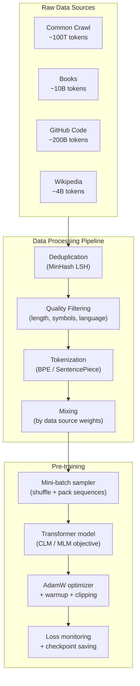

# Pre-training Strategies

## Prerequisites

- [Lesson 02: From Transformers to LLMs](./02-transformers-to-llms.md) — decoder-only vs encoder-only, autoregressive generation
- [Module 06 L10: Scaling Laws](../../module-06-transformers-attention-mechanisms/lessons/10-scaling-laws.md) — Chinchilla, compute budgets, Kaplan laws

## What You'll Learn

| Concept | Key insight |
|---------|------------|
| Pre-training objectives | CLM, MLM, span corruption — what each learns |
| Data sources and curation | Why data quality matters as much as quantity |
| Compute planning | Use Chinchilla to size your run before spending |
| Training stability | Warmup, gradient clipping, loss spikes |
| Data pipelines | Deduplication, quality filtering, mixing ratios |

---

## Intuition: What is Pre-training Trying to Achieve?

Pre-training is the phase where the model learns *language itself* — grammar, facts, reasoning patterns, coding conventions — from raw unlabeled text. No human labels, no task-specific supervision.

The key question is: *what self-supervised objective forces the model to encode useful knowledge?*

The answer depends on what you want the model to do:

```
If you want generation → Causal LM (predict next token)
If you want understanding → Masked LM (predict masked tokens)
If you want seq2seq → Span corruption (reconstruct corrupted spans)
```

All three objectives share a common structure: the model must predict hidden text from visible context. To do this reliably, it must internalize the statistical structure of language.

---

## Objective 1: Causal Language Modeling (CLM)

Used by: GPT-1/2/3/4, LLaMA, Mistral, Claude, Gemini

**Objective**: given tokens `t_1, ..., t_{k-1}`, predict `t_k`.

```python
import torch
import torch.nn as nn
import torch.nn.functional as F


def causal_lm_loss(
    model: nn.Module,
    token_ids: torch.Tensor,         # (B, T+1) — includes both input and target
    ignore_index: int = -100,        # index to ignore in loss (e.g. padding)
) -> torch.Tensor:
    """
    Next-token prediction loss for GPT-style causal language modeling.

    Every token position is a training signal:
    Position 0 → predict token 1
    Position 1 → predict token 2
    ...
    Position T-1 → predict token T

    This gives T loss signals per sequence of length T+1.
    """
    input_ids  = token_ids[:, :-1]   # (B, T) — all but last
    target_ids = token_ids[:, 1:]    # (B, T) — all but first (shifted)

    logits = model(input_ids)        # (B, T, vocab_size)
    B, T, V = logits.shape

    loss = F.cross_entropy(
        logits.view(B * T, V),
        target_ids.reshape(B * T),
        ignore_index=ignore_index,
    )
    return loss


# Simulate one training step
def simulate_clm_step():
    """Show the input/target shift for CLM."""
    # Example sequence: "The cat sat on the mat"
    # (using fake token IDs for illustration)
    sequence = torch.tensor([[101, 102, 103, 104, 105, 106, 107]])
    # B=1, T+1=7

    print("CLM input/target alignment:")
    print(f"Input  (positions 0..5): {sequence[0, :-1].tolist()}")
    print(f"Target (positions 1..6): {sequence[0, 1:].tolist()}")
    print()
    print("Position 0 input=101 → predict 102")
    print("Position 1 input=102 → predict 103")
    print("... (T predictions from one sequence)")

simulate_clm_step()
```

**Why CLM is efficient**: every token in the sequence is both an input and a target (shifted by 1). A sequence of T+1 tokens gives T training signals — near-perfect data efficiency.

---

## Objective 2: Masked Language Modeling (MLM)

Used by: BERT, RoBERTa, ALBERT, DeBERTa

**Objective**: randomly mask 15% of tokens and predict the originals.

```python
def apply_bert_masking(
    token_ids: torch.Tensor,  # (B, T)
    vocab_size: int,
    mask_token_id: int,       # typically 103 for bert-base-uncased
    mask_prob: float = 0.15,
    seed: int = None,
) -> tuple[torch.Tensor, torch.Tensor]:
    """
    Apply BERT-style masked language modeling.

    For 15% of tokens, apply one of:
      - 80% probability: replace with [MASK]
      - 10% probability: replace with random token
      - 10% probability: keep original (model can't rely on [MASK] as signal)

    Returns:
        masked_ids : (B, T) — input with some tokens replaced
        labels     : (B, T) — original IDs at masked positions, -100 elsewhere
    """
    if seed:
        torch.manual_seed(seed)

    labels     = token_ids.clone()
    masked_ids = token_ids.clone()

    # Sample 15% of positions
    probability_matrix = torch.full(token_ids.shape, mask_prob)
    masked_positions   = torch.bernoulli(probability_matrix).bool()  # (B, T)

    # Only compute loss on masked positions
    labels[~masked_positions] = -100

    # Apply 80/10/10 split
    rand = torch.rand(token_ids.shape)

    # 80%: replace with [MASK]
    replace_with_mask = masked_positions & (rand < 0.8)
    masked_ids[replace_with_mask] = mask_token_id

    # 10%: replace with random token
    replace_with_rand = masked_positions & (rand >= 0.8) & (rand < 0.9)
    random_tokens     = torch.randint(vocab_size, token_ids.shape)
    masked_ids[replace_with_rand] = random_tokens[replace_with_rand]

    # 10%: keep original (no action needed — already in masked_ids)

    return masked_ids, labels


# Demonstration
token_ids = torch.tensor([[101, 2054, 2003, 1037, 4937, 3064, 2079, 102]])
masked, labels = apply_bert_masking(token_ids, vocab_size=30522, mask_token_id=103, seed=42)

print("Original:   ", token_ids[0].tolist())
print("Masked:     ", masked[0].tolist())
print("Labels:     ", labels[0].tolist())
print("(-100 = not masked, original value = position to predict)")
```

**MLM vs CLM efficiency**: MLM only computes loss on ~15% of tokens per sequence. CLM computes loss on all tokens (100%). This makes CLM ~6.7× more data-efficient, which is one reason CLM-trained models scale better.

---

## Objective 3: Span Corruption (T5)

Used by: T5, mT5, FLAN-T5

**Objective**: replace random spans of tokens with single sentinel tokens (`<extra_id_0>`, `<extra_id_1>`, ...) and train encoder-decoder to reconstruct them.

```python
def apply_span_corruption(
    tokens: list[str],
    corruption_rate: float = 0.15,
    mean_span_length: float = 3.0,
) -> tuple[list[str], list[str]]:
    """
    T5-style span corruption.

    Example:
    Input:  "Thank you for inviting me to your party last week"
    Output:
      Corrupted: "Thank you for <extra_id_0> your <extra_id_1> week"
      Target:    "<extra_id_0> inviting me to <extra_id_1> party last <extra_id_2>"
    """
    total_corrupt = int(len(tokens) * corruption_rate)
    corrupted_input = []
    target_output   = []

    i = 0
    sentinel_id = 0

    while i < len(tokens):
        # Randomly decide if this position starts a corrupted span
        if len(target_output) < total_corrupt and torch.rand(1).item() < 0.3:
            # Corrupt a span of mean_span_length tokens
            span_len = max(1, int(torch.poisson(torch.tensor(mean_span_length)).item()))
            sentinel = f"<extra_id_{sentinel_id}>"

            corrupted_input.append(sentinel)
            target_output.append(sentinel)

            # Add corrupted tokens to target
            for j in range(span_len):
                if i + j < len(tokens):
                    target_output.append(tokens[i + j])

            sentinel_id += 1
            i += span_len
        else:
            corrupted_input.append(tokens[i])
            i += 1

    # Final sentinel in target
    target_output.append(f"<extra_id_{sentinel_id}>")

    return corrupted_input, target_output


# Example
tokens = "Thank you for inviting me to your party last week".split()
corrupted, target = apply_span_corruption(tokens)

print("Original: ", " ".join(tokens))
print("Corrupted:", " ".join(corrupted))
print("Target:   ", " ".join(target))
```

---

## Pre-training Data: Sources and Curation

The quality of pre-training data determines the quality of the resulting model. Modern frontier models use carefully curated data mixtures:

### Common Pre-training Data Sources

| Source | Content | Typical quality | Size |
|--------|---------|----------------|------|
| Common Crawl | Web pages | Variable (needs filtering) | Petabytes |
| Books (BookCorpus, Gutenberg) | Long-form text | High | ~10B tokens |
| Wikipedia | Factual reference | High | ~4B tokens |
| GitHub | Code | High (for code tasks) | ~200B tokens |
| ArXiv | Scientific papers | High | ~30B tokens |
| Stack Overflow | Q&A | High | ~10B tokens |
| Reddit (Pushshift) | Diverse discussions | Medium | ~200B tokens |

### The Data Pipeline

```python
from dataclasses import dataclass
from typing import Iterator


@dataclass
class Document:
    text: str
    source: str
    language: str
    quality_score: float


def filter_pipeline(documents: Iterator[Document]) -> Iterator[Document]:
    """
    Standard LLM pre-training data filtering pipeline.
    Based on Gopher, LLaMA, and Dolma filtering practices.
    """
    for doc in documents:
        # --- Quality filters ---

        # 1. Length filter: remove very short documents
        word_count = len(doc.text.split())
        if word_count < 50:
            continue

        # 2. Repetition filter: high repetition = low quality
        lines = doc.text.split("\n")
        unique_ratio = len(set(lines)) / max(len(lines), 1)
        if unique_ratio < 0.3:  # >70% duplicate lines
            continue

        # 3. Symbol ratio: too many non-alphanumeric chars = spam/HTML artifacts
        alpha_count = sum(c.isalpha() for c in doc.text)
        if alpha_count / max(len(doc.text), 1) < 0.4:
            continue

        # 4. Language filter: keep target language(s)
        if doc.language not in {"en", "zh", "es", "fr", "de", "ja"}:
            continue

        # 5. Quality score threshold (e.g. from fasttext classifier)
        if doc.quality_score < 0.7:
            continue

        # --- Deduplication (typically done in a separate pass) ---
        # MinHash LSH or exact URL deduplication reduces memorization

        yield doc


def estimate_filtered_size(total_tokens: float, filter_rate: float = 0.3) -> dict:
    """
    Estimate the effective dataset size after filtering.
    Typical filter rates:
    - Common Crawl: keep ~25-40% after filtering
    - Books/Wikipedia: keep >90%
    - Code: keep ~70%
    """
    kept_tokens = total_tokens * (1 - filter_rate)
    return {
        "total_raw_tokens": f"{total_tokens/1e12:.1f}T",
        "filter_rate": f"{filter_rate:.0%}",
        "effective_tokens": f"{kept_tokens/1e12:.1f}T",
    }

# Common Crawl: ~100 trillion raw tokens, ~30T after filtering
print(estimate_filtered_size(100e12, filter_rate=0.70))
```

### Data Mixing Ratios

Different data sources contribute differently to model capabilities:

```python
# LLaMA-2 approximate data mixture (from paper)
llama2_data_mix = {
    "Common Crawl (filtered)": 0.67,   # 67% web text
    "GitHub code":             0.085,  # 8.5% code
    "Wikipedia":               0.045,  # 4.5% reference
    "Books":                   0.045,  # 4.5% long-form
    "ArXiv":                   0.025,  # 2.5% scientific
    "Stack Exchange":          0.020,  # 2.0% Q&A
    "Other":                   0.11,   # 11% other
}

# Total training tokens: 2T
total_tokens = 2e12

print("LLaMA-2 data mixture (2T tokens total):")
for source, fraction in llama2_data_mix.items():
    tokens = fraction * total_tokens
    print(f"  {source:35s}: {fraction:.1%} = {tokens/1e9:.0f}B tokens")
```

---

## Computing Pre-training Requirements

Before starting a training run, use Chinchilla scaling laws to plan:

```python
def plan_pretraining_run(
    target_model_params: float,  # e.g. 7e9 for 7B
    gpu_flops_tflops:  float = 312.0,   # A100 SXM peak
    num_gpus:          int   = 512,
    model_flops_utilization: float = 0.40,  # typical MFU
    days_available:    float = 30.0,
) -> dict:
    """
    Plan a pre-training run using Chinchilla optimal compute allocation.

    Returns recommended token count, estimated duration, and cost estimates.
    """
    # Chinchilla optimal: N_tokens ≈ 20 × N_params
    optimal_tokens = 20 * target_model_params

    # FLOPs: approximately 6 × N × D (forward + backward)
    total_flops = 6 * target_model_params * optimal_tokens

    # Effective throughput
    gpu_flops_per_sec = gpu_flops_tflops * 1e12   # convert to FLOPS
    effective_flops_per_sec = gpu_flops_per_sec * num_gpus * model_flops_utilization
    seconds_needed = total_flops / effective_flops_per_sec
    days_needed    = seconds_needed / 86400

    # Feasibility
    feasible = days_needed <= days_available

    # Rough GPU cost (A100 ≈ $2/hour on major clouds)
    gpu_hours = num_gpus * days_needed * 24
    cost_usd  = gpu_hours * 2.0

    return {
        "model_params":      f"{target_model_params/1e9:.1f}B",
        "optimal_tokens":    f"{optimal_tokens/1e9:.0f}B",
        "total_FLOPs":       f"{total_flops:.2e}",
        "gpus_needed":       num_gpus,
        "training_days":     f"{days_needed:.1f}",
        "feasible_in_budget": feasible,
        "estimated_cost_USD": f"${cost_usd:,.0f}",
    }


configs = [
    ("Small (125M)", 125e6, 64),
    ("Medium (1B)",  1e9,  256),
    ("Large (7B)",   7e9,  512),
    ("XL (70B)",     70e9, 4096),
]

for name, params, gpus in configs:
    result = plan_pretraining_run(params, num_gpus=gpus)
    print(f"\n{name}:")
    for k, v in result.items():
        print(f"  {k}: {v}")
```

---

## Training Stability: Common Failure Modes

### Loss Spike Pattern

```
Normal training curve:
Step 0:     Loss = 6.5  (random model)
Step 1000:  Loss = 4.2  (learning)
Step 10000: Loss = 3.1  (converging)
Step 50000: Loss = 2.8  (trained)

Unhealthy curve — spike and recovery:
Step 0:     Loss = 6.5
Step 5000:  Loss = 3.8
Step 5100:  Loss = 8.2  ← spike! (often from bad data batch)
Step 5200:  Loss = 4.1  ← recovery if gradient clipping saved it
Step 5300:  Loss = 3.9  ← continues
```

```python
def diagnose_training_issue(
    train_losses: list[float],
    grad_norms:   list[float],
) -> str:
    """
    Diagnose common pre-training issues from loss and gradient norm history.
    """
    # Check for NaN
    if any(loss != loss for loss in train_losses):
        return "NaN loss — likely gradient explosion. Reduce LR or increase clip norm."

    # Check for loss explosion
    if train_losses[-1] > train_losses[0] * 2:
        return "Loss increased overall — LR too high or incorrect data preprocessing."

    # Check for loss spike
    max_loss = max(train_losses[10:])  # skip warmup
    final_loss = sum(train_losses[-5:]) / 5
    if max_loss > final_loss * 2:
        spike_step = train_losses.index(max_loss)
        return f"Loss spike at step {spike_step} — check data batch at that step."

    # Check for gradient explosion
    if max(grad_norms) > 10:
        return "Gradient norms too high — reduce max_grad_norm or add warmup steps."

    # Healthy
    if train_losses[-1] < train_losses[0] * 0.5:
        return "Healthy training — loss reduced by >50%."

    return "Slow training — consider increasing learning rate or batch size."
```

---

## Diagram: Pre-training Data Flow



---

## Comparing Pre-training Objectives

| Objective | Models | Data efficiency | Best for | Training signal |
|-----------|--------|----------------|----------|----------------|
| Causal LM | GPT, LLaMA | 100% of tokens | Generation | 100% positions |
| Masked LM | BERT | ~15% of tokens | Understanding, embeddings | 15% positions |
| Span Corruption | T5 | ~15% of tokens | Seq2seq | Reconstructed spans |
| Prefix LM | GLM | Hybrid | Multi-task | Varies |

---

## Edge Cases & Misconceptions

!!! warning "Misconception: More data always helps"
    Data quality has a bigger impact than quantity beyond a point. Doubling low-quality data often hurts more than it helps. The DCLM project (2024) showed that careful data curation with web-filtered sources outperforms simply using more raw Common Crawl.

!!! warning "Misconception: Perplexity is the only metric that matters during pre-training"
    Models with similar perplexity can differ dramatically on downstream tasks. Evaluate on held-out tasks (ARC, HellaSwag, MMLU) throughout training, not just perplexity.

!!! note "Batch packing vs padding"
    Instead of padding short sequences to the same length (wasteful), production training systems *pack* multiple short sequences into one block of `max_seq_len` tokens, separated by `<EOS>` tokens. This improves GPU utilization significantly.

---

## Production Connection

**Reproducing published models**: Understanding the pre-training setup lets you reproduce or audit published model claims. The LLaMA-3 technical report details exact data sources, mixing ratios, tokenizer choices, and hyperparameters — all of which are engineering decisions with consequences for downstream behavior.

**Fine-tuning vs pre-training from scratch**: Pre-training a 7B model costs ~$500K in cloud GPU time. Fine-tuning an existing 7B model costs ~$100–$1,000. For 99% of use cases, fine-tuning a pre-trained checkpoint is the right choice. Understanding pre-training tells you *what* knowledge is already in the checkpoint and what fine-tuning needs to add.

---

## Key Takeaways

1. **Causal LM** (predict next token) trains on 100% of tokens — most data-efficient objective, dominates modern LLMs.
2. **Masked LM** (BERT) trains on 15% of tokens — better for bidirectional representations and classification.
3. **Data quality beats quantity**: aggressive filtering, deduplication, and quality scoring improve model performance more than raw scale.
4. **Chinchilla planning**: before training, compute optimal (N_params, N_tokens) using `D ≈ 20 × N` and estimate GPU-days.
5. **Loss spikes** happen — gradient clipping at max_norm=1.0 and checkpoint recovery are standard practice.
6. **Batch packing** eliminates padding waste — essential for training throughput at scale.

---

## Further Reading

- [GPT-3 paper](https://arxiv.org/abs/2005.14165) — Brown et al. 2020, data and training details in appendix
- [LLaMA-2 paper](https://arxiv.org/abs/2307.09288) — Touvron et al. 2023, explicit data mixing ratios
- [Dolma dataset](https://arxiv.org/abs/2402.00159) — Open pre-training corpus with full data documentation
- [DCLM paper](https://arxiv.org/abs/2406.11794) — Data curation for language model pre-training
- [Chinchilla paper](https://arxiv.org/abs/2203.15556) — Hoffmann et al. 2022

---

## Next Lesson

**[Lesson 4: Tokenization Deep Dive](./04-tokenization.md)** — how text becomes tokens, BPE from scratch, vocabulary design, and production edge cases.
