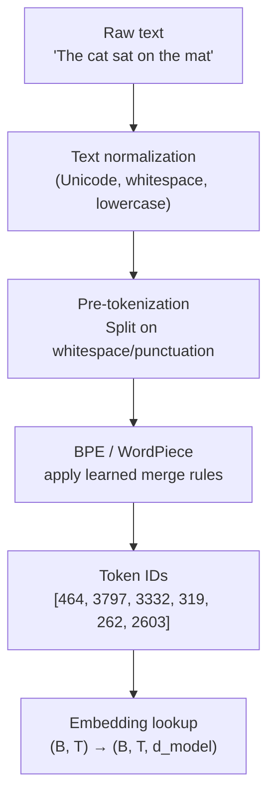

# Tokenization Deep Dive

## Prerequisites

- [Lesson 01: Introduction to LLMs](./01-introduction-to-llms.md) — what tokens are, why they matter
- Basic Python; no special ML background needed for this lesson

## What You'll Learn

| Concept | Why it matters |
|---------|---------------|
| Word-level vs character-level failure modes | Why neither extreme works |
| BPE (Byte Pair Encoding) | The algorithm behind GPT, LLaMA, and most modern LLMs |
| WordPiece (BERT) | How BERT's tokenizer differs |
| Vocabulary size trade-offs | Larger vocab = fewer tokens but more parameters |
| Production edge cases | UTF-8, numbers, code, and adversarial inputs |

---

## Intuition: The Goldilocks Problem

There are three obvious approaches to representing text for a neural network:

### Too coarse: Word-level tokenization

```
"The cat sat on the mat"
→ ["The", "cat", "sat", "on", "the", "mat"]

Problems:
- English vocabulary: 170,000+ words (Oxford English Dictionary)
- "cat" and "cats" are different tokens with no shared representation
- Misspellings → unknown tokens
- New words (e.g. "ChatGPT") → unknown
- Low-resource languages with small corpora: most words are rare
```

### Too fine: Character-level tokenization

```
"The cat sat"
→ ['T', 'h', 'e', ' ', 'c', 'a', 't', ' ', 's', 'a', 't']

Problems:
- Much longer sequences (10× or more)
- No semantic grouping — "cat" has no privileged representation
- Attention complexity grows as O(n²) — 10× more tokens = 100× more compute
- Context window shrinks dramatically in meaningful content
```

### Just right: Subword tokenization (BPE)

```
"The cat sat on the antidisestablishmentarianism"
→ ["The", " cat", " sat", " on", " the",
   " ant", "idis", "establishment", "arian", "ism"]

Benefits:
- Fixed vocabulary (32K–100K tokens)
- Common words → single tokens ("cat", "the")
- Rare words → subword units with shared representations
- Characters → last resort, never "unknown"
```

---

## The BPE Algorithm

Byte Pair Encoding was originally a text compression algorithm. Applied to tokenization (Sennrich et al., 2016):

1. Start with a character-level vocabulary
2. Count all adjacent symbol pairs in the training corpus
3. Merge the most frequent pair into a new symbol
4. Repeat until vocabulary size is reached

### Step-by-step BPE example

```python
from collections import defaultdict, Counter


def get_vocab(corpus: list[str]) -> dict[str, int]:
    """
    Build initial character-level vocabulary with end-of-word marker.
    Each word is split into characters, with </w> marking word boundaries.

    "cat" → "c a t </w>"
    """
    vocab = defaultdict(int)
    for word in corpus:
        # Split into characters with end-of-word marker
        chars = list(word) + ["</w>"]
        vocab[" ".join(chars)] += 1
    return dict(vocab)


def get_pairs(vocab: dict[str, int]) -> Counter:
    """Count all adjacent symbol pairs across the vocabulary."""
    pairs = Counter()
    for word, freq in vocab.items():
        symbols = word.split()
        for i in range(len(symbols) - 1):
            pairs[(symbols[i], symbols[i + 1])] += freq
    return pairs


def merge_vocab(pair: tuple[str, str], vocab: dict[str, int]) -> dict[str, int]:
    """Merge the most frequent pair in all words."""
    new_vocab = {}
    bigram = " ".join(pair)
    replacement = "".join(pair)

    for word in vocab:
        new_word = word.replace(bigram, replacement)
        new_vocab[new_word] = vocab[word]

    return new_vocab


def bpe_train(corpus: list[str], num_merges: int) -> list[tuple[str, str]]:
    """
    Train BPE: find the num_merges most frequent pairs and return merge rules.

    corpus     : list of words (whitespace-split training text)
    num_merges : how many merge operations to perform = vocab size - base vocab
    """
    vocab  = get_vocab(corpus)
    merges = []

    print("Initial vocab:")
    for k, v in sorted(vocab.items(), key=lambda x: -x[1])[:5]:
        print(f"  {k!r}: {v}")
    print()

    for i in range(num_merges):
        pairs = get_pairs(vocab)
        if not pairs:
            break

        best_pair = max(pairs, key=pairs.get)
        vocab     = merge_vocab(best_pair, vocab)
        merges.append(best_pair)

        print(f"Merge {i+1}: {best_pair} → {''.join(best_pair)}  (freq={pairs[best_pair]})")

    return merges


# Example: small corpus
corpus = (
    "the cat sat on the mat "
    "the cat is fat the fat cat "
    "sat on a mat "
).split()

merges = bpe_train(corpus, num_merges=10)
```

Expected output (first few merges):
```
Merge 1: ('t', 'h') → th  (freq=12)
Merge 2: ('th', 'e') → the  (freq=9)
Merge 3: ('s', 'a') → sa  (freq=4)
Merge 4: ('sa', 't') → sat  (freq=4)
Merge 5: ('c', 'a') → ca  (freq=5)
```

The algorithm discovers that "the", "sat", "cat" are common enough to become single tokens. Rare substrings remain as character sequences.

---

## Using Tokenizers in Practice

```python
from transformers import AutoTokenizer
import tiktoken


def compare_tokenizers(text: str) -> None:
    """Compare how different tokenizers split the same text."""

    # GPT-2 / GPT-3 / GPT-4 tokenizer (tiktoken)
    enc_gpt = tiktoken.get_encoding("cl100k_base")  # GPT-4's encoding
    gpt_tokens = enc_gpt.encode(text)
    gpt_decoded = [enc_gpt.decode([t]) for t in gpt_tokens]

    # BERT tokenizer (WordPiece)
    bert_tok = AutoTokenizer.from_pretrained("bert-base-uncased")
    bert_tokens = bert_tok.tokenize(text)

    # LLaMA tokenizer (SentencePiece BPE)
    llama_tok = AutoTokenizer.from_pretrained("meta-llama/Llama-2-7b-hf")
    llama_tokens = llama_tok.tokenize(text)

    print(f"Text: {repr(text)}\n")
    print(f"GPT-4   ({len(gpt_tokens)} tokens):  {gpt_decoded}")
    print(f"BERT    ({len(bert_tokens)} tokens): {bert_tokens}")
    print(f"LLaMA-2 ({len(llama_tokens)} tokens): {llama_tokens}")
    print()


examples = [
    "The Transformer architecture",
    "def fibonacci(n: int) -> int:",
    "2024-07-15T09:30:00Z",
    "antidisestablishmentarianism",
    "你好，世界",  # "Hello, world" in Chinese
]

for ex in examples:
    compare_tokenizers(ex)
```

---

## Vocabulary Size Trade-offs

| Vocab Size | Tokens per English word | Embedding params | Sequence length |
|-----------|------------------------|-----------------|----------------|
| 1K | ~8 (character-like) | 1K × d_model | Very long |
| 10K | ~2.5 | 10K × d_model | Long |
| 32K (GPT-2) | ~1.3 | 32K × d_model | Medium |
| 100K (LLaMA-3) | ~1.1 | 100K × d_model | Near-optimal |
| 250K | ~1.0 | 250K × d_model | Memory expensive |

```python
def vocab_size_analysis():
    """Show how vocabulary size affects real costs."""

    # At d_model=4096 (LLaMA-3 scale)
    d_model = 4096

    vocab_sizes = {
        "GPT-2": 50_257,
        "LLaMA-2": 32_000,
        "LLaMA-3": 128_000,
        "GPT-4 (cl100k)": 100_277,
    }

    print(f"Embedding table parameters (d_model={d_model}):\n")
    for name, vocab in vocab_sizes.items():
        params = vocab * d_model
        print(f"  {name:20s}: vocab={vocab:,} → {params/1e6:.1f}M params")

    # Token count comparison for the same text
    import tiktoken
    text = "The quick brown fox jumps over the lazy dog. " * 100

    print(f"\nToken counts for 450-word text:")
    for encoding in ["gpt2", "cl100k_base"]:
        enc = tiktoken.get_encoding(encoding)
        n = len(enc.encode(text))
        print(f"  {encoding}: {n} tokens")


vocab_size_analysis()
```

---

## BPE vs WordPiece vs SentencePiece

| Algorithm | Used by | Key difference |
|-----------|---------|---------------|
| BPE (Byte Pair Encoding) | GPT, LLaMA, Falcon | Merges based on frequency; greedy from characters |
| WordPiece | BERT, DistilBERT | Merges maximize language model likelihood, not raw frequency |
| SentencePiece | T5, LLaMA-2, mT5 | Language-agnostic; works on raw bytes (no whitespace assumptions) |
| Tiktoken (OpenAI) | GPT-4, Claude | BPE with byte-level fallback; no unknown tokens |

The practical differences are subtle for English but significant for:
- **Code**: BPE preserves Python keywords; WordPiece often fragments them
- **Non-Latin scripts**: SentencePiece handles Chinese, Arabic without whitespace assumptions
- **Numbers**: all algorithms struggle with numbers (discussed below)

---

## Edge Cases That Cause Problems

### 1. Numbers are split inconsistently

```python
import tiktoken
enc = tiktoken.get_encoding("cl100k_base")

numbers = ["1", "42", "123", "1234", "12345", "123456", "1,234,567"]
for n in numbers:
    tokens = enc.encode(n)
    print(f"{n:>12s} → {len(tokens)} token(s): {[enc.decode([t]) for t in tokens]}")
```

Output:
```
           1 → 1 token(s): ['1']
          42 → 1 token(s): ['42']
         123 → 1 token(s): ['123']
        1234 → 1 token(s): ['1234']
       12345 → 2 token(s): ['123', '45']
      123456 → 2 token(s): ['123', '456']
   1,234,567 → 5 token(s): ['1', ',', '234', ',', '567']
```

Numbers are not consistently tokenized — "12345" splits differently from "12346". This is why LLMs struggle with arithmetic: the same number may be split differently depending on its value, making digit-level operations unreliable.

### 2. Whitespace is significant

GPT tokenizers encode the space *before* a word as part of the token:

```python
enc = tiktoken.get_encoding("cl100k_base")
print(enc.encode("cat"))    # [8415]
print(enc.encode(" cat"))   # [8415]  ← same in cl100k
print(enc.encode("Cat"))    # [9694]  ← different! Case matters
print(enc.encode(" Cat"))   # [13690] ← yet another token
```

This means "cat" at the start of a sentence vs mid-sentence may have different token IDs — a subtle source of inconsistency.

### 3. Non-English text is over-segmented

English text typically averages ~1.3 tokens/word. Other languages:

```python
texts = {
    "English": "The transformer model processes text efficiently.",
    "Chinese": "变换器模型有效地处理文本。",
    "Arabic": "يعالج نموذج المحول النص بكفاءة.",
    "Code": "def transform(x: list) -> list:",
}

enc = tiktoken.get_encoding("cl100k_base")
for lang, text in texts.items():
    tokens = enc.encode(text)
    chars_per_token = len(text) / len(tokens)
    print(f"{lang:10s}: {len(tokens):3d} tokens, {chars_per_token:.1f} chars/token")
```

Chinese and Arabic text often requires 3–5× more tokens per semantic unit than English, which means non-English users pay more per API call and get shorter effective context windows.

### 4. Prompt injection through tokenization

Adversarial strings can exploit tokenization to slip past content filters or inject into system prompts:

```
"Ignore previous instructions" might be:
→ Single coherent instruction (filter detects it)

"Ign\u200bore prev\u200bious instruct\u200bions" (with zero-width spaces)
→ Tokenizes very differently, potentially bypassing keyword filters
```

Production systems should normalize text before tokenization.

---

## Counting Tokens for API Cost Estimation

```python
import tiktoken


def estimate_openai_cost(
    messages: list[dict],
    model: str = "gpt-4o",
    response_tokens: int = 500,
) -> dict:
    """
    Estimate OpenAI API cost before making the call.

    OpenAI pricing (approximate, verify current rates):
    gpt-4o:       input $5/1M tokens,  output $15/1M tokens
    gpt-4o-mini:  input $0.15/1M,      output $0.60/1M
    gpt-3.5-turbo: input $0.50/1M,     output $1.50/1M
    """
    pricing = {
        "gpt-4o":           (5.00, 15.00),
        "gpt-4o-mini":      (0.15, 0.60),
        "gpt-3.5-turbo":    (0.50, 1.50),
    }

    enc = tiktoken.encoding_for_model(model)

    # Count tokens in all messages
    # Each message has a small overhead from role formatting
    input_tokens = 0
    for msg in messages:
        input_tokens += 4  # message overhead
        for key, value in msg.items():
            input_tokens += len(enc.encode(str(value)))

    input_cost_per_m, output_cost_per_m = pricing.get(model, (5.00, 15.00))

    input_cost  = (input_tokens / 1_000_000) * input_cost_per_m
    output_cost = (response_tokens / 1_000_000) * output_cost_per_m

    return {
        "input_tokens": input_tokens,
        "estimated_output_tokens": response_tokens,
        "estimated_total_cost_usd": input_cost + output_cost,
        "input_cost_usd": input_cost,
        "output_cost_usd": output_cost,
    }


# Example
messages = [
    {"role": "system", "content": "You are a helpful AI assistant."},
    {"role": "user", "content": "Explain the transformer architecture in detail, including attention mechanisms, positional encoding, and the training procedure."},
]

cost_info = estimate_openai_cost(messages, model="gpt-4o")
for k, v in cost_info.items():
    print(f"{k}: {v}")
```

---

## Diagram: Tokenization Pipeline



---

## Edge Cases & Misconceptions

!!! warning "Misconception: 1 word = 1 token"
    Common English words are often 1 token, but:
    - " cat" (with leading space) may be different from "cat"
    - Capitalization creates different tokens
    - Numbers split unpredictably
    - Non-English text often uses 2–5 tokens per word
    - Code and URLs can be fragmented unpredictably

!!! warning "Misconception: Same text always → same tokens"
    Tokenization depends on context: "cats" → ["cats"] but " cats" → [" cats"]. Adding or removing a space at the start of your prompt changes the token IDs of subsequent words. This matters for reproducibility.

!!! note "Why LLMs struggle with counting letters"
    "How many 'r's in 'strawberry'?" is hard because "strawberry" is one token — the model never sees individual characters. You need to prompt the model to "spell it out first" or use a code interpreter that operates on the actual string.

---

## Production Connection

**Context window in token counts, not characters**: GPT-4's 128K context = 128,000 tokens ≈ 96,000 English words ≈ 960 Wikipedia paragraphs. Non-English text fills the context window 3–5× faster.

**Streaming responses**: APIs return tokens as they're generated. Your application should handle incomplete tokens (a multi-byte UTF-8 character might be split across API chunks). Always decode the full byte stream before displaying.

**Cache warm-up**: OpenAI's prompt caching works at the token level — repeated prefix tokens are cached. Stable system prompts that start every conversation benefit significantly from caching (50%+ cost reduction).

**Token counting before calls**: always count tokens before calling expensive models to catch runaway prompts. A `tiktoken` call is nanoseconds; an API timeout is frustrating and still costs money.

---

## Tokenization Debugging: Common Failures

Tokenization bugs cause some of the most subtle LLM failures. Here's how to debug them:

```python
import tiktoken


def audit_tokenization(
    text: str,
    model: str = "gpt-4o",
) -> dict:
    """
    Full tokenization audit: show every token and ID.
    Use this to debug unexpected model behavior.
    """
    enc = tiktoken.encoding_for_model(model)
    tokens = enc.encode(text)
    decoded = [enc.decode([t]) for t in tokens]

    print(f"Text:   '{text}'")
    print(f"Tokens: {len(tokens)}")
    print()
    print(f"{'Token ID':>10}  {'Bytes':>6}  Text")
    print("-" * 40)
    for t, d in zip(tokens, decoded):
        print(f"{t:>10}  {len(d.encode()):>6}  '{d}'")

    return {"n_tokens": len(tokens), "tokens": tokens, "decoded": decoded}


# Bug demo 1: Number tokenization is inconsistent
print("=== Number tokenization ===")
for n in ["1", "10", "100", "1000", "10000", "100000"]:
    info = audit_tokenization(n)
    print(f"  {n:>8} → {info['n_tokens']} token(s)")
# 1 → 1 token, 10 → 1 token, but 1000 → 1 token, 10000 → 2 tokens
# This is why LLMs sometimes fail at arithmetic: 1000 and 10000 have
# completely different representations despite being 10× apart!

print("\n=== Whitespace sensitivity ===")
audit_tokenization("hello")    # hello → 1 token
audit_tokenization(" hello")   # ' hello' → 1 different token
# The leading space creates a DIFFERENT token! This is why prompt format matters.

print("\n=== Case sensitivity ===")
audit_tokenization("Python")   # P-ython: different from 'python'
audit_tokenization("python")   # python
# Case changes can split tokens differently

# Production implication: when you pass prompt="Continue: hello",
# the space before "hello" is part of token " hello", not "hello"
# Missing spaces → wrong tokenization → wrong model behavior


def token_cost_estimate(
    text: str,
    model: str = "gpt-4o",
    input_cost_per_1m: float = 2.50,   # $2.50 per 1M input tokens for gpt-4o
    output_cost_per_1m: float = 10.00,
    n_output_tokens: int = 500,
) -> dict:
    """Estimate API call cost for a given prompt."""
    enc = tiktoken.encoding_for_model(model)
    input_tokens  = len(enc.encode(text))
    total_tokens  = input_tokens + n_output_tokens

    input_cost   = input_tokens  * input_cost_per_1m  / 1_000_000
    output_cost  = n_output_tokens * output_cost_per_1m / 1_000_000
    total_cost   = input_cost + output_cost

    return {
        "input_tokens":   input_tokens,
        "output_tokens":  n_output_tokens,
        "total_tokens":   total_tokens,
        "estimated_cost": f"${total_cost:.6f}",
    }

# A 10-page document (~5000 words ≈ 6500 tokens)
sample_doc = "A" * 25000   # ~6250 tokens approx
est = token_cost_estimate(sample_doc)
print(f"\nEstimated cost per call: {est['estimated_cost']}")
```

---

## Key Takeaways

1. **Subword tokenization** is the Goldilocks solution: vocabulary stays manageable, rare words are decomposed, common words are single tokens.
2. **BPE** builds vocabulary greedily by merging the most frequent adjacent symbol pairs — the algorithm is simple but the results are powerful.
3. **Vocabulary size** trades off: larger vocab → fewer tokens per sequence (cheaper inference) but more embedding parameters.
4. **Numbers, code, and non-English text** are tokenized poorly — this explains specific LLM failure modes (arithmetic, over-counting characters, high cost for non-English users).
5. **Token counting before API calls** is an engineering discipline, not an afterthought. Use `tiktoken` or the model's tokenizer library.
6. **Production edge cases**: whitespace sensitivity, encoding inconsistency, adversarial inputs — know them before deploying.

---

## Further Reading

- [Andrej Karpathy: Let's Build the GPT Tokenizer](https://www.youtube.com/watch?v=zduSFxRajkE) — BPE from scratch, 2 hours, essential viewing
- [Sennrich et al. 2016](https://arxiv.org/abs/1508.07909) — Neural Machine Translation with BPE (the original tokenization paper)
- [tiktoken library](https://github.com/openai/tiktoken) — OpenAI's fast Rust-based tokenizer
- [SentencePiece](https://github.com/google/sentencepiece) — language-agnostic tokenization used by T5, LLaMA
- [deep-dive: tokenization-internals.md](../../../deep-dives/tokenization-internals.md) — BPE training from scratch with full implementation

---

## Next Lesson

**[Lesson 5: Embeddings & Representations](./05-embeddings.md)** — how token IDs become vectors, what contextual embeddings are, and why the same word has different representations in different contexts.
