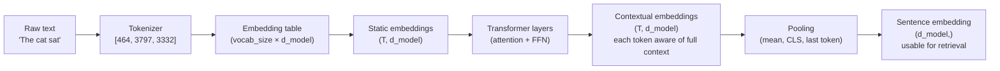

# Embeddings & Representations

## Prerequisites

- [Lesson 04: Tokenization](./04-tokenization.md) — token IDs
- [Module 06 L02: Self-Attention](../../module-06-transformers-attention-mechanisms/lessons/02-self-attention.md) — how attention creates contextual representations

## What You'll Learn

| Concept | Why it matters |
|---------|---------------|
| Token embedding lookup | Integer IDs → dense vectors that the model can process |
| Static vs contextual embeddings | "bank" has one meaning (Word2Vec) vs context-dependent (BERT) |
| Cosine similarity | Measuring semantic relatedness between vectors |
| Embedding models | text-embedding-3-small, Sentence-BERT, GTE |
| RAG foundation | Embeddings power vector databases and retrieval systems |

---

## Intuition: Why Vectors, Not Integers?

A neural network cannot process integer IDs directly — it needs floating-point vectors it can differentiate through. The embedding layer converts the discrete token ID into a continuous vector:

```
Token ID: 3797    →    embedding[3797]    →    [0.2, -0.5, 0.1, ..., 0.3]
  (integer)               (lookup)                (512 or 4096 floats)
```

This is just a learned lookup table. The model learns during training to assign similar vectors to semantically similar tokens:

```
embedding["cat"]  ≈  embedding["cats"]   (same concept, different form)
embedding["dog"]  ~  embedding["cat"]    (both animals, somewhat similar)
embedding["car"]  ≠  embedding["cat"]    (different domain)
```

The key insight: **similarity in vector space ≈ semantic similarity**. This geometric interpretation enables semantic search, clustering, and retrieval.

---

## Step 1: The Embedding Lookup

```python
import numpy as np
import torch
import torch.nn as nn


class TokenEmbedding(nn.Module):
    """
    Learnable token embedding table.

    Parameters
    ----------
    vocab_size : int — number of unique tokens (e.g. 50,257 for GPT-2)
    d_model    : int — embedding dimension (e.g. 768 for BERT-Base)

    Weight matrix: (vocab_size, d_model)
    Memory: 50,257 × 768 × 4 bytes ≈ 154 MB for FP32 (GPT-2 scale)
    """

    def __init__(self, vocab_size: int, d_model: int):
        super().__init__()
        # Each row is a learnable vector for one token
        self.embedding = nn.Embedding(vocab_size, d_model)

        # Scale embeddings by √d_model (original Transformer paper convention)
        # This makes token embeddings and positional encodings comparable in magnitude
        self.scale = d_model ** 0.5

    def forward(self, token_ids: torch.Tensor) -> torch.Tensor:
        """
        token_ids : (B, T)  — integer token IDs
        returns   : (B, T, d_model)  — dense embeddings
        """
        return self.embedding(token_ids) * self.scale


# Demonstration
vocab_size, d_model = 50_257, 768
emb_layer = TokenEmbedding(vocab_size, d_model)

# "The cat sat on the mat" → GPT-2 token IDs
token_ids = torch.tensor([[464, 3797, 3332, 319, 262, 2603]])  # (1, 6)

embeddings = emb_layer(token_ids)
print(f"Input shape:  {token_ids.shape}")    # (1, 6)
print(f"Output shape: {embeddings.shape}")   # (1, 6, 768)
print(f"d_model = 768 floats per token")

# The embedding weight matrix
print(f"\nEmbedding table: {emb_layer.embedding.weight.shape}")  # (50257, 768)
print(f"Parameters: {emb_layer.embedding.weight.numel():,}")     # 38,597,376
```

---

## Step 2: Static Embeddings (Word2Vec)

Before transformers, **Word2Vec** (Mikolov et al., 2013) created static embeddings: each word always maps to the same vector, regardless of context.

```python
# Classic Word2Vec arithmetic (famous examples from the paper)
# These work because of how Word2Vec trains: predict word from context

def word2vec_analogy(embeddings: dict, a: str, b: str, c: str, n: int = 5) -> list:
    """
    Solve analogy: a is to b as c is to ?

    Method: embedding(b) - embedding(a) + embedding(c)
    and find nearest neighbor.
    """
    # Compute analogy vector
    target = embeddings[b] - embeddings[a] + embeddings[c]
    target = target / np.linalg.norm(target)

    # Find nearest neighbors by cosine similarity
    similarities = {}
    for word, vec in embeddings.items():
        if word in [a, b, c]:
            continue
        vec_norm = vec / np.linalg.norm(vec)
        similarities[word] = float(np.dot(target, vec_norm))

    return sorted(similarities.items(), key=lambda x: -x[1])[:n]


# Classic Word2Vec analogies:
# king - man + woman ≈ queen
# Paris - France + Italy ≈ Rome
# biggest - big + cold ≈ coldest

# These work because Word2Vec organizes the embedding space so that
# semantic and syntactic relationships are encoded as vector offsets.
print("king - man + woman ≈ queen")
print("This works because the 'royalty' direction is encoded as a vector offset")
```

**Why Word2Vec fails**: the word "bank" has a fixed vector regardless of whether it means:
- "river bank" (geological feature)
- "bank account" (financial institution)
- "bank shot" (sports)

All three senses share the same embedding, which is averaged and blurred.

---

## Step 3: Contextual Embeddings (BERT/GPT)

Modern LLMs produce **contextual embeddings** — the vector for each token depends on its full context:

```python
import torch
from transformers import BertModel, BertTokenizer


def get_bert_embeddings(sentences: list[str]) -> dict:
    """
    Get BERT contextual embeddings for tokens in each sentence.
    Same word → different vectors depending on context.
    """
    tokenizer = BertTokenizer.from_pretrained("bert-base-uncased")
    model = BertModel.from_pretrained("bert-base-uncased")
    model.eval()

    results = {}
    for sentence in sentences:
        inputs = tokenizer(sentence, return_tensors="pt")
        tokens = tokenizer.convert_ids_to_tokens(inputs["input_ids"][0])

        with torch.no_grad():
            outputs = model(**inputs)

        # last_hidden_state: (1, T, 768) — one 768-dim vector per token
        hidden_states = outputs.last_hidden_state[0]  # (T, 768)

        results[sentence] = {
            "tokens": tokens,
            "embeddings": hidden_states,  # (T, 768)
        }

    return results


# The classic "bank" disambiguation
sentences = [
    "I deposited money in the bank.",       # financial institution
    "The river bank was covered in mud.",   # geological feature
]

data = get_bert_embeddings(sentences)

# Find "bank" token in both sentences and compare their embeddings
def cosine_sim(a: torch.Tensor, b: torch.Tensor) -> float:
    a, b = a.float(), b.float()
    return float(torch.dot(a, b) / (torch.norm(a) * torch.norm(b)))

for sentence, info in data.items():
    bank_idx = info["tokens"].index("bank")
    bank_emb = info["embeddings"][bank_idx]
    print(f"Context: {sentence[:40]}")
    print(f"  'bank' embedding norm: {bank_emb.norm():.2f}")

# Compare "bank" embeddings across contexts
emb1 = data[sentences[0]]["embeddings"][data[sentences[0]]["tokens"].index("bank")]
emb2 = data[sentences[1]]["embeddings"][data[sentences[1]]["tokens"].index("bank")]
sim = cosine_sim(emb1, emb2)
print(f"\nCosine similarity between 'bank' in two contexts: {sim:.3f}")
print("(< 0.8 suggests the model distinguishes the two meanings)")
```

---

## Step 4: Sentence Embeddings for Semantic Search

For retrieval and similarity tasks, you need a single vector representing an entire passage, not one vector per token.

```python
from transformers import AutoTokenizer, AutoModel
import torch
import numpy as np


def mean_pooling(model_output: torch.Tensor, attention_mask: torch.Tensor) -> torch.Tensor:
    """
    Average token embeddings weighted by attention mask.
    Standard technique for sentence embeddings from BERT-style models.
    """
    token_embeddings = model_output.last_hidden_state  # (B, T, d)
    # Expand mask: (B, T) → (B, T, d) for broadcasting
    input_mask_expanded = attention_mask.unsqueeze(-1).expand(token_embeddings.size()).float()
    # Weighted sum divided by sum of weights
    return torch.sum(token_embeddings * input_mask_expanded, dim=1) / \
           torch.clamp(input_mask_expanded.sum(dim=1), min=1e-9)


def encode_sentences(sentences: list[str], model_name: str = "sentence-transformers/all-MiniLM-L6-v2") -> np.ndarray:
    """
    Encode sentences to fixed-size embedding vectors.
    Returns: (N, d) array, L2-normalized
    """
    tokenizer = AutoTokenizer.from_pretrained(model_name)
    model     = AutoModel.from_pretrained(model_name)
    model.eval()

    encoded = tokenizer(sentences, padding=True, truncation=True,
                        max_length=512, return_tensors="pt")

    with torch.no_grad():
        output = model(**encoded)

    embeddings = mean_pooling(output, encoded["attention_mask"])

    # Normalize to unit sphere for cosine similarity via dot product
    norms = embeddings.norm(dim=1, keepdim=True)
    return (embeddings / norms).numpy()


def semantic_search(query: str, corpus: list[str], top_k: int = 3) -> list[tuple[str, float]]:
    """
    Find the top_k most semantically similar passages to the query.
    Uses cosine similarity (= dot product for normalized vectors).
    """
    all_sentences = [query] + corpus
    embeddings = encode_sentences(all_sentences)

    query_emb  = embeddings[0]      # (d,)
    corpus_emb = embeddings[1:]     # (N, d)

    # Cosine similarity = dot product (vectors are already normalized)
    similarities = corpus_emb @ query_emb   # (N,)

    # Sort by similarity
    ranked = sorted(zip(corpus, similarities), key=lambda x: -x[1])
    return ranked[:top_k]


# Example: semantic search over a mini knowledge base
corpus = [
    "The transformer architecture uses self-attention to process sequences.",
    "Python is a popular programming language for data science.",
    "GPT-4 is a large language model developed by OpenAI.",
    "Backpropagation computes gradients by applying the chain rule.",
    "BERT uses masked language modeling as its pre-training objective.",
    "Neural networks learn representations through gradient descent.",
]

query = "How do attention mechanisms work in language models?"
results = semantic_search(query, corpus)

print(f"Query: '{query}'\n")
print("Top matches:")
for text, score in results:
    print(f"  [{score:.3f}] {text}")
```

---

## Visualizing the Embedding Space

```python
from sklearn.decomposition import PCA
import matplotlib.pyplot as plt
import numpy as np


def visualize_embeddings(words: list[str], embeddings: np.ndarray) -> None:
    """
    Reduce embeddings to 2D using PCA and visualize.
    Color-coded by semantic category.
    """
    # Reduce to 2D
    pca = PCA(n_components=2, random_state=42)
    coords_2d = pca.fit_transform(embeddings)

    fig, ax = plt.subplots(figsize=(10, 8))
    ax.scatter(coords_2d[:, 0], coords_2d[:, 1], s=100, alpha=0.7, c="steelblue")

    for i, word in enumerate(words):
        ax.annotate(
            word,
            (coords_2d[i, 0], coords_2d[i, 1]),
            textcoords="offset points",
            xytext=(5, 5),
            fontsize=11,
        )

    ax.set_title("Word Embeddings in 2D (PCA projection)", fontsize=13)
    ax.set_xlabel(f"PC1 ({pca.explained_variance_ratio_[0]:.1%} variance)")
    ax.set_ylabel(f"PC2 ({pca.explained_variance_ratio_[1]:.1%} variance)")
    ax.grid(True, alpha=0.3)
    plt.tight_layout()
    plt.show()


# Example with semantic clusters visible in 2D
word_groups = {
    "animals": ["cat", "dog", "horse", "elephant", "tiger"],
    "countries": ["France", "Germany", "Japan", "Brazil", "India"],
    "verbs": ["run", "walk", "jump", "swim", "fly"],
    "colors": ["red", "blue", "green", "yellow", "purple"],
}

# In practice you'd use actual embeddings; this shows the concept
print("In a well-trained embedding space:")
print("  - Animals cluster together")
print("  - Countries cluster together")
print("  - The 'is the capital of' relationship appears as a consistent vector offset")
print("  - Synonyms are near each other; antonyms may be moderately close")
```

---

## OpenAI Embeddings API in Practice

```python
from openai import OpenAI
import numpy as np
from typing import Union


def get_openai_embeddings(
    texts: Union[str, list[str]],
    model: str = "text-embedding-3-small",
) -> np.ndarray:
    """
    Get embeddings from OpenAI API.

    Models and dimensions:
    - text-embedding-3-small: 1536 dimensions ($0.02/1M tokens)
    - text-embedding-3-large: 3072 dimensions ($0.13/1M tokens)
    - text-embedding-ada-002: 1536 dimensions (older, $0.10/1M tokens)
    """
    client = OpenAI()
    if isinstance(texts, str):
        texts = [texts]

    response = client.embeddings.create(model=model, input=texts)
    embeddings = np.array([e.embedding for e in response.data])  # (N, d)
    return embeddings


def build_vector_store(documents: list[str]) -> tuple[np.ndarray, list[str]]:
    """
    Build a simple in-memory vector store.
    In production: use Pinecone, Weaviate, Qdrant, or pgvector.
    """
    embeddings = get_openai_embeddings(documents)
    # Normalize for cosine similarity
    norms = np.linalg.norm(embeddings, axis=1, keepdims=True)
    normalized = embeddings / norms
    return normalized, documents


def retrieve(
    query: str,
    store_embeddings: np.ndarray,
    store_docs: list[str],
    top_k: int = 3,
) -> list[dict]:
    """Retrieve top_k most relevant documents for a query."""
    query_emb = get_openai_embeddings(query)[0]
    query_emb = query_emb / np.linalg.norm(query_emb)

    # Cosine similarity via dot product (vectors are normalized)
    scores = store_embeddings @ query_emb  # (N,)

    top_idx = np.argsort(scores)[::-1][:top_k]
    return [
        {"document": store_docs[i], "score": float(scores[i])}
        for i in top_idx
    ]


# Usage pattern (requires OPENAI_API_KEY)
# docs, store = build_vector_store(["doc1...", "doc2..."])
# results = retrieve("What is attention?", docs, store)
```

---

## Embedding Dimensions and Trade-offs

| Model | Dimensions | Tokens/$ | MTEB Score | Use case |
|-------|-----------|----------|-----------|----------|
| text-embedding-3-small | 1536 | 62.5M | 62.3 | General, cost-efficient |
| text-embedding-3-large | 3072 | 9.6M | 64.6 | Highest quality |
| BAAI/bge-m3 (open) | 1024 | ∞ (local) | 65.0 | Multilingual, private |
| all-MiniLM-L6-v2 (open) | 384 | ∞ (local) | 56.3 | Fast, lightweight |

Higher dimensions capture more nuanced relationships but cost more to store and search. For most semantic search tasks, 384–1536 dimensions are sufficient.

---

## Diagram: From Token to Meaning



---

## Edge Cases & Misconceptions

!!! warning "Misconception: Word2Vec and BERT embeddings are interchangeable"
    They serve different purposes. Word2Vec static embeddings are fast lookup tables for lexical similarity. BERT contextual embeddings are dynamic representations that encode meaning *in context*. Using Word2Vec for semantic search over long passages misses context-dependent meaning.

!!! warning "Misconception: Cosine similarity is always the right metric"
    Cosine similarity measures angle between vectors, ignoring magnitude. For some embedding spaces, Euclidean distance or dot product may be more appropriate. OpenAI recommends cosine similarity for text-embedding-3 models.

!!! note "The embedding layer is not frozen during fine-tuning"
    When you fine-tune a BERT or GPT model, the embedding table is trainable too. Fine-tuning on domain-specific data shifts the embedding space to better represent that domain. This is why fine-tuned models often significantly outperform base models on domain-specific retrieval.

!!! warning "Embedding drift between model versions"
    text-embedding-ada-002 and text-embedding-3-small produce incompatible vectors — you cannot mix embeddings from different models in the same vector database. When OpenAI releases a new embedding model, you must re-embed all your documents.

---

## Production Connection

**RAG (Retrieval-Augmented Generation)** is built on embeddings:

```
1. Index: Embed all documents → store in vector database (Pinecone, Qdrant, pgvector)
2. Retrieve: Embed user query → find top-k similar documents
3. Generate: Concatenate retrieved documents + query → call LLM

Cost breakdown for RAG:
- Indexing: run once, pay embedding cost once
- Retrieval: embed query ($0.00002 for text-embedding-3-small) + vector search (~1ms)
- Generation: standard LLM API cost for augmented prompt

Why RAG beats fine-tuning for knowledge: embeddings allow dynamic retrieval of the
most relevant information per query; fine-tuning bakes information into weights statically.
```

**Vector database choices** (2024):
- **pgvector**: PostgreSQL extension — start here if you already use Postgres
- **Pinecone**: managed, serverless, proven at scale
- **Weaviate**: open-source, multi-modal, hybrid search
- **Qdrant**: fast, written in Rust, good for self-hosting

---

## Evaluating Embedding Quality

```python
import numpy as np
from sklearn.metrics.pairwise import cosine_similarity


def embedding_intrinsic_eval(
    embeddings: dict[str, np.ndarray],   # word → embedding
    word_pairs: list[tuple[str, str, float]],  # (word1, word2, human_similarity_score)
) -> float:
    """
    Intrinsic evaluation: Spearman correlation with human similarity judgments.

    Standard dataset: WordSim-353 (Finkelstein et al.)
    Each pair has a human-judged similarity score 0-10.
    Good embeddings: ρ > 0.7 with human scores.
    """
    model_scores  = []
    human_scores  = []

    for w1, w2, human_score in word_pairs:
        if w1 not in embeddings or w2 not in embeddings:
            continue

        e1 = embeddings[w1].reshape(1, -1)
        e2 = embeddings[w2].reshape(1, -1)
        cos_sim = cosine_similarity(e1, e2)[0, 0]

        model_scores.append(cos_sim)
        human_scores.append(human_score)

    # Spearman rank correlation
    from scipy.stats import spearmanr
    correlation, p_value = spearmanr(model_scores, human_scores)
    print(f"Spearman ρ: {correlation:.3f} (p={p_value:.3f})")
    return correlation


# Extrinsic evaluation: downstream task performance
def retrieval_evaluation(
    query_embeddings:  np.ndarray,   # (Q, d) — query vectors
    doc_embeddings:    np.ndarray,   # (D, d) — document vectors
    relevant_docs:     list[set],    # set of relevant doc IDs per query
    k:                 int = 10,
) -> dict:
    """
    Evaluate embedding quality via Recall@K for retrieval.

    For each query, find top-K most similar documents.
    Recall@K = fraction of relevant docs retrieved in top-K.
    """
    # Compute pairwise similarities: (Q, D)
    sims = cosine_similarity(query_embeddings, doc_embeddings)

    recalls = []
    for q_idx, relevants in enumerate(relevant_docs):
        # Get top-K doc indices for this query
        top_k_ids = set(np.argsort(sims[q_idx])[::-1][:k])
        recall = len(top_k_ids & relevants) / len(relevants)
        recalls.append(recall)

    return {
        f"Recall@{k}": round(np.mean(recalls), 4),
        "n_queries":    len(relevant_docs),
    }
```

---

## Key Takeaways

1. **Embeddings** convert discrete token IDs to dense floating-point vectors that neural networks can differentiate through.
2. **Static embeddings** (Word2Vec) give one fixed vector per word — great for lexical similarity, blind to context.
3. **Contextual embeddings** (BERT/GPT) produce different vectors for the same word depending on surrounding context — essential for semantic understanding.
4. **Sentence embeddings** pool token embeddings into a single vector representing the entire passage; they power semantic search and RAG systems.
5. **Cosine similarity** between normalized embedding vectors measures semantic relatedness — the foundation of all vector search.
6. **Embedding models** differ in dimensions, cost, multilingual support, and domain specialization — match the model to your use case.

---

## Further Reading

- [Illustrated Word2Vec](https://jalammar.github.io/illustrated-word2vec/) — Jay Alammar's visual guide
- [Mikolov et al. 2013](https://arxiv.org/abs/1301.3781) — Efficient estimation of word representations in vector space (Word2Vec)
- [MTEB Leaderboard](https://huggingface.co/spaces/mteb/leaderboard) — Massive Text Embedding Benchmark for comparing models
- [OpenAI Embeddings Guide](https://platform.openai.com/docs/guides/embeddings) — practical guide with code examples
- [Sentence-Transformers](https://www.sbert.net/) — open-source library for sentence and paragraph embeddings

---

## Next Lesson

**[Lesson 6: Fine-Tuning Techniques](./06-fine-tuning.md)** — how to adapt a pre-trained LLM to your specific task using full fine-tuning, LoRA, and prompt tuning.
