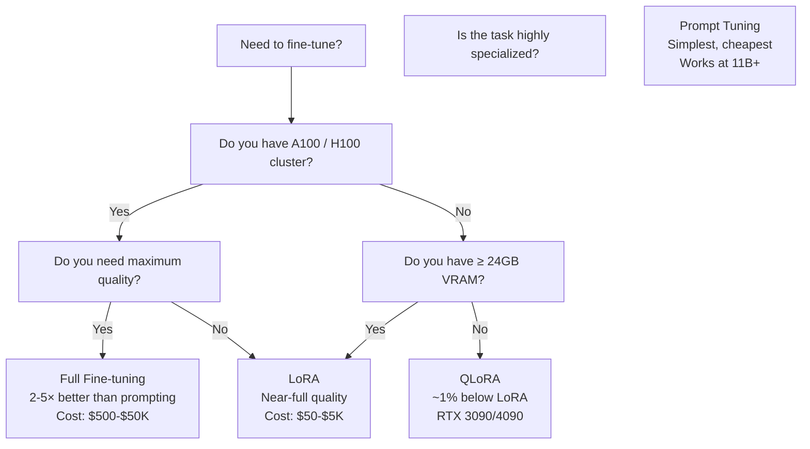

# Fine-Tuning Techniques

## Prerequisites

- [Lesson 03: Pre-training Strategies](./03-pretraining-strategies.md) — what pre-training produces
- [Module 06 L07: Training Transformers](../../module-06-transformers-attention-mechanisms/lessons/07-training-transformers.md) — Adam, gradient clipping, mixed precision

## What You'll Learn

| Technique | Parameters updated | VRAM needed | When to use |
|-----------|-------------------|-------------|-------------|
| Full fine-tuning | All | 4–16× model size | Best quality, have data + compute |
| LoRA | 0.1–1% (adapters) | 1–2× model size | Good quality, limited compute |
| QLoRA | 0.1–1% (on quantized base) | 0.5–1× model size | Consumer GPUs (≥16GB) |
| Prompt tuning | <0.001% (soft prompts) | Base model size | Minimal compute, many tasks |

---

## Intuition: When to Fine-tune vs Prompt

Before deciding *how* to fine-tune, decide *whether* to fine-tune:

```
Prompting is better when:
  - Task is general (translation, summarization, QA)
  - You have <100 examples
  - Latency doesn't require a smaller model
  - API budget allows GPT-4 / Claude calls

Fine-tuning is better when:
  - Task requires specific output format (structured JSON, specific style)
  - Domain is specialized (legal, medical, code in an internal framework)
  - You have >1000 labeled examples
  - You need lower cost per call (fine-tuned 7B < GPT-4 per call)
  - You need lower latency (smaller model after fine-tuning)
```

The typical decision tree in 2024: start with prompting → evaluate quality → if quality is insufficient and you have data, fine-tune.

---

## Full Fine-tuning

Full fine-tuning updates all model parameters on your labeled dataset. This maximizes quality but requires significant compute.

```python
from transformers import AutoModelForCausalLM, AutoTokenizer, Trainer, TrainingArguments
from datasets import Dataset
import torch


def prepare_dataset(examples: list[dict]) -> Dataset:
    """
    Format examples as instruction-following pairs.

    Each example: {"instruction": str, "output": str}
    Formatted:    "<s>[INST] {instruction} [/INST] {output} </s>"
    """
    tokenizer = AutoTokenizer.from_pretrained("mistralai/Mistral-7B-Instruct-v0.2")
    tokenizer.pad_token = tokenizer.eos_token

    def format_and_tokenize(example: dict) -> dict:
        # Alpaca-style prompt format
        text = (
            f"<s>[INST] {example['instruction']} [/INST] "
            f"{example['output']} </s>"
        )
        tokenized = tokenizer(
            text,
            max_length=512,
            truncation=True,
            padding="max_length",
        )
        # Labels = input_ids (teacher forcing for CLM)
        # Mask instruction tokens from loss (only compute loss on output)
        instruction_len = len(tokenizer(
            f"<s>[INST] {example['instruction']} [/INST] "
        )["input_ids"])

        labels = tokenized["input_ids"].copy()
        labels[:instruction_len] = [-100] * instruction_len  # ignore instruction in loss
        tokenized["labels"] = labels

        return tokenized

    dataset = Dataset.from_list(examples)
    return dataset.map(format_and_tokenize, remove_columns=["instruction", "output"])


def full_finetune(
    model_name: str = "mistralai/Mistral-7B-Instruct-v0.2",
    train_data: list[dict] = None,
    output_dir: str = "./fine-tuned-model",
):
    """
    Full fine-tuning with Hugging Face Trainer.
    Requires 4× A100 80GB for a 7B model.
    """
    model = AutoModelForCausalLM.from_pretrained(
        model_name,
        torch_dtype=torch.bfloat16,   # BF16 for A100+
        device_map="auto",
    )
    tokenizer = AutoTokenizer.from_pretrained(model_name)

    # All parameters trainable
    trainable_params = sum(p.numel() for p in model.parameters() if p.requires_grad)
    total_params     = sum(p.numel() for p in model.parameters())
    print(f"Trainable: {trainable_params/1e9:.1f}B / {total_params/1e9:.1f}B = 100%")

    dataset = prepare_dataset(train_data or [])

    training_args = TrainingArguments(
        output_dir=output_dir,
        num_train_epochs=3,
        per_device_train_batch_size=4,    # per GPU
        gradient_accumulation_steps=4,    # effective batch = 16
        warmup_ratio=0.03,
        learning_rate=2e-5,               # lower LR than pre-training
        lr_scheduler_type="cosine",
        bf16=True,
        logging_steps=10,
        save_strategy="epoch",
        dataloader_num_workers=4,
        max_grad_norm=1.0,
    )

    trainer = Trainer(
        model=model,
        args=training_args,
        train_dataset=dataset,
    )

    trainer.train()
    model.save_pretrained(output_dir)
    tokenizer.save_pretrained(output_dir)
```

---

## LoRA: Low-Rank Adaptation

LoRA (Hu et al., 2021) is the most widely used parameter-efficient fine-tuning technique. Instead of updating the full weight matrix `W ∈ ℝ^{d×d}`, it adds a low-rank decomposition:

```
W_new = W_original + ΔW = W_original + B × A

where:
  A ∈ ℝ^{d × r}   (down-projection)
  B ∈ ℝ^{r × d}   (up-projection)
  r ≪ d            (typically r = 4, 8, 16, 32, 64)
```

**Why this saves parameters**:
```
Full fine-tuning:   d × d = 4096 × 4096 = 16.7M parameters per matrix
LoRA (r=8):         d × r + r × d = 4096×8 + 8×4096 = 65,536 parameters
Savings:            16,777,216 / 65,536 = 256× fewer parameters!
```

```python
import torch
import torch.nn as nn
import math


class LoRALinear(nn.Module):
    """
    Linear layer with LoRA adaptation.

    Replaces a standard nn.Linear with:
        y = x @ W.T + b + x @ A.T @ B.T × (alpha/r)

    Parameters frozen:   W, b  (original pre-trained weights)
    Parameters trained:  A, B  (low-rank adaptation)
    """

    def __init__(
        self,
        in_features:  int,
        out_features: int,
        rank:         int   = 8,
        alpha:        float = 16.0,   # scaling factor (often 2× rank)
        dropout:      float = 0.0,
    ):
        super().__init__()

        self.in_features  = in_features
        self.out_features = out_features
        self.rank         = rank
        self.scaling      = alpha / rank  # scale ΔW contribution

        # Original (frozen) linear layer
        self.linear = nn.Linear(in_features, out_features)
        self.linear.weight.requires_grad = False  # FREEZE
        if self.linear.bias is not None:
            self.linear.bias.requires_grad = False  # FREEZE

        # LoRA matrices (trained)
        self.lora_A = nn.Linear(in_features,  rank, bias=False)   # down-projection
        self.lora_B = nn.Linear(rank, out_features, bias=False)   # up-projection

        # Initialize: A ~ N(0, σ²), B = 0  → ΔW starts at 0
        nn.init.kaiming_uniform_(self.lora_A.weight, a=math.sqrt(5))
        nn.init.zeros_(self.lora_B.weight)   # B=0 means ΔW=0 at start

        self.dropout = nn.Dropout(dropout)

    def forward(self, x: torch.Tensor) -> torch.Tensor:
        """
        x : (B, T, in_features)
        returns: (B, T, out_features)

        y = x @ W.T + (dropout(x) @ A.T) @ B.T × scale
          = original output + low-rank adaptation
        """
        original = self.linear(x)
        lora_out = self.lora_B(self.lora_A(self.dropout(x))) * self.scaling
        return original + lora_out

    def merge_weights(self) -> nn.Linear:
        """
        Merge LoRA weights into base model for deployment.
        Result: single Linear layer with W_merged = W + B × A × scale
        No overhead at inference time!
        """
        merged = nn.Linear(self.in_features, self.out_features)
        merged.weight = nn.Parameter(
            self.linear.weight + self.lora_B.weight @ self.lora_A.weight * self.scaling
        )
        if self.linear.bias is not None:
            merged.bias = self.linear.bias
        return merged


# Parameter count comparison
def compare_params(d_model: int = 4096, rank: int = 8) -> None:
    full    = d_model * d_model
    lora    = d_model * rank + rank * d_model
    savings = full / lora

    print(f"d_model={d_model}, rank={rank}")
    print(f"  Full fine-tuning:  {full:,} params")
    print(f"  LoRA:              {lora:,} params")
    print(f"  Reduction:         {savings:.0f}×")

compare_params(4096, 8)    # Mistral 7B
compare_params(8192, 16)   # LLaMA-3 70B


# Test LoRA layer
layer = LoRALinear(in_features=512, out_features=512, rank=8, alpha=16)

x = torch.randn(2, 10, 512)  # (B, T, d_model)
out = layer(x)
print(f"\nLoRA output shape: {out.shape}")  # (2, 10, 512)

# Count parameters
total_params   = sum(p.numel() for p in layer.parameters())
trainable      = sum(p.numel() for p in layer.parameters() if p.requires_grad)
print(f"Total: {total_params:,}, Trainable (LoRA only): {trainable:,}")
```

### Applying LoRA with PEFT

```python
from peft import get_peft_model, LoraConfig, TaskType
from transformers import AutoModelForCausalLM


def apply_lora(model_name: str, rank: int = 16, alpha: int = 32) -> nn.Module:
    """
    Apply LoRA adapters to a pre-trained model using Hugging Face PEFT.

    target_modules: which weight matrices to apply LoRA to.
    For transformer LLMs: typically Q, K, V, and O projections.
    """
    model = AutoModelForCausalLM.from_pretrained(
        model_name,
        torch_dtype=torch.bfloat16,
        device_map="auto",
    )

    config = LoraConfig(
        task_type=TaskType.CAUSAL_LM,
        r=rank,              # rank of decomposition
        lora_alpha=alpha,    # scaling factor
        target_modules=[     # which layers to adapt
            "q_proj",        # query projection
            "v_proj",        # value projection
            # Also common: "k_proj", "o_proj", "gate_proj", "up_proj", "down_proj"
        ],
        lora_dropout=0.1,
        bias="none",
    )

    model = get_peft_model(model, config)
    model.print_trainable_parameters()
    # Output: trainable params: 2,097,152 || all params: 3,752,071,168 || trainable%: 0.056%

    return model
```

---

## QLoRA: Quantized LoRA

QLoRA (Dettmers et al., 2023) enables fine-tuning 65B+ models on a single GPU by quantizing the base model to 4-bit NF4 (Normal Float 4).

```python
from transformers import BitsAndBytesConfig
from peft import prepare_model_for_kbit_training


def qlora_setup(model_name: str = "meta-llama/Llama-2-7b-hf"):
    """
    QLoRA setup: 4-bit quantized base + LoRA adapters.

    Memory usage (7B model):
    - Full FP32:   28 GB
    - BF16:        14 GB
    - INT8:         7 GB
    - 4-bit NF4:  ~3.5 GB  ← enables 24GB consumer GPU
    """
    bnb_config = BitsAndBytesConfig(
        load_in_4bit=True,                     # quantize to 4 bits
        bnb_4bit_quant_type="nf4",             # Normal Float 4 (better than int4)
        bnb_4bit_compute_dtype=torch.bfloat16, # compute in BF16
        bnb_4bit_use_double_quant=True,        # 2nd quantization saves ~0.4 bits/param
    )

    model = AutoModelForCausalLM.from_pretrained(
        model_name,
        quantization_config=bnb_config,
        device_map="auto",
    )

    # Prepare for training: freeze quantized weights, enable gradient checkpointing
    model = prepare_model_for_kbit_training(model)

    # Apply LoRA on top of quantized model
    lora_config = LoraConfig(
        r=64, lora_alpha=16,
        target_modules=["q_proj", "v_proj", "k_proj", "o_proj"],
        lora_dropout=0.05,
        bias="none",
        task_type=TaskType.CAUSAL_LM,
    )

    model = get_peft_model(model, lora_config)
    model.print_trainable_parameters()

    return model

# Typical output:
# trainable params: 33,554,432 || all params: 3,785,625,600 || trainable%: 0.886%
```

**QLoRA vs LoRA trade-offs**:

| | LoRA | QLoRA |
|-|------|-------|
| Base model precision | BF16/FP16 | 4-bit NF4 |
| VRAM (7B model) | ~14 GB | ~5 GB |
| Quality | Full LoRA quality | ~1% below LoRA |
| Speed | ~2× faster training | Standard (with compilation) |
| Use case | A100 / H100 available | RTX 3090, 4090, T4 |

---

## Prompt Tuning: Train the Prompt, Not the Model

Prompt tuning (Lester et al., 2021) prepends a small number of trainable "soft prompt" tokens to the input, leaving the full model frozen:

```python
class SoftPromptTuning(nn.Module):
    """
    Prompt tuning: learn a fixed prefix of embedding vectors.
    Only soft_prompt is trained; everything else is frozen.

    At 11B+ parameters, prompt tuning approaches fine-tuning quality.
    At 7B, typically 5-10% below full fine-tuning.
    """

    def __init__(
        self,
        model: nn.Module,
        tokenizer,
        num_virtual_tokens: int = 20,   # length of trainable prefix
        d_model: int = 4096,
    ):
        super().__init__()
        self.model = model

        # Freeze ALL model parameters
        for param in model.parameters():
            param.requires_grad = False

        # Trainable soft prompt: (num_virtual_tokens, d_model)
        self.soft_prompt = nn.Parameter(
            torch.randn(num_virtual_tokens, d_model) * 0.01
        )

    def forward(self, input_ids: torch.Tensor, **kwargs) -> torch.Tensor:
        """Prepend soft prompt embeddings to the input token embeddings."""
        B = input_ids.shape[0]

        # Get token embeddings from the frozen model
        token_embeds = self.model.get_input_embeddings()(input_ids)  # (B, T, d)

        # Expand soft prompt for the batch
        soft = self.soft_prompt.unsqueeze(0).expand(B, -1, -1)  # (B, P, d)

        # Concatenate: [soft_prompt | input_tokens]
        full_embeds = torch.cat([soft, token_embeds], dim=1)   # (B, P+T, d)

        # Forward through frozen model with the combined embeddings
        return self.model(inputs_embeds=full_embeds, **kwargs)


# Parameter comparison for 7B model
model_params = 7e9
prompt_params = 20 * 4096  # 20 tokens × d_model

print(f"Full fine-tuning: {model_params/1e9:.0f}B parameters")
print(f"Prompt tuning:    {prompt_params:,} parameters ({prompt_params/model_params*100:.4f}%)")
```

---

## Choosing a Fine-tuning Strategy



---

## Edge Cases & Misconceptions

!!! warning "Misconception: LoRA always adds overhead at inference"
    After training, LoRA adapters can be *merged* into the base model: `W_merged = W + B × A × scale`. The merged model has no additional inference cost over the base model.

!!! warning "Misconception: More LoRA rank = better"
    Higher rank captures more information but also overfits faster. For most tasks, rank 8–32 is optimal. The LoftQ paper showed that very high ranks (>64) often hurt performance by fitting noise.

!!! note "When fine-tuning fails"
    If fine-tuned model quality is worse than the base model, check: (1) learning rate too high — try 10× smaller, (2) data format mismatch — the model expects specific tokens like `[INST]` or `<|user|>`, (3) too few examples — need ≥1000 for specialized tasks, (4) catastrophic forgetting — use lower LR or merge with base model weights.

---

## Production Connection

**Serving fine-tuned models**: fine-tuned LoRA adapters are often swapped at inference time. vLLM supports loading multiple LoRA adapters in memory and applying them per-request — enabling a single base model instance to serve many fine-tuned variants simultaneously.

**The fine-tune vs RAG decision**: fine-tuning teaches the model *how* to behave (style, format, instruction following). RAG gives the model *what* to know (recent facts, private documents). Both are complementary: fine-tune for behavior, RAG for knowledge.

**Cost estimate** (7B model, 10K examples):
- LoRA on A100: ~$10–50 for 3 epochs
- QLoRA on RTX 4090: ~$0 compute cost if using own GPU, ~12 hours
- Full fine-tune on A100 cluster: ~$500–5000 depending on epochs

---

## Fine-Tuning Hyperparameter Guide

Starting point configurations that work for most tasks:

```python
# LoRA recommended starting config (adjust based on task)
LORA_CONFIG_START = {
    "rank":             16,       # r: start here, increase to 64 if underfitting
    "alpha":            32,       # lora_alpha: 2× rank is conventional
    "dropout":          0.05,     # light regularization
    "target_modules":  ["q_proj", "v_proj"],  # minimal; add k,o,gate if needed
    "learning_rate":    2e-4,     # higher than full fine-tuning
    "epochs":           3,
    "warmup_ratio":     0.05,
    "lr_scheduler":     "cosine",
    "batch_size":       4,
    "grad_accum":       8,        # effective batch = 32
}

# Full fine-tuning recommended starting config
FULL_FT_CONFIG_START = {
    "learning_rate":    1e-5,     # much lower than LoRA
    "epochs":           1,        # often 1 epoch is enough for large datasets
    "warmup_ratio":     0.03,
    "lr_scheduler":     "cosine",
    "batch_size":       1,
    "grad_accum":       32,
    "weight_decay":     0.01,
    "gradient_clipping": 1.0,
}
```

### Data Quality Over Quantity

For fine-tuning, 1000 high-quality examples often outperform 100,000 noisy ones:

| Dataset size | When it works |
|-------------|---------------|
| 10–100 examples | Prompt tuning; very narrow task |
| 100–1K examples | LoRA for domain adaptation |
| 1K–10K examples | Standard LoRA or full fine-tuning |
| 10K–100K examples | Full fine-tuning for complex behaviors |
| 100K+ examples | Full fine-tuning or continued pre-training |

### Evaluation During Fine-Tuning

Always evaluate on a held-out set using task-specific metrics, not just validation loss:

```python
from transformers import EvalPrediction
import numpy as np


def compute_generation_metrics(eval_pred: EvalPrediction) -> dict:
    """
    Example evaluation for summarization fine-tuning.
    In practice, use ROUGE for summarization, exact match for QA.
    """
    predictions, labels = eval_pred
    # Convert token IDs back to text and compute ROUGE/BLEU/etc.
    # This is task-specific — always define metrics aligned with your goal
    return {"mean_logprob": float(np.mean(predictions))}
```

---

## Dataset Quality Assessment

Before fine-tuning, evaluate your dataset with these heuristics:

```python
import json
import re
from collections import Counter


def assess_instruction_dataset(dataset: list[dict]) -> dict:
    """
    Quality metrics for instruction fine-tuning datasets.

    Check before investing in fine-tuning compute:
    - Diversity: are instructions varied enough?
    - Length: are responses substantive?
    - Format: is the format consistent?
    - Deduplication: are there near-duplicate examples?
    """
    # Response length distribution
    response_lengths = [len(ex.get("output", "").split()) for ex in dataset]
    avg_len   = sum(response_lengths) / len(response_lengths)
    short_pct = sum(1 for l in response_lengths if l < 10) / len(response_lengths)

    # Instruction verb diversity
    TASK_VERBS = {"write", "explain", "list", "summarize", "translate",
                  "classify", "analyze", "compare", "create", "describe",
                  "generate", "calculate", "extract", "answer"}
    verb_hits = sum(
        any(v in ex.get("instruction", "").lower() for v in TASK_VERBS)
        for ex in dataset
    )
    verb_coverage = verb_hits / len(dataset)

    # Near-duplicate detection (simple: first 50 chars)
    prefixes = Counter(ex.get("instruction", "")[:50] for ex in dataset)
    dup_count = sum(1 for c in prefixes.values() if c > 1)

    # Format consistency (check for instruction field presence)
    has_instruction = sum(1 for ex in dataset if "instruction" in ex and ex["instruction"])
    has_output      = sum(1 for ex in dataset if "output" in ex and ex["output"])

    quality_score = (
        verb_coverage * 40 +                        # 40 pts for diversity
        min(avg_len / 100, 1.0) * 30 +             # 30 pts for length
        (1 - short_pct) * 20 +                     # 20 pts for non-trivial
        (1 - dup_count / len(dataset)) * 10         # 10 pts for uniqueness
    )

    report = {
        "total_examples":     len(dataset),
        "avg_response_words": round(avg_len, 1),
        "short_response_pct": round(short_pct * 100, 1),
        "task_diversity":     round(verb_coverage * 100, 1),
        "near_duplicates":    dup_count,
        "has_instruction":    has_instruction,
        "has_output":         has_output,
        "quality_score":      round(quality_score, 1),
    }

    print("=== Dataset Quality Report ===")
    for k, v in report.items():
        print(f"  {k:25s}: {v}")

    if quality_score < 60:
        print("\n⚠ Low quality — improve before fine-tuning:")
        if verb_coverage < 0.5:
            print("  → Add more diverse task types")
        if avg_len < 50:
            print("  → Responses too short — need more detailed answers")
        if short_pct > 0.2:
            print("  → Too many trivial responses (<10 words)")

    return report
```

---

## Key Takeaways

1. **Full fine-tuning** gives best quality but requires significant compute (2–4× GPU-days for 7B vs LoRA).
2. **LoRA** trains a low-rank decomposition `ΔW = B × A`; with rank=8, uses 256× fewer parameters than full fine-tuning on each matrix.
3. **Initialize B=0**: LoRA always starts with ΔW=0, which means the model begins from the pre-trained state and learns the delta.
4. **QLoRA** quantizes the base model to 4-bit and trains LoRA on top, enabling 7B model fine-tuning on a single 24GB consumer GPU.
5. **Merge for deployment**: LoRA weights can be merged into the base model after training, adding zero inference overhead.
6. **Fine-tune for behavior, RAG for knowledge**: they're complementary, not alternatives.

---

## Further Reading

- [LoRA paper](https://arxiv.org/abs/2106.09685) — Hu et al. 2021, original paper
- [QLoRA paper](https://arxiv.org/abs/2305.14314) — Dettmers et al. 2023
- [Prompt tuning paper](https://arxiv.org/abs/2104.08691) — Lester et al. 2021
- [Hugging Face PEFT](https://huggingface.co/docs/peft) — library for all PEFT methods
- [Axolotl](https://github.com/OpenAccess-AI-Collective/axolotl) — fine-tuning framework for LLMs

---

## Next Lesson

**[Lesson 7: Instruction Tuning](./07-instruction-tuning.md)** — how models learn to follow natural language instructions through supervised fine-tuning on curated (instruction, response) pairs.
