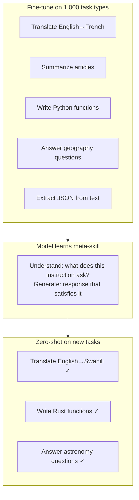

# Instruction Tuning

## Prerequisites

- [Lesson 06: Fine-tuning Techniques](./06-fine-tuning.md) — LoRA, QLoRA, Trainer API
- [Lesson 03: Pre-training Strategies](./03-pretraining-strategies.md) — CLM objective

## What You'll Learn

A pre-trained LLM completes text. An instruction-tuned LLM *follows instructions*. This lesson explains the data, loss masking, and multi-task training that bridge those two behaviors — and why instruction-tuning generalizes to *unseen* instructions.

---

## Intuition: Why Completion ≠ Instruction Following

After pre-training, a 7B model given:

```
Input: "What is the capital of France?"
```

Might continue: `"What is the capital of Germany? What is the capital of Spain? ..."` — because the pre-training corpus is full of quiz lists.

After instruction tuning:

```
Input: "[INST] What is the capital of France? [/INST]"
Output: "The capital of France is Paris."
```

The model has learned a *format convention*: when it sees `[INST] ... [/INST]`, it should produce a helpful response to what's inside.

**Why it generalizes**: Wei et al. (2021) showed that training on thousands of diverse (instruction, response) pairs leads to emergent instruction following on novel tasks. The model learns the meta-skill of "understand instruction → produce helpful response" rather than memorizing specific QA pairs.

---

## Instruction Dataset Formats

### Alpaca Format (Single-turn)

The original Stanford Alpaca dataset used 52K GPT-4-generated instruction pairs:

```python
ALPACA_EXAMPLES = [
    {
        "instruction": "Classify the following as positive, negative, or neutral.",
        "input": "The movie was surprisingly good but quite long.",
        "output": "Positive",
    },
    {
        "instruction": "Write a Python function that reverses a string.",
        "input": "",
        "output": "def reverse_string(s: str) -> str:\n    return s[::-1]",
    },
    {
        "instruction": "Summarize the following text in one sentence.",
        "input": "The mitochondria is the powerhouse of the cell ...",
        "output": "The mitochondria generates most of the cell's energy supply.",
    },
]


def format_alpaca(example: dict) -> str:
    """Convert Alpaca example to prompt format."""
    if example.get("input"):
        return (
            f"Below is an instruction that describes a task, paired with an input.\n"
            f"Write a response that appropriately completes the request.\n\n"
            f"### Instruction:\n{example['instruction']}\n\n"
            f"### Input:\n{example['input']}\n\n"
            f"### Response:\n{example['output']}"
        )
    else:
        return (
            f"Below is an instruction that describes a task.\n"
            f"Write a response that appropriately completes the request.\n\n"
            f"### Instruction:\n{example['instruction']}\n\n"
            f"### Response:\n{example['output']}"
        )


print(format_alpaca(ALPACA_EXAMPLES[0]))
```

### ShareGPT / ChatML Format (Multi-turn)

Modern models use multi-turn conversation formats to learn context-following:

```python
SHAREGPT_EXAMPLE = {
    "conversations": [
        {"role": "system", "content": "You are a helpful coding assistant."},
        {"role": "user",   "content": "How do I sort a list in Python?"},
        {"role": "assistant", "content": "Use `sorted()` for a new list or `.sort()` in-place:\n```python\nmy_list = [3, 1, 2]\nsorted_list = sorted(my_list)  # [1, 2, 3], original unchanged\nmy_list.sort()                 # modifies in-place\n```"},
        {"role": "user",   "content": "How do I sort by a key?"},
        {"role": "assistant", "content": "Pass a `key` function:\n```python\npeople = [{'name': 'Alice', 'age': 30}, {'name': 'Bob', 'age': 25}]\nsorted(people, key=lambda p: p['age'])  # Sort by age\n```"},
    ]
}


def format_chatml(conversation: dict) -> str:
    """
    ChatML format used by OpenAI, Mistral, and many OSS models.

    <|im_start|>system
    You are helpful.<|im_end|>
    <|im_start|>user
    Question<|im_end|>
    <|im_start|>assistant
    Answer<|im_end|>
    """
    text = ""
    for turn in conversation["conversations"]:
        role    = turn["role"]
        content = turn["content"]
        text += f"<|im_start|>{role}\n{content}<|im_end|>\n"
    return text


# Llama-3 format
def format_llama3(conversation: dict) -> str:
    """<|begin_of_text|> format for LLaMA 3."""
    text = "<|begin_of_text|>"
    for turn in conversation["conversations"]:
        role    = turn["role"]
        content = turn["content"]
        text += f"<|start_header_id|>{role}<|end_header_id|>\n\n{content}<|eot_id|>"
    text += "<|start_header_id|>assistant<|end_header_id|>\n\n"
    return text
```

---

## Loss Masking: Train on Responses Only

The critical technique in instruction tuning is *masking the instruction tokens* from the loss. We only compute cross-entropy loss on the response tokens:

```python
import torch
from transformers import AutoTokenizer


def tokenize_with_masking(
    instruction: str,
    response:    str,
    tokenizer,
    max_length:  int = 512,
) -> dict:
    """
    Tokenize instruction+response with loss masking.

    Loss is computed ONLY on response tokens.
    Instruction tokens get label = -100 (ignored by CrossEntropyLoss).

    Without masking: model learns to predict both instruction and response.
    With masking: model only learns to generate the response.

    Why this matters: without masking, the model wastes capacity memorizing
    instruction formats instead of learning to generate good responses.
    """
    tokenizer.pad_token = tokenizer.eos_token

    # Format the full text
    full_text  = f"[INST] {instruction} [/INST] {response}"
    instr_text = f"[INST] {instruction} [/INST] "

    # Tokenize both (to find instruction length)
    full_enc  = tokenizer(full_text, max_length=max_length, truncation=True)
    instr_enc = tokenizer(instr_text, add_special_tokens=False)

    input_ids = full_enc["input_ids"]
    instr_len = len(instr_enc["input_ids"])

    # Labels: -100 for instruction tokens, actual token IDs for response tokens
    labels = [-100] * instr_len + input_ids[instr_len:]

    assert len(input_ids) == len(labels), "Length mismatch!"

    return {
        "input_ids":      input_ids,
        "attention_mask": full_enc["attention_mask"],
        "labels":         labels,
    }


# Demonstration
tokenizer = AutoTokenizer.from_pretrained("mistralai/Mistral-7B-Instruct-v0.2")

example = tokenize_with_masking(
    instruction="What is 2+2?",
    response    ="4",
    tokenizer   =tokenizer,
)

print("input_ids length:", len(example["input_ids"]))
print("Label -100 count (instruction):", example["labels"].count(-100))
print("Label non-(-100) count (response):", sum(1 for l in example["labels"] if l != -100))
```

---

## Multi-task Instruction Tuning

The key to generalization is **diversity** in the instruction dataset. FLAN (Wei et al., 2021) fine-tuned T5 on 60+ NLP tasks formatted as instructions, finding that more tasks → better zero-shot generalization:

```python
MULTI_TASK_DATASET = [
    # Classification
    {"instruction": "Classify the sentiment of: '{text}'", "output": "Positive / Negative / Neutral"},

    # Translation
    {"instruction": "Translate to Spanish: '{text}'",      "output": "<spanish text>"},

    # Summarization
    {"instruction": "Summarize in 3 sentences: '{text}'",  "output": "<summary>"},

    # Question answering
    {"instruction": "Answer based on the context. Context: '{context}' Question: '{question}'",
     "output": "<answer>"},

    # Code generation
    {"instruction": "Write Python code to {task}.",        "output": "```python\n...\n```"},

    # Structured extraction
    {"instruction": "Extract entities (persons, places, organizations) from: '{text}'. Return JSON.",
     "output": '{"persons": [...], "places": [...], "organizations": [...]}'},

    # Mathematical reasoning
    {"instruction": "Solve step by step: {problem}",       "output": "Step 1: ...\nStep 2: ...\nAnswer: ..."},
]


def create_task_mixture(tasks: list[dict], proportions: list[float]) -> list[dict]:
    """
    Mix multiple instruction task datasets with specified proportions.

    Mimics FLAN's multi-task approach: diverse task mixture improves
    generalization to unseen instructions.
    """
    import random

    assert abs(sum(proportions) - 1.0) < 1e-6, "Proportions must sum to 1"

    total_examples = 100_000  # target dataset size
    mixed = []

    for task_examples, proportion in zip(tasks, proportions):
        n = int(total_examples * proportion)
        # Sample with replacement if needed
        mixed.extend(random.choices(task_examples, k=n))

    random.shuffle(mixed)
    return mixed
```

### Scaling Instructions: From 52K (Alpaca) to 1M+ (Open Hermes)

```python
import json
from pathlib import Path
from datasets import load_dataset


def load_orca_dataset(max_samples: int = 50_000) -> list[dict]:
    """
    Open Orca: GPT-4/ChatGPT augmented instruction datasets.
    Significantly better than Alpaca due to richer, longer responses.
    """
    dataset = load_dataset("Open-Orca/OpenOrca", split="train")
    examples = []

    for row in dataset.select(range(max_samples)):
        examples.append({
            "system":      row.get("system_prompt", ""),
            "instruction": row["question"],
            "output":      row["response"],
        })

    return examples


def estimate_instruction_quality(dataset: list[dict]) -> dict:
    """
    Heuristics for instruction dataset quality.

    Good instruction datasets have:
    - Average response length > 100 tokens
    - Task diversity (multiple verbs: write, explain, list, summarize, translate)
    - Low duplication (< 5% exact duplicates)
    """
    response_lengths  = [len(ex["output"].split()) for ex in dataset]
    avg_response_len  = sum(response_lengths) / len(response_lengths)

    instruction_verbs = ["write", "explain", "list", "summarize", "translate", "code",
                         "classify", "analyze", "compare", "describe"]
    verb_coverage = sum(
        any(verb in ex["instruction"].lower() for verb in instruction_verbs)
        for ex in dataset
    ) / len(dataset)

    unique_instructions = len(set(ex["instruction"] for ex in dataset))
    dedup_ratio         = unique_instructions / len(dataset)

    return {
        "avg_response_words": avg_response_len,
        "task_diversity":     verb_coverage,
        "dedup_ratio":        dedup_ratio,
        "total_examples":     len(dataset),
    }
```

---

## Why Instruction Tuning Generalizes



The model learns a *shared representation* of "what it means to follow an instruction" — this transfers to novel instructions not seen during training.

---

## Evaluating Instruction-Tuned Models

```python
import openai
from typing import Any


def evaluate_instruction_following(
    model_output: str,
    rubric: list[str],
) -> dict[str, Any]:
    """
    LLM-as-judge evaluation: use GPT-4 to score model outputs.
    MT-Bench and Alpaca Eval use this approach.
    """
    rubric_text = "\n".join(f"- {r}" for r in rubric)

    prompt = f"""Rate the following response on a scale of 1-10 for each criterion:

Criteria:
{rubric_text}

Response to evaluate:
{model_output}

For each criterion, provide:
1. Score (1-10)
2. Brief justification (1-2 sentences)

Format as JSON: {{"criterion_name": {{"score": N, "justification": "..."}}}}"""

    response = openai.chat.completions.create(
        model="gpt-4o",
        messages=[{"role": "user", "content": prompt}],
        response_format={"type": "json_object"},
    )

    return json.loads(response.choices[0].message.content)


# Standard MT-Bench rubric
MT_BENCH_RUBRIC = [
    "Relevance: Does the response directly address the instruction?",
    "Accuracy: Is the information correct?",
    "Completeness: Does it cover all aspects of the instruction?",
    "Helpfulness: Is it practically useful to the user?",
    "Format: Is the format appropriate (length, structure, tone)?",
]
```

---

## Edge Cases & Misconceptions

!!! warning "Misconception: More instruction data always helps"
    Quality >> quantity. 1,000 GPT-4 generated responses can outperform 50,000 template-based responses (LIMA paper, 2023). The key is diversity and quality, not scale.

!!! warning "Sycophancy: when instruction tuning goes wrong"
    Models learn from human feedback that agreeable responses score higher, leading to sycophancy — agreeing with factually incorrect statements to please the user. RLHF (Lesson 08) partially addresses this through explicit reward modeling.

!!! note "Instruction tuning ≠ capability training"
    Instruction tuning *unlocks* capabilities learned during pre-training; it doesn't add new knowledge. A model that can't do calculus during pre-training won't learn it from instruction tuning.

!!! note "Format consistency is critical"
    If your dataset mixes `[INST]`, `<human>`, and `### Instruction:` formats without consistency, the model learns ambiguous format triggers and produces unreliable outputs. Pick one format and stick to it.

---

## Production Connection

**Serving instruction-following models**: you must use the same prompt template at inference time as during fine-tuning. Using the wrong template format (e.g., LLaMA-3 format with a Mistral-trained model) degrades output quality significantly.

**Alignment tax**: instruction tuning slightly reduces benchmark performance on academic tasks (MMLU, HellaSwag) compared to the base model, because it focuses the model on conversational formats. This is usually acceptable since conversational capability is the goal.

**System prompt injection**: always validate that user inputs can't escape the system prompt format. Prompt injection attacks use instruction-like text to override the system prompt.

---

## Data Quality and Diversity

**The LIMA finding** (Zhou et al. 2023): 1,000 carefully curated examples matched models trained on 52,000 examples (Alpaca). Quality > quantity for instruction tuning.

```python
def score_data_quality(example: dict) -> float:
    """
    Simple heuristic quality scorer for SFT examples.
    Higher score = higher quality example.
    """
    instruction = example["instruction"]
    response    = example["response"]
    score = 0.0

    # Response length check (too short or too long are suspicious)
    resp_words = len(response.split())
    if 30 <= resp_words <= 500:
        score += 1.0
    elif resp_words < 10:
        score -= 2.0  # likely low quality

    # Instruction specificity (more specific = better)
    if len(instruction.split()) > 5:
        score += 0.5

    # Penalize repetitive responses
    sentences = response.split(".")
    unique_ratio = len(set(sentences)) / max(len(sentences), 1)
    score += unique_ratio * 0.5

    # Penalize responses that just repeat the instruction
    words_in_common = set(instruction.lower().split()) & set(response.lower().split()[:20])
    if len(words_in_common) / max(len(instruction.split()), 1) > 0.7:
        score -= 1.0   # response is just repeating the instruction

    return max(0.0, score)


def filter_sft_dataset(
    examples:       list[dict],
    min_score:      float = 0.8,
    deduplicate:    bool = True,
) -> list[dict]:
    """
    Filter SFT dataset by quality score and deduplicate.
    """
    # Score
    scored = [(ex, score_data_quality(ex)) for ex in examples]
    filtered = [ex for ex, score in scored if score >= min_score]

    # Deduplicate by instruction similarity (simple: exact match)
    if deduplicate:
        seen = set()
        deduped = []
        for ex in filtered:
            key = ex["instruction"].strip().lower()[:100]
            if key not in seen:
                seen.add(key)
                deduped.append(ex)
        return deduped

    return filtered
```

### Prompt Format Comparison

Different organizations use different chat formats. Pick one and stick to it:

| Format | Used by | Separator |
|--------|---------|-----------|
| Alpaca | Stanford, LLaMA-1 | `### Instruction:` / `### Response:` |
| ChatML | OpenAI, Mistral, Qwen | `<|im_start|>user` / `<|im_end|>` |
| Llama-3 | Meta | `<|start_header_id|>user<|end_header_id|>` |
| Vicuna | LMSYS | `USER:` / `ASSISTANT:` |

**Rule**: whatever format you train with, use at inference. Mismatched formats cause quality degradation.

---

## Data Mixing and Task Proportions

How you mix tasks in your instruction dataset matters significantly:

```python
import random
import math


def compute_mixing_proportions(
    task_datasets: dict[str, list[dict]],
    strategy: str = "proportional",
) -> dict[str, float]:
    """
    Compute mixing proportions for multi-task instruction tuning.

    Strategies:
    1. proportional:    proportion ∝ dataset_size (large datasets dominate)
    2. temperature:     proportion ∝ dataset_size^(1/T), T=3 (less skewed)
    3. equal:           each task gets equal weight (1/n)
    4. custom:          manually specified proportions

    FLAN uses temperature sampling T=2; most recent work uses T=1-3.
    """
    sizes = {k: len(v) for k, v in task_datasets.items()}
    total = sum(sizes.values())

    if strategy == "proportional":
        return {k: s / total for k, s in sizes.items()}

    elif strategy == "temperature":
        T = 3.0  # temperature parameter — higher T = more uniform
        raw  = {k: s ** (1/T) for k, s in sizes.items()}
        denom = sum(raw.values())
        return {k: v / denom for k, v in raw.items()}

    elif strategy == "equal":
        n = len(task_datasets)
        return {k: 1/n for k in task_datasets}

    raise ValueError(f"Unknown strategy: {strategy}")


# Example: FLAN-style task mixture
EXAMPLE_TASKS = {
    "translation":     ["Ex1", "Ex2"] * 10000,    # 20K examples
    "summarization":   ["Ex"] * 5000,              # 5K examples
    "question_answer": ["Ex"] * 15000,             # 15K examples
    "classification":  ["Ex"] * 8000,              # 8K examples
    "code_generation": ["Ex"] * 3000,              # 3K examples
}

for strategy in ["proportional", "temperature", "equal"]:
    props = compute_mixing_proportions(EXAMPLE_TASKS, strategy)
    print(f"\n{strategy.capitalize()} mixing:")
    for task, prop in props.items():
        bar = "█" * int(prop * 50)
        print(f"  {task:20s}: {prop:.3f}  {bar}")


def sample_from_mixture(
    task_datasets:  dict[str, list[dict]],
    proportions:    dict[str, float],
    total_examples: int = 50_000,
    seed:           int = 42,
) -> list[dict]:
    """
    Sample a mixed dataset from multiple task datasets.
    Each example is tagged with its task for analysis.
    """
    random.seed(seed)
    mixed = []

    for task, prop in proportions.items():
        n = int(total_examples * prop)
        examples = task_datasets[task]

        # Sample with replacement if needed
        sampled = random.choices(examples, k=n)
        mixed.extend([{**ex, "_task": task} for ex in sampled])

    random.shuffle(mixed)
    return mixed
```

**Format templates matter**: different base models expect different prompt formats. Using the wrong format is one of the most common fine-tuning mistakes:

```python
# Mistral expects [INST] [/INST] format
def format_mistral(instruction: str, response: str) -> str:
    return f"<s>[INST] {instruction} [/INST] {response}</s>"

# LLaMA-3 expects different special tokens
def format_llama3(instruction: str, response: str, system: str = "") -> str:
    system_block = f"<|start_header_id|>system<|end_header_id|>\n\n{system}<|eot_id|>" if system else ""
    return (
        f"<|begin_of_text|>{system_block}"
        f"<|start_header_id|>user<|end_header_id|>\n\n{instruction}<|eot_id|>"
        f"<|start_header_id|>assistant<|end_header_id|>\n\n{response}<|eot_id|>"
    )

# Phi-3 expects ### tags
def format_phi3(instruction: str, response: str) -> str:
    return f"<|user|>\n{instruction}<|end|>\n<|assistant|>\n{response}<|end|>"

# Using the WRONG format at inference causes the model to output garbage
# Even if the base model understands all formats, fine-tuning on one format
# "imprints" that format as the expected conversation structure
```

---

## Key Takeaways

1. **Instruction tuning converts text completion into instruction following** by fine-tuning on diverse (instruction, response) pairs with a specific format convention.
2. **Loss masking is essential**: compute loss only on response tokens (`labels=-100` for instructions) so the model learns to *generate* responses, not memorize instruction formats.
3. **Diversity, not scale**: 1,000 high-quality, diverse examples often outperform 50,000 template-based ones (LIMA paper).
4. **Generalization comes from task diversity**: training on many task types teaches the meta-skill of "understand instruction → generate response," which transfers to unseen tasks.
5. **Format consistency matters**: pick one prompt format (ChatML, Llama-3, Alpaca) and use it throughout training and inference.

---

## Further Reading

- [FLAN paper](https://arxiv.org/abs/2109.01652) — Wei et al. 2021, original multi-task instruction tuning
- [Alpaca paper](https://crfm.stanford.edu/2023/03/13/alpaca.html) — Stanford, 52K GPT-4 examples
- [LIMA paper](https://arxiv.org/abs/2305.11206) — Less Is More for Alignment (1,000 examples)
- [Open Hermes 2.5](https://huggingface.co/datasets/teknium/OpenHermes-2.5) — high-quality instruction dataset
- [MT-Bench](https://arxiv.org/abs/2306.05685) — Zheng et al. 2023, LLM-as-judge evaluation

---

## Next Lesson

**[Lesson 8: RLHF — Reinforcement Learning from Human Feedback](./08-rlhf.md)** — how human preferences are used to align models beyond instruction tuning.
