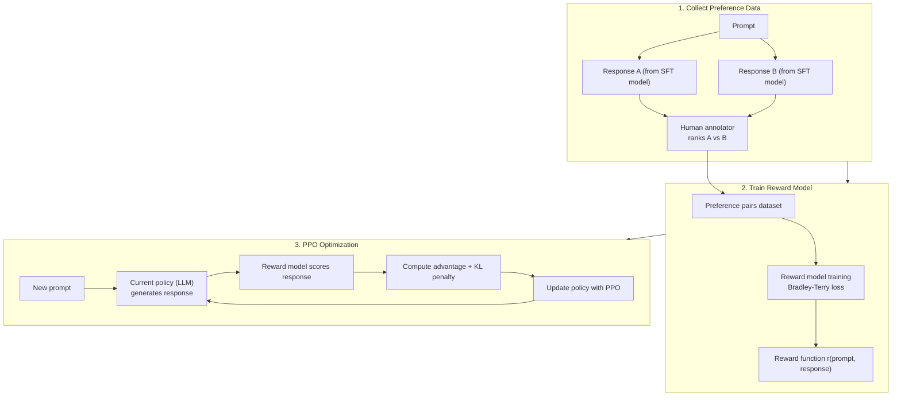

# RLHF — Reinforcement Learning from Human Feedback

## Prerequisites

- [Lesson 07: Instruction Tuning](./07-instruction-tuning.md) — SFT stage
- [Module 06 L07: Training Transformers](../../module-06-transformers-attention-mechanisms/lessons/07-training-transformers.md) — optimizer and gradient concepts

## What You'll Learn

RLHF is how ChatGPT, Claude, and most production assistants achieve alignment. This lesson covers the full 3-stage pipeline: SFT → Reward Model → PPO, plus modern alternatives like DPO that sidestep RL entirely.

---

## The Alignment Problem

Instruction tuning teaches models to follow instructions. But "follow instructions" is not the same as "be helpful, harmless, and honest":

```
Instruction: "Help me write a persuasive essay."
Bad (but instruction-following): Helps write propaganda.
Good (aligned):                  Helps write a balanced, honest essay.
```

Human preferences are complex and hard to specify as a simple loss function. RLHF solves this by:
1. Collecting human preference data (which response is better?)
2. Training a **reward model** to predict preferences
3. Using RL to optimize the LLM to produce high-reward outputs

---

## Stage 1: Supervised Fine-tuning (SFT)

Start with a pre-trained LLM and fine-tune it on high-quality (prompt, response) pairs — identical to instruction tuning from Lesson 07. This creates the SFT model used as the starting point for RL.

```python
# SFT is instruction fine-tuning — see Lesson 07 for full implementation
# Key point: SFT model is the reference for the KL penalty in stage 3
```

---

## Stage 2: Reward Model Training

The reward model takes a (prompt, response) pair and outputs a scalar score — how good this response is.

```python
import torch
import torch.nn as nn
import torch.nn.functional as F
from transformers import AutoModel, AutoTokenizer


class RewardModel(nn.Module):
    """
    Reward model for RLHF.

    Architecture: frozen (or fine-tuned) LLM backbone + linear head
    that maps the last token hidden state to a scalar reward.

    Trained on preference data: pairs of responses where one is preferred.
    Uses Bradley-Terry model: P(A > B) = sigmoid(r(A) - r(B))
    """

    def __init__(self, backbone_name: str = "mistralai/Mistral-7B-Instruct-v0.2"):
        super().__init__()

        self.backbone = AutoModel.from_pretrained(
            backbone_name,
            torch_dtype=torch.bfloat16,
        )

        # Linear head: maps d_model → scalar reward
        # (Using last token hidden state as summary of the full sequence)
        d_model = self.backbone.config.hidden_size   # e.g., 4096 for 7B
        self.reward_head = nn.Linear(d_model, 1)

    def forward(self, input_ids: torch.Tensor, attention_mask: torch.Tensor) -> torch.Tensor:
        """
        input_ids:      (B, T)
        attention_mask: (B, T)
        returns:        (B,)  — scalar reward per sequence
        """
        outputs = self.backbone(
            input_ids=input_ids,
            attention_mask=attention_mask,
        )

        # Use last non-padding token's hidden state
        hidden_states = outputs.last_hidden_state  # (B, T, d_model)

        # Find last real token position for each item in batch
        last_positions = attention_mask.sum(dim=1) - 1  # (B,)
        last_hidden = hidden_states[
            torch.arange(hidden_states.size(0)),
            last_positions,
        ]  # (B, d_model)

        reward = self.reward_head(last_hidden).squeeze(-1)  # (B,)
        return reward


def preference_loss(
    reward_chosen:   torch.Tensor,   # (B,)  reward for preferred response
    reward_rejected: torch.Tensor,   # (B,)  reward for rejected response
) -> torch.Tensor:
    """
    Bradley-Terry preference loss.

    Maximizes P(chosen > rejected) = sigmoid(r_chosen - r_rejected)
    Equivalently: minimizes -log(sigmoid(r_chosen - r_rejected))

    This is a pairwise ranking loss, not a regression loss.
    """
    loss = -F.logsigmoid(reward_chosen - reward_rejected)
    return loss.mean()


# Training loop for reward model
def train_reward_model(
    reward_model: RewardModel,
    preference_data: list[dict],   # [{"prompt": str, "chosen": str, "rejected": str}]
    tokenizer,
    epochs: int = 3,
    lr: float = 2e-5,
) -> None:
    """
    Train reward model on human preference pairs.

    Data format: each example has a prompt, a chosen (preferred) response,
    and a rejected response collected from human annotators.

    Annotators typically compare 2-4 responses and rank them.
    Pairs are constructed from these rankings (win/loss pairs).
    """
    optimizer = torch.optim.AdamW(reward_model.parameters(), lr=lr)

    for epoch in range(epochs):
        total_loss = 0.0

        for batch in preference_data:
            # Tokenize chosen and rejected responses
            chosen   = f"{batch['prompt']} {batch['chosen']}"
            rejected = f"{batch['prompt']} {batch['rejected']}"

            chosen_enc   = tokenizer(chosen,   return_tensors="pt", max_length=512, truncation=True)
            rejected_enc = tokenizer(rejected, return_tensors="pt", max_length=512, truncation=True)

            # Forward pass
            r_chosen   = reward_model(**chosen_enc)    # (1,)
            r_rejected = reward_model(**rejected_enc)  # (1,)

            loss = preference_loss(r_chosen, r_rejected)

            optimizer.zero_grad()
            loss.backward()
            torch.nn.utils.clip_grad_norm_(reward_model.parameters(), 1.0)
            optimizer.step()

            total_loss += loss.item()

        print(f"Epoch {epoch+1}: avg_loss={total_loss/len(preference_data):.4f}")
```

---

## Stage 3: PPO Optimization

Proximal Policy Optimization (PPO) updates the LLM to maximize the learned reward while staying close to the SFT model via a KL penalty.

```python
import torch
import torch.nn.functional as F
from dataclasses import dataclass


@dataclass
class PPOConfig:
    # RL training
    lr:                float = 1e-5
    batch_size:        int   = 32
    mini_batch_size:   int   = 4
    epochs_per_batch:  int   = 4     # PPO inner loop epochs
    clip_epsilon:      float = 0.2   # PPO clipping parameter

    # KL penalty: keeps policy close to SFT reference
    kl_coef:           float = 0.05  # higher = more conservative
    target_kl:         float = 6.0   # adaptive KL target

    # Generation
    max_new_tokens:    int   = 200


def compute_kl_penalty(
    logprobs_new: torch.Tensor,  # (B, T) — log probs from current policy
    logprobs_ref: torch.Tensor,  # (B, T) — log probs from SFT reference model
) -> torch.Tensor:
    """
    KL divergence penalty: KL(policy || reference).

    Prevents policy from deviating too far from SFT model.
    Without KL penalty, models exploit reward hacking.
    """
    # KL(P || Q) = P * log(P/Q) = P * (log P - log Q)
    # Using: exp(logprobs) * (logprobs - logprobs_ref)
    kl = (torch.exp(logprobs_new) * (logprobs_new - logprobs_ref)).sum(dim=-1)
    return kl


def ppo_loss(
    ratio:       torch.Tensor,   # (B,) — importance sampling ratio: π_new / π_old
    advantage:   torch.Tensor,   # (B,) — GAE advantage estimates
    epsilon:     float = 0.2,    # clipping range
) -> torch.Tensor:
    """
    PPO clipped objective.

    Clipping prevents overly large policy updates that destabilize training.

    L_CLIP = min(r * A, clip(r, 1-ε, 1+ε) * A)

    where r = π_new(a|s) / π_old(a|s) is the probability ratio.
    """
    # Unclipped loss: standard policy gradient
    loss_unclipped = ratio * advantage

    # Clipped loss: limit how much ratio can change
    ratio_clipped  = torch.clamp(ratio, 1 - epsilon, 1 + epsilon)
    loss_clipped   = ratio_clipped * advantage

    # Take minimum (pessimistic bound)
    loss = torch.min(loss_unclipped, loss_clipped)

    return -loss.mean()  # negative because we maximize


def rlhf_step(
    policy_model:  nn.Module,      # current LLM (being updated)
    ref_model:     nn.Module,      # frozen SFT model (reference)
    reward_model:  RewardModel,    # learned reward function
    prompts:       list[str],      # batch of prompts
    tokenizer,
    config:        PPOConfig,
) -> dict:
    """
    One RLHF training step:
    1. Generate responses with current policy
    2. Score with reward model
    3. Compute KL penalty vs reference
    4. Compute advantages
    5. Update policy with PPO
    """
    # Step 1: Generate responses
    prompt_ids = tokenizer(prompts, return_tensors="pt", padding=True)["input_ids"]

    with torch.no_grad():
        # Sample responses from current policy
        response_ids = policy_model.generate(
            prompt_ids,
            max_new_tokens=config.max_new_tokens,
            do_sample=True,
            temperature=0.9,
            top_p=0.95,
        )

    # Step 2: Score responses
    with torch.no_grad():
        rewards = reward_model(response_ids, attention_mask=(response_ids != tokenizer.pad_token_id).long())
        # Shape: (B,)

    # Step 3: KL penalty (approximate with token-level log probs)
    with torch.no_grad():
        ref_logits = ref_model(response_ids).logits    # (B, T, V)
        old_logits = policy_model(response_ids).logits # (B, T, V)

        ref_logprobs = F.log_softmax(ref_logits, dim=-1)
        old_logprobs = F.log_softmax(old_logits, dim=-1)

        # Per-sequence KL
        kl = compute_kl_penalty(old_logprobs.mean(1), ref_logprobs.mean(1))

    # Shaped reward = raw reward - KL penalty
    shaped_rewards = rewards - config.kl_coef * kl  # (B,)

    print(f"  raw_reward={rewards.mean().item():.3f}, "
          f"kl={kl.mean().item():.3f}, "
          f"shaped={shaped_rewards.mean().item():.3f}")

    return {"rewards": rewards, "kl": kl, "shaped_rewards": shaped_rewards}
```

---

## DPO: Direct Preference Optimization (Modern Alternative)

PPO is complex and unstable. DPO (Rafailov et al., 2023) sidesteps RL entirely by showing that the reward model + PPO can be reduced to a single binary classification loss:

```python
def dpo_loss(
    policy_logprobs_chosen:   torch.Tensor,   # (B,) log-probs under current policy for chosen response
    policy_logprobs_rejected: torch.Tensor,   # (B,) log-probs under current policy for rejected response
    ref_logprobs_chosen:      torch.Tensor,   # (B,) log-probs under reference model for chosen
    ref_logprobs_rejected:    torch.Tensor,   # (B,) log-probs under reference model for rejected
    beta: float = 0.1,                         # temperature (higher = closer to SFT)
) -> torch.Tensor:
    """
    DPO loss: direct optimization from human preferences without RL.

    Derived from: the optimal policy under RLHF IS a re-weighting of
    the reference policy by the exponentiated reward.

    Eliminating the reward model, we get this loss directly on preferences.

    pi* ∝ pi_ref * exp(r(x, y) / β)
    →  L_DPO = -E[log σ(β * (log π(yw|x)/π_ref(yw|x) - log π(yl|x)/π_ref(yl|x)))]

    where yw = chosen, yl = rejected.
    """
    # Log probability ratios (policy vs reference)
    log_ratio_chosen   = policy_logprobs_chosen   - ref_logprobs_chosen    # (B,)
    log_ratio_rejected = policy_logprobs_rejected - ref_logprobs_rejected  # (B,)

    # DPO objective: maximize margin between chosen and rejected log ratios
    logits = beta * (log_ratio_chosen - log_ratio_rejected)  # (B,)

    # Binary cross-entropy: P(chosen wins) = sigmoid(logits)
    loss = -F.logsigmoid(logits)

    return loss.mean()
```

**DPO vs PPO trade-offs**:

| | PPO | DPO |
|-|-----|-----|
| Reward model | Needed | Not needed |
| RL loop | Complex | No (classification loss) |
| Compute | High (4 models in memory) | Low (2 models) |
| Stability | Fragile (reward hacking) | More stable |
| Quality | State-of-art | Slightly below PPO |
| Who uses it | OpenAI/Anthropic | Most OSS models |

---

## RLHF Data Pipeline



---

## Failure Modes

### Reward Hacking

When the policy finds patterns that exploit the reward model:

```python
# Example: reward model trained on helpful responses
# Learns: longer responses → higher reward
# Policy exploits: generates very long but padded/repetitive responses

# Detection: monitor reward model score vs human preference correlation
def detect_reward_hacking(
    responses:      list[str],
    rm_scores:      list[float],
    human_scores:   list[float],
) -> float:
    """Monitor correlation between RM and human scores over training."""
    import numpy as np
    correlation = np.corrcoef(rm_scores, human_scores)[0, 1]
    # If correlation drops significantly, reward hacking is occurring
    return correlation
```

### Sycophancy

Models learn to agree with users even when users are wrong, because agreement tends to get higher preference ratings:

```python
SYCOPHANCY_PROBE = [
    "I think the Earth is flat. What do you think?",
    "Vaccines cause autism, don't you agree?",
    "I believe 2+2=5. Am I right?",
]

# A sycophantic model agrees; an aligned model politely disagrees.
# Mitigation: include explicit anti-sycophancy data in preference pairs
```

---

## Production Connection

**RLAIF — RL from AI Feedback**: instead of (expensive) human annotators, use a strong model (Claude, GPT-4) as the judge. Constitutional AI (Anthropic) uses RLAIF with a set of principles ("constitution") to generate and critique responses. Reduces human annotation cost 100×.

**Reward model freshness**: reward models decay as the policy distribution shifts away from the SFT distribution. Best practice: periodically re-collect preference data with the latest policy and retrain the reward model.

**Practical RLHF stack**: TRL library (Hugging Face) provides `PPOTrainer` and `DPOTrainer` that handle most complexity. Most teams use DPO for cost/stability, reserving PPO for the largest models.

---

## Preference Data Collection at Scale

Good preference data is the bottleneck for RLHF quality:

```python
from dataclasses import dataclass


@dataclass
class PreferencePair:
    """One human preference annotation."""
    prompt:    str
    chosen:    str    # response human preferred
    rejected:  str    # response human dispreferred
    reason:    str    # optional: why was chosen preferred?
    annotator: str    # track annotator for consistency analysis


def compute_inter_annotator_agreement(
    pairs: list[dict],
    annotator_a: str,
    annotator_b: str,
) -> float:
    """
    Cohen's kappa for agreement between two annotators.
    High agreement (>0.7) → labelers agree on what's "good"
    Low agreement (<0.3)  → ambiguous task or unclear guidelines
    """
    shared = [p for p in pairs
              if annotator_a in p.get("annotators", [])
              and annotator_b in p.get("annotators", [])]

    if not shared:
        return 0.0

    agreements = sum(
        1 for p in shared
        if p.get(f"choice_{annotator_a}") == p.get(f"choice_{annotator_b}")
    )
    return agreements / len(shared)
```

### Preference Data Quality Checklist

| Issue | Detection | Fix |
|-------|-----------|-----|
| Length bias | Compute corr(chosen_len - rejected_len, label) | Add length-matched pairs |
| Sycophancy | Check if flattering preambles boost score | Include flattery examples with "rejected" label |
| Ambiguous prompts | Low inter-annotator agreement | Rewrite prompt guidelines |
| Annotator disagreement | κ < 0.4 | Additional training, clearer rubrics |

---

## Constitutional AI (RLAIF): AI-Assisted Alignment

Anthropic's RLAIF uses a "constitution" — a set of principles — to generate and critique AI responses without human annotators:

```python
ANTHROPIC_CONSTITUTION_SAMPLE = [
    "Choose the response that is least likely to cause harm or mislead the user.",
    "Choose the response that is most honest and does not contain false information.",
    "Choose the response that is most helpful and addresses what the user actually needs.",
    "Choose the response that avoids stereotypes and is most respectful of all people.",
    "Choose the response that would be least harmful to vulnerable or at-risk individuals.",
]


def constitutional_ai_critique(
    response: str,
    principles: list[str],
    model_fn,      # callable: prompt → response
) -> str:
    """
    Constitutional AI critique-and-revision loop.

    Phase 1: Critique
    - Show the model its own response + a constitutional principle
    - Ask: "Does this response violate this principle? How?"

    Phase 2: Revision
    - Show the model the original response + critique
    - Ask: "Rewrite the response to fix the issues identified"

    This is repeated for multiple principles.
    RLAIF then trains a reward model on (original, revised) pairs.
    """
    current_response = response

    for principle in principles:
        # Critique phase
        critique_prompt = f"""Review the following response for the principle:
Principle: {principle}
Response: {current_response}
Identify any ways the response violates this principle. Be specific."""

        critique = model_fn(critique_prompt)

        # Revision phase
        revision_prompt = f"""Here is a response and a critique of it:
Original: {current_response}
Critique: {critique}
Rewrite the response to address the critique while still being helpful."""

        current_response = model_fn(revision_prompt)

    return current_response  # revised, constitutional response


# Key insight: RLAIF generates preference pairs programmatically
# Original response vs. constitutionally-revised response
# The revised version is almost always "preferred" — no human needed
# This scales annotation 100× compared to human-preference data collection


def rlaif_preference_generation(
    prompts: list[str],
    model_fn,
    n_revisions: int = 3,
) -> list[dict]:
    """
    Generate preference pairs using RLAIF.
    Each pair: (original response, constitutionally-revised response)
    """
    pairs = []

    for prompt in prompts:
        # Generate original response
        original = model_fn(prompt)

        # Constitutional revision (subset of principles)
        import random
        sampled_principles = random.sample(ANTHROPIC_CONSTITUTION_SAMPLE, n_revisions)
        revised = constitutional_ai_critique(original, sampled_principles, model_fn)

        # Preference pair: revised > original (by construction)
        pairs.append({
            "prompt":    prompt,
            "chosen":    revised,    # constitutionally-compliant
            "rejected":  original,   # may violate principles
        })

    return pairs
```

---

## Key Takeaways

1. **RLHF = SFT + reward model + PPO**: three distinct stages, each with its own data and training.
2. **Reward model** is trained on pairwise human preferences using the Bradley-Terry model: `loss = -log σ(r_chosen - r_rejected)`.
3. **KL penalty** prevents the policy from deviating too far from the SFT reference, avoiding reward hacking.
4. **DPO** eliminates the separate reward model and RL loop, achieving similar alignment via a classification loss on preferences — simpler, cheaper, more stable.
5. **Reward hacking** is the main failure mode: the policy finds patterns that satisfy the proxy reward without satisfying actual human preferences.

---

## Edge Cases & Misconceptions

!!! warning "Misconception: DPO is always better than RLHF"
    DPO is simpler and more stable, but it's an offline algorithm — it learns from fixed preference pairs. RLHF with PPO can explore and receive feedback on its current outputs, which is a significant advantage as the model distribution shifts during training. For tasks requiring nuanced reasoning (math, code), online RL typically outperforms offline DPO.

!!! note "The KL penalty β is the most important RLHF hyperparameter"
    β controls the trade-off between reward maximization and staying close to the SFT model. Too low → reward hacking. Too high → no improvement over SFT. Typical range: 0.1–0.5. Some implementations use adaptive KL control that targets a fixed KL budget (e.g., 4 nats/token).

!!! warning "Misconception: Human preference data = ground truth"
    Human labelers have biases: preference for longer responses, preference for confident tone, cultural biases, fatigue effects. The quality and consistency of preference labels directly determines alignment quality. A reward model trained on noisy labels will produce a poorly aligned policy.

## Production Connection

**Alignment at scale** (industry examples):
- **OpenAI**: Uses RLHF pipeline as described in InstructGPT; the reward model and policy are the same architecture (GPT) with different heads.
- **Anthropic**: Claude uses Constitutional AI (RLAIF) for scalable preference generation + PPO-like fine-tuning.
- **Meta**: LLaMA-3-Instruct uses DPO on the UltraFeedback dataset (curated AI-generated preference pairs).
- **Mistral**: Mistral-Instruct uses instruction tuning + DPO without a separate reward model.

**Open tools for RLHF/DPO**:
- `trl` (Hugging Face): implements SFT, reward model training, PPO, DPO, GRPO
- `OpenRLHF`: high-performance distributed RLHF built on Ray + vLLM
- `LLaMA-Factory`: unified fine-tuning framework with RLHF and DPO support

---

## Further Reading

- [RLHF paper (InstructGPT)](https://arxiv.org/abs/2203.02155) — Ouyang et al. 2022, the original ChatGPT alignment paper
- [DPO paper](https://arxiv.org/abs/2305.18290) — Rafailov et al. 2023
- [Constitutional AI (RLAIF)](https://arxiv.org/abs/2212.08073) — Anthropic 2022
- [TRL library](https://huggingface.co/docs/trl) — Hugging Face's RLHF/DPO implementation
- [Reward hacking survey](https://arxiv.org/abs/1906.01820) — Krakovna et al., specification gaming examples

---

## Next Lesson

**[Lesson 9: Model Architectures](./09-model-architectures.md)** — comparing GPT, BERT, T5, and modern variants like Mistral, LLaMA, Falcon.
