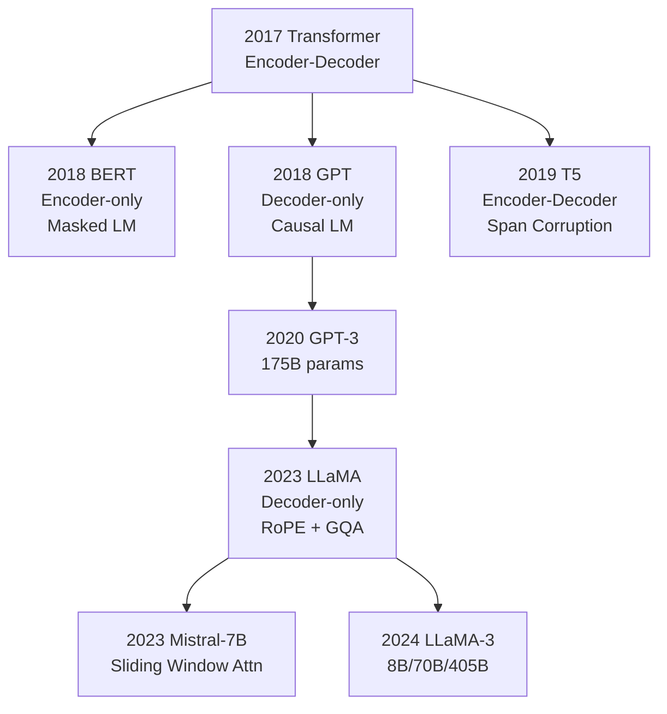

# LLM Model Architectures

## Prerequisites

- [Module 06: Transformers](../../module-06-transformers-attention-mechanisms/lessons/05-transformer-architecture.md) — full Transformer architecture
- [Lesson 02: Transformers to LLMs](./02-transformers-to-llms.md) — evolution from research to production

## What You'll Learn

The "LLM" label covers architectures with very different structures and trade-offs. This lesson traces the evolution from the original 2017 Transformer to today's Mistral, LLaMA-3, and Gemma, focusing on the key innovations that make modern models faster and more capable.

---

## Three Architecture Families



| Architecture | Attention | Best for | Examples |
|---|---|---|---|
| Encoder-only | Bidirectional | Classification, NER, embeddings | BERT, RoBERTa |
| Decoder-only | Causal (unidirectional) | Text generation, chat | GPT, LLaMA, Mistral |
| Encoder-decoder | Cross-attention | Seq2seq: translation, summarization | T5, BART, Flan-T5 |

**Why decoder-only won**: causal attention enables efficient autoregressive generation and scales better with compute. KV cache only works efficiently for causal models.

---

## Original GPT-2 Architecture

```python
import torch
import torch.nn as nn
import torch.nn.functional as F
from dataclasses import dataclass, field


@dataclass
class GPT2Config:
    vocab_size:    int   = 50_257
    max_seq_len:   int   = 1_024
    d_model:       int   = 768      # GPT-2 small
    n_heads:       int   = 12
    n_layers:      int   = 12
    d_ff:          int   = 3_072    # 4 × d_model
    dropout:       float = 0.1
    bias:          bool  = True


class GPT2Block(nn.Module):
    """
    Standard Transformer decoder block (GPT-2 style).

    Pre-LayerNorm (different from original Transformer which uses post-LayerNorm).
    This is now standard: more stable training at scale.
    """

    def __init__(self, config: GPT2Config):
        super().__init__()

        self.ln_1 = nn.LayerNorm(config.d_model)  # pre-attention norm
        self.attn = nn.MultiheadAttention(
            embed_dim=config.d_model,
            num_heads=config.n_heads,
            dropout=config.dropout,
            batch_first=True,
        )
        self.ln_2 = nn.LayerNorm(config.d_model)  # pre-FFN norm

        # FFN: expand 4× then contract
        self.ffn = nn.Sequential(
            nn.Linear(config.d_model, config.d_ff),
            nn.GELU(),                              # GPT-2 uses GELU, not ReLU
            nn.Linear(config.d_ff, config.d_model),
            nn.Dropout(config.dropout),
        )

    def forward(self, x: torch.Tensor, causal_mask: torch.Tensor) -> torch.Tensor:
        """
        x:           (B, T, d_model)
        causal_mask: (T, T) — upper triangular, True means "attend"
        returns:     (B, T, d_model)

        Pre-LN: x → norm → attention → residual → norm → FFN → residual
        """
        # Self-attention with residual
        norm_x = self.ln_1(x)
        attn_out, _ = self.attn(norm_x, norm_x, norm_x, attn_mask=causal_mask)
        x = x + attn_out

        # FFN with residual
        x = x + self.ffn(self.ln_2(x))

        return x
```

---

## Innovations in LLaMA and Mistral

Modern models (LLaMA, Mistral, Gemma) differ from GPT-2 in four key ways:

| Innovation | GPT-2 | LLaMA/Mistral | Benefit |
|---|---|---|---|
| Position embeddings | Learned absolute | RoPE (rotary) | Better length extrapolation |
| Normalization | LayerNorm | RMSNorm | Faster (no mean computation) |
| FFN activation | GELU | SiLU/SwiGLU | Better gradient flow |
| KV Heads | Multi-head (n_heads KV) | GQA (fewer KV heads) | Lower KV cache memory |

### 1. RMSNorm (Root Mean Square Normalization)

```python
class RMSNorm(nn.Module):
    """
    RMSNorm: simpler and faster than LayerNorm.

    LayerNorm: normalize by mean AND std → subtract mean, divide by std
    RMSNorm:   normalize by RMS ONLY → divide by root mean square

    Removes mean-subtraction, which empirically doesn't hurt quality.
    ~10% faster than LayerNorm.

    Formula: x / RMS(x) * γ
    where RMS(x) = sqrt(mean(x²) + ε)
    """

    def __init__(self, d_model: int, eps: float = 1e-6):
        super().__init__()
        self.eps = eps
        self.gamma = nn.Parameter(torch.ones(d_model))  # learnable scale

    def forward(self, x: torch.Tensor) -> torch.Tensor:
        """
        x:       (B, T, d_model)
        returns: (B, T, d_model)
        """
        # RMS: root mean square across d_model dimension
        rms = torch.sqrt(x.pow(2).mean(dim=-1, keepdim=True) + self.eps)  # (B, T, 1)
        x_norm = x / rms                                                    # (B, T, d_model)
        return self.gamma * x_norm                                          # (B, T, d_model)
```

### 2. SwiGLU Activation (Feedforward)

```python
class SwiGLU(nn.Module):
    """
    SwiGLU: Swish-Gated Linear Unit.
    Used by LLaMA, PaLM, Gemma instead of standard GELU FFN.

    Standard FFN:   x → W1 → GELU → W2
    SwiGLU FFN:     x → (W1 → SiLU) ⊙ (Wg) → W2

    The gate (Wg) learns to suppress unimportant features.
    Uses 2/3 × 4 × d_model hidden dim (so parameter count stays similar).
    """

    def __init__(self, d_model: int, d_ff: int = None):
        super().__init__()
        if d_ff is None:
            # LLaMA heuristic: 2/3 × 4 × d_model, rounded to nearest 256
            d_ff = int(2/3 * 4 * d_model)
            d_ff = ((d_ff + 255) // 256) * 256

        self.w1 = nn.Linear(d_model, d_ff, bias=False)  # gate
        self.w2 = nn.Linear(d_ff,    d_model, bias=False)  # output
        self.w3 = nn.Linear(d_model, d_ff, bias=False)  # up-projection

    def forward(self, x: torch.Tensor) -> torch.Tensor:
        """
        x:       (B, T, d_model)
        returns: (B, T, d_model)

        SwiGLU: SiLU(W1 x) ⊙ W3 x → W2
        """
        gate = F.silu(self.w1(x))   # (B, T, d_ff) — gating signal
        up   = self.w3(x)            # (B, T, d_ff) — value signal
        return self.w2(gate * up)    # (B, T, d_model)
```

### 3. Rotary Position Embeddings (RoPE)

```python
def precompute_freqs_cis(d_model: int, max_seq_len: int, theta: float = 10_000.0):
    """
    Precompute rotary frequency matrix for RoPE.

    RoPE encodes position by rotating Q and K vectors in 2D subspaces.
    Each pair of dimensions (i, i+1) is rotated by angle θ_i * position.

    θ_i = 1 / (10000^(2i/d_model))   for i = 0, 1, ..., d_model/2

    Benefits over absolute positional embeddings:
    - Attention scores are naturally relative (dot product of rotated Q, K)
    - Can extrapolate to longer sequences than seen in training
    - No learned parameters needed
    """
    freqs = 1.0 / (theta ** (torch.arange(0, d_model, 2).float() / d_model))
    # freqs shape: (d_model/2,)

    positions = torch.arange(max_seq_len)   # (T,)
    freqs_matrix = torch.outer(positions, freqs)  # (T, d_model/2)
    freqs_cis = torch.polar(torch.ones_like(freqs_matrix), freqs_matrix)  # complex (T, d_model/2)
    return freqs_cis


def apply_rotary_emb(
    xq: torch.Tensor,   # (B, T, n_heads, head_dim)
    xk: torch.Tensor,   # (B, T, n_heads, head_dim)
    freqs_cis: torch.Tensor,  # (T, head_dim/2)
) -> tuple[torch.Tensor, torch.Tensor]:
    """
    Apply RoPE to Q and K tensors.

    Each head_dim/2 pairs of dimensions are treated as complex numbers
    and rotated by the positional frequencies.
    """
    # Reshape to complex: (B, T, n_heads, head_dim/2, 2) → complex (B, T, n_heads, head_dim/2)
    xq_complex = torch.view_as_complex(xq.float().reshape(*xq.shape[:-1], -1, 2))
    xk_complex = torch.view_as_complex(xk.float().reshape(*xk.shape[:-1], -1, 2))

    # Broadcast freqs_cis to (1, T, 1, head_dim/2)
    freqs_cis = freqs_cis.unsqueeze(0).unsqueeze(2)  # (1, T, 1, head_dim/2)

    # Multiply = rotate in complex plane = apply positional encoding
    xq_rotated = torch.view_as_real(xq_complex * freqs_cis).flatten(-2)  # (B, T, n_heads, head_dim)
    xk_rotated = torch.view_as_real(xk_complex * freqs_cis).flatten(-2)  # (B, T, n_heads, head_dim)

    return xq_rotated.type_as(xq), xk_rotated.type_as(xk)


# Verify RoPE is relative:
# Q_i · K_j depends only on (i - j), not absolute positions i and j
head_dim = 64
freqs = precompute_freqs_cis(d_model=head_dim, max_seq_len=2048)

q = torch.randn(1, 10, 1, head_dim)   # single head, 10 tokens
k = torch.randn(1, 10, 1, head_dim)

q_rot, k_rot = apply_rotary_emb(q, k, freqs[:10])
print("RoPE applied. Q shape:", q_rot.shape)  # (1, 10, 1, 64)
```

### 4. Grouped Query Attention (GQA)

GQA reduces KV cache size by having multiple query heads share the same K and V heads:

```python
class GroupedQueryAttention(nn.Module):
    """
    Grouped Query Attention (GQA) — used in LLaMA-2, Mistral, Gemma.

    Multi-Head Attention (MHA):   n_kv_heads = n_heads       (full)
    Multi-Query Attention (MQA):  n_kv_heads = 1             (maximum compression)
    Grouped Query Attention (GQA): 1 < n_kv_heads < n_heads  (balanced)

    Example: n_heads=32, n_kv_heads=8 → 4 query heads share 1 KV head
    KV cache reduction: 4× smaller (32→8 KV heads)

    Memory at inference (T=4096, d_model=4096, B=1):
    MHA:  2 × n_heads × T × head_dim × 2 bytes = 2 × 32 × 4096 × 128 × 2 = 67 MB
    GQA8: 2 × 8 × 4096 × 128 × 2 = 17 MB  ← 4× reduction
    """

    def __init__(
        self,
        d_model:     int,
        n_heads:     int = 32,
        n_kv_heads:  int = 8,    # GQA: fewer KV heads
        head_dim:    int = None,
    ):
        super().__init__()
        assert n_heads % n_kv_heads == 0, "n_heads must be divisible by n_kv_heads"

        self.n_heads    = n_heads
        self.n_kv_heads = n_kv_heads
        self.head_dim   = head_dim or (d_model // n_heads)
        self.n_rep      = n_heads // n_kv_heads   # how many Q heads per KV head

        # Q gets n_heads * head_dim, K/V get n_kv_heads * head_dim
        self.Wq = nn.Linear(d_model, n_heads    * self.head_dim, bias=False)
        self.Wk = nn.Linear(d_model, n_kv_heads * self.head_dim, bias=False)
        self.Wv = nn.Linear(d_model, n_kv_heads * self.head_dim, bias=False)
        self.Wo = nn.Linear(n_heads * self.head_dim, d_model,    bias=False)

        self.scale = self.head_dim ** -0.5

    def _repeat_kv(self, x: torch.Tensor) -> torch.Tensor:
        """
        Repeat K or V to match the number of Q heads.

        x shape: (B, T, n_kv_heads, head_dim)
        returns: (B, T, n_heads,    head_dim)

        Each KV head is broadcast to n_rep query heads.
        """
        B, T, n_kv, hd = x.shape
        if self.n_rep == 1:
            return x  # MHA case, no repetition needed
        # Expand and reshape: repeat each KV head n_rep times
        x = x.unsqueeze(3).expand(B, T, n_kv, self.n_rep, hd)  # (B, T, n_kv, n_rep, hd)
        return x.reshape(B, T, n_kv * self.n_rep, hd)            # (B, T, n_heads, hd)

    def forward(
        self,
        x:     torch.Tensor,   # (B, T, d_model)
        mask:  torch.Tensor = None,
    ) -> torch.Tensor:
        B, T, _ = x.shape

        # Project to Q, K, V
        Q = self.Wq(x).view(B, T, self.n_heads,    self.head_dim)   # (B, T, n_heads, hd)
        K = self.Wk(x).view(B, T, self.n_kv_heads, self.head_dim)   # (B, T, n_kv,   hd)
        V = self.Wv(x).view(B, T, self.n_kv_heads, self.head_dim)   # (B, T, n_kv,   hd)

        # Expand K, V to match n_heads
        K = self._repeat_kv(K)  # (B, T, n_heads, hd)
        V = self._repeat_kv(V)  # (B, T, n_heads, hd)

        # Attention — transpose for (B, n_heads, T, hd)
        Q = Q.transpose(1, 2)   # (B, n_heads, T, hd)
        K = K.transpose(1, 2)
        V = V.transpose(1, 2)

        scores = (Q @ K.transpose(-2, -1)) * self.scale  # (B, n_heads, T, T)

        if mask is not None:
            scores = scores + mask  # causal mask (add -inf to future positions)

        attn = F.softmax(scores, dim=-1)
        out  = attn @ V                                   # (B, n_heads, T, hd)

        # Merge heads and project
        out = out.transpose(1, 2).reshape(B, T, -1)      # (B, T, n_heads*hd)
        return self.Wo(out)                               # (B, T, d_model)


# KV cache size comparison
def kv_cache_size_mb(
    n_kv_heads: int,
    T: int,
    head_dim: int,
    n_layers: int,
    dtype_bytes: int = 2,  # BF16
) -> float:
    """KV cache memory in MB for a given sequence length."""
    kv_elements = 2 * n_kv_heads * T * head_dim * n_layers
    return kv_elements * dtype_bytes / 1e6


T = 4096
print("LLaMA-2-7B KV cache @ T=4096:")
print(f"  MHA (32 heads): {kv_cache_size_mb(32, T, 128, 32):.1f} MB")
print(f"  GQA (8 heads):  {kv_cache_size_mb(8,  T, 128, 32):.1f} MB  (4× reduction)")
```

---

## Model Comparison Table

| Model | Params | Heads (Q/KV) | Context | Position | FFN | Notes |
|---|---|---|---|---|---|---|
| GPT-2 | 1.5B | 25/25 (MHA) | 1K | Absolute | GELU | 2019 baseline |
| LLaMA-1 | 7B–65B | 32/32 (MHA) | 2K | RoPE | SwiGLU | First open model |
| LLaMA-2 | 7B–70B | 32/8 (GQA) | 4K | RoPE | SwiGLU | Added GQA |
| Mistral-7B | 7B | 32/8 (GQA) | 32K | RoPE | SwiGLU | Sliding window attn |
| LLaMA-3-8B | 8B | 32/8 (GQA) | 8K | RoPE | SwiGLU | 128K vocab |
| LLaMA-3-70B | 70B | 64/8 (GQA) | 8K | RoPE | SwiGLU | Best open 70B |
| Gemma-7B | 8.5B | 16/1 (MQA) | 8K | RoPE | GeGLU | Google |
| Phi-3-mini | 3.8B | 32/32 (MHA) | 128K | RoPE | SwiGLU | Efficient small |

---

## Edge Cases & Misconceptions

!!! warning "Misconception: More parameters always means better"
    Mistral-7B outperforms LLaMA-2-13B on many benchmarks despite being 1.9× smaller. Architecture quality, training data, and compute efficiency matter more than raw parameter count.

!!! note "Sliding Window Attention (Mistral)"
    Mistral uses sliding window attention: each token attends to at most W previous tokens (default W=4096). For sequences shorter than W, this is identical to standard attention. For long sequences, it enables linear rather than quadratic memory scaling. Rolling K/V cache allows extending to arbitrary sequence lengths.

!!! warning "RoPE theta and long context"
    LLaMA models trained with theta=10000 struggle to extrapolate beyond 2× training length. LongRoPE, YaRN, and LLaMA-3.1 extend context by adjusting theta (from 10K to 500K+). This is critical for applications with very long documents.

---

## Production Connection

**Serving latency**: KV cache size is often the bottleneck, not compute. GQA models (like Mistral, LLaMA-3) serve 4× longer sequences for the same GPU memory budget as MHA models, which directly translates to serving more concurrent requests.

**Model selection heuristics**:
- Task is simple (classification, extraction): fine-tune a smaller model (3B–7B)
- Task requires reasoning: use 70B+ or frontier model via API
- Need long context (>10K): use Mistral-7B, LLaMA-3.1, or Claude
- Need fast inference (<100ms): use quantized 7B or smaller

**Quantization**: INT8 loses ~0.5% quality vs BF16; INT4 loses ~2–3%. GPTQ and AWQ are the standard post-training quantization methods. A quantized 7B runs on 8GB VRAM; a quantized 70B needs ~40GB.

---

## Building Blocks: Side-by-Side Code Comparison

How GPT-2 and LLaMA differ at the code level:

```python
import torch
import torch.nn as nn


# GPT-2 style block
class GPT2Block(nn.Module):
    """Standard Transformer decoder block."""
    def __init__(self, d_model=768, n_heads=12):
        super().__init__()
        self.ln_1  = nn.LayerNorm(d_model)          # standard LayerNorm
        self.attn  = nn.MultiheadAttention(d_model, n_heads, batch_first=True)
        self.ln_2  = nn.LayerNorm(d_model)
        self.mlp   = nn.Sequential(
            nn.Linear(d_model, 4 * d_model),
            nn.GELU(),                               # GELU activation
            nn.Linear(4 * d_model, d_model),
        )

    def forward(self, x, mask=None):
        # MHA with pre-LN
        x = x + self.attn(self.ln_1(x), self.ln_1(x), self.ln_1(x), attn_mask=mask)[0]
        x = x + self.mlp(self.ln_2(x))
        return x


# LLaMA-3 style block
class RMSNorm(nn.Module):
    def __init__(self, d, eps=1e-6):
        super().__init__()
        self.gamma = nn.Parameter(torch.ones(d))
        self.eps   = eps
    def forward(self, x):
        return self.gamma * x / (x.pow(2).mean(-1, keepdim=True) + self.eps).sqrt()


class SwiGLU(nn.Module):
    def __init__(self, d_model, d_ff):
        super().__init__()
        self.w1 = nn.Linear(d_model, d_ff, bias=False)
        self.w2 = nn.Linear(d_ff,    d_model, bias=False)
        self.w3 = nn.Linear(d_model, d_ff, bias=False)
    def forward(self, x):
        return self.w2(torch.nn.functional.silu(self.w1(x)) * self.w3(x))


class LLaMABlock(nn.Module):
    """LLaMA-3 style block — 4 key differences from GPT-2."""
    def __init__(self, d_model=4096, n_heads=32, n_kv_heads=8):
        super().__init__()
        self.norm1 = RMSNorm(d_model)               # RMSNorm instead of LayerNorm
        # GQA instead of MHA (fewer KV heads)
        self.attn  = nn.MultiheadAttention(
            d_model, n_heads, batch_first=True,
            kdim=d_model // (n_heads // n_kv_heads),  # simplified; real GQA is custom
            vdim=d_model // (n_heads // n_kv_heads),
        )
        self.norm2 = RMSNorm(d_model)
        d_ff = int(2/3 * 4 * d_model)
        d_ff = ((d_ff + 255) // 256) * 256          # round to nearest 256
        self.mlp   = SwiGLU(d_model, d_ff)           # SwiGLU instead of GELU

    def forward(self, x, mask=None):
        # RoPE would be applied to Q, K here (omitted for brevity)
        x = x + self.attn(self.norm1(x), self.norm1(x), self.norm1(x))[0]
        x = x + self.mlp(self.norm2(x))
        return x


# Parameter comparison
def count_params(model):
    return sum(p.numel() for p in model.parameters())

gpt2 = GPT2Block(768, 12)
print(f"GPT-2 block params:  {count_params(gpt2)/1e6:.2f}M")

llama = LLaMABlock(4096, 32, 8)
print(f"LLaMA block params:  {count_params(llama)/1e6:.2f}M")
```

---

## Key Takeaways

1. **Decoder-only architectures** (GPT, LLaMA, Mistral) dominate generative LLMs due to efficient causal attention and KV cache.
2. **RMSNorm** replaces LayerNorm in modern models: faster (no mean computation) with equivalent empirical quality.
3. **RoPE** encodes positions by rotating Q and K vectors, enabling better length extrapolation than absolute positional embeddings.
4. **GQA** reduces KV cache by 4–8× by having multiple query heads share K/V heads — enabling longer contexts on the same hardware.
5. **SwiGLU** FFN with 2/3× 4× hidden dimension achieves better gradient flow than GELU with standard 4× dimension.

---

## Edge Cases & Misconceptions

!!! warning "Misconception: Bigger models always need GQA"
    GQA reduces KV cache memory, which matters most when serving many users concurrently or using very long contexts. For research experiments with short sequences, MHA (standard multi-head attention) is fine. GQA is an inference-time optimization, not a training-time one.

!!! note "Why BERT's context length is 512"
    BERT uses absolute learned positional embeddings — each position 0..511 gets a learnable vector. Inputs longer than 512 have no trained position embedding, causing poor performance. Modern models use relative positional encodings (RoPE, ALiBi) which can extrapolate beyond training length.

!!! warning "Misconception: The original BERT is still competitive"
    BERT (2018) has been surpassed by DeBERTa-v3, ELECTRA, and others on most benchmarks. For production classification and NER, use DeBERTa-v3-base or DeBERTa-v3-large — same architecture, better pre-training objective and data.

## Production Connection

**Choosing between architectures in 2024/2025**:

| Use case | Recommended model | Why |
|----------|------------------|-----|
| REST API (simple tasks) | GPT-4o-mini or Claude Haiku | Cheap, fast, reliable |
| On-prem inference | LLaMA-3-8B or Mistral-7B | Open weights, VRAM-efficient |
| Long documents (100K+) | Claude-3.5-Sonnet or Gemini 1.5 Pro | Highest context windows |
| Code generation | Qwen2.5-Coder-7B (local) or GPT-4o | Best at code |
| Classification/NER | DeBERTa-v3-large | 10× faster, 100× cheaper |
| Embeddings | text-embedding-3-small or bge-m3 | Semantic search, RAG |

---

## Further Reading

- [LLaMA-2 paper](https://arxiv.org/abs/2307.09288) — Touvron et al. 2023
- [Mistral-7B paper](https://arxiv.org/abs/2310.06825) — Jiang et al. 2023
- [GQA paper](https://arxiv.org/abs/2305.13245) — Ainslie et al. 2023
- [RoPE paper](https://arxiv.org/abs/2104.09864) — Su et al. 2021
- [RMSNorm paper](https://arxiv.org/abs/1910.07467) — Zhang & Sennrich 2019

---

## Next Lesson

**[Lesson 10: Working with LLM APIs](./10-working-with-apis.md)** — calling OpenAI, Anthropic, and local models efficiently in production.
