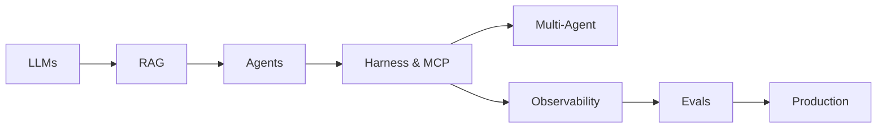

# AI Engineering Handbook

Your **free, open-source** path from transformers and LLMs to production-grade RAG, agentic AI, harnesses, tools, orchestration, evals, and observability.

  16 courses
  140+ lessons
  2 optional tracks
  MIT license

!!! tip "New here?"
    Go to **[Start Here](start-here.md)** — one page to pick your path, prerequisites, and first project.

---

## Who is this for?

  

    
New to AI

    
Software engineer or student starting from scratch

    <a class="persona-card__cta" href="start-here.md"><strong>Start Here →</strong></a>
  

  

    
Know ML, need LLMs

    
ML practitioner catching up on transformers and APIs

    <a class="persona-card__cta" href="learn/index.md"><strong>Jump to Learn →</strong></a>
  

  

    
Building agents

    
Engineer shipping autonomous AI systems

    <a class="persona-card__cta" href="agent-engineering/index.md"><strong>Agent Engineering →</strong></a>
  

  

    
Using Claude Code / Cursor

    
Skills, loops, and context for IDE agents

    <a class="persona-card__cta" href="ai-engineering-2026/index.md"><strong>Modern AI (2026) →</strong></a>
  

  

    
Shipping to production

    
Need LLMOps, evals, monitoring, safety

    <a class="persona-card__cta" href="production/module-10-llmops-production-systems/index.md"><strong>Course 12 · LLMOps →</strong></a>
  

---

## How to navigate

  <a class="quick-nav__item" href="start-here.md">Start Here</a>
  <a class="quick-nav__item" href="learn/index.md">Learn</a>
  <a class="quick-nav__item" href="learn/study-plans.md">Study Plans</a>
  <a class="quick-nav__item" href="projects/build-these.md">Build These</a>
  <a class="quick-nav__item" href="topic-map.md">Topic Map</a>
  <a class="quick-nav__item" href="faq.md">FAQ</a>
  <a class="quick-nav__item" href="getting-started.md">Setup</a>

| Goal | Go to |
|------|-------|
| **Follow the curriculum** | **[Learn](learn/index.md)** — 16 courses in order, lessons inside each course |
| **New here** | [Start Here](start-here.md) — persona routing and first project |
| **Week-by-week schedule** | [Study Plans](learn/study-plans.md) |
| **Build something** | [Build These First](projects/build-these.md) — 10 portfolio projects |
| **Find a topic** | [Topic Map](topic-map.md) — concept → course lookup |
| **Questions / stuck** | [FAQ](faq.md) |
| **Optional agent track** | [Agent Engineering](agent-engineering/index.md) — concise 7-lesson path |
| **IDE agent skills** | [Modern AI (2026)](ai-engineering-2026/index.md) |

---

## The learning path (overview)

Work through courses **01 → 16** in the **Learn** tab. Each course opens with a lesson list.

| Part | Courses | Topics |
|------|---------|--------|
| **Understand AI** | 01–05 | NLP → neural nets → transformers → LLMs |
| **Build applications** | 06–11 | RAG, agents, harness, multi-agent, vector DBs, prompts |
| **Production** | 12–14 | LLMOps, evals, safety |
| **Advanced** | 15–16 | Fine-tuning, capstone projects |

Optional focused tracks at the bottom of **Learn**: [Agent Engineering](agent-engineering/index.md) · [Modern AI (2026)](ai-engineering-2026/index.md)

[Full course list →](learn/index.md)

---

## The agentic stack

---

## Resources & practice

- [Essential Papers](resources/essential-papers.md) · [Essential Videos](resources/essential-videos.md)
- [Open Source Hubs](resources/open-source-hubs.md) — Agents Towards Production, Awesome Evals, RAG Techniques
- [Exercises](exercises/index.md) · [Build These First](projects/build-these.md) · [FAQ](faq.md)

---

## Contribute

Help make this the best free AI engineering handbook. See [Contribute](contribute.md) and [Roadmap](roadmap.md).
[GitHub →](https://github.com/psssnikhil/learn-ai-engineering){ .md-button }
