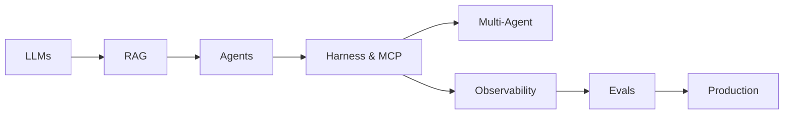

# AI Engineering Handbook

Your **free, open-source** path from transformers and LLMs to production-grade RAG, agentic AI, harnesses, tools, orchestration, evals, and observability.

  16 modules
  140+ lessons
  2 skill tracks
  4 phases
  MIT license

!!! tip "New here?"
    Go to **[Start Here](start-here.md)** — one page to pick your path, prerequisites, and first project.

---

## Who is this for?

  

    
New to AI

    
Software engineer or student starting from scratch

    <a class="persona-card__cta" href="start-here.md"><strong>Start Here →</strong></a>
  

  

    
Know ML, need LLMs

    
ML practitioner catching up on transformers and APIs

    <a class="persona-card__cta" href="foundations/module-07-large-language-models-llms/index.md"><strong>Jump to M07 →</strong></a>
  

  

    
Building agents

    
Engineer shipping autonomous AI systems

    <a class="persona-card__cta" href="agent-engineering/index.md"><strong>Agent Engineering →</strong></a>
  

  

    
Using Claude Code / Cursor

    
Skills, loops, and context for IDE agents

    <a class="persona-card__cta" href="ai-engineering-2026/index.md"><strong>2026 Skills →</strong></a>
  

  

    
Shipping to production

    
Need LLMOps, evals, monitoring, safety

    <a class="persona-card__cta" href="production/module-10-llmops-production-systems/index.md"><strong>Go to Production →</strong></a>
  

---

## Start here

  <a class="quick-nav__item" href="start-here.md">Start Here</a>
  <a class="quick-nav__item" href="getting-started.md">Setup</a>
  <a class="quick-nav__item" href="learning-path.md">Learning Path</a>
  <a class="quick-nav__item" href="projects/build-these.md">Build These</a>
  <a class="quick-nav__item" href="topic-map.md">Topic Map</a>
  <a class="quick-nav__item" href="faq.md">FAQ</a>
  <a class="quick-nav__item" href="agent-engineering/index.md">Agent Engineering</a>
  <a class="quick-nav__item" href="ai-engineering-2026/index.md">2026 Skills</a>
  <a class="quick-nav__item" href="glossary.md">Glossary</a>

| Goal | Go to |
|------|-------|
| **New here** | [Start Here](start-here.md) — persona routing and first project |
| **Local setup** | [Getting Started](getting-started.md) — `mkdocs serve`, exercises |
| **Build something** | [Build These First](projects/build-these.md) — 10 portfolio projects |
| **Find a topic** | [Topic Map](topic-map.md) — concept → module lookup |
| **Full curriculum** | [Learning Path](learning-path.md) — all 16 modules in order |
| **Questions / stuck** | [FAQ](faq.md) — decisions, troubleshooting |
| **Build agents (concise)** | [Agent Engineering](agent-engineering/index.md) — 7-lesson dedicated track |
| **IDE agent skills** | [2026 Skills](ai-engineering-2026/index.md) — Claude Code, skills, loops |
| **Build agents (modules)** | [Agentic AI Hub](agentic-ai/index.md) — M11 → M18 → M12 path |
| **Ship with confidence** | [Evals & Observability](evals-observability/index.md) |
| **Find a term** | [Glossary](glossary.md) |

---

## Four phases

Module IDs (M00, M05, …) match the original platform catalog — gaps like M02–M04 are intentional, not missing content.

| Phase | Modules | Topics |
|-------|---------|--------|
| [Foundations](foundations/index.md) | M00, M01, M05, M06, M07 | NLP → neural nets → transformers → LLMs |
| [Build](build/index.md) | M09, M11, M18, M12, M13, M14 | RAG, agents, harness, MCP, multi-agent, prompts |
| [Production](production/index.md) | M10, M19, M16 | LLMOps, evals, safety, monitoring |
| [Advanced](advanced/index.md) | M15, M17 | Fine-tuning, capstone projects |

**Supplemental tracks** (not numbered modules): [Agent Engineering](agent-engineering/index.md) · [2026 Skills](ai-engineering-2026/index.md)

---

## The agentic stack

---

## What's new

- **[Agent Engineering](agent-engineering/index.md)** — dedicated 7-lesson track: loop, memory, tools, harness, orchestration, observability, evals
- **[2026 Skills](ai-engineering-2026/index.md)** — Claude Code, skills & rules, loop engineering, context engineering
- **M18 · Agent Harness, Tools & Runtime** — loops, MCP, permissions, tracing
- **M19 · LLM Evaluation & Quality** — golden sets, CI gates, production monitoring
- **M12 · Multi-Agent** — 10 lessons (orchestration, handoffs, end-to-end build)

---

## Resources & practice

- [Essential Papers](resources/essential-papers.md) · [Essential Videos](resources/essential-videos.md)
- [Open Source Hubs](resources/open-source-hubs.md) — Agents Towards Production, Awesome Evals, RAG Techniques
- [Exercises](exercises/index.md) · [Build These First](projects/build-these.md) · [Projects](projects/index.md) · [FAQ](faq.md)

---

## Contribute

Help make this the best free AI engineering handbook. See [Contribute](contribute.md) and [Roadmap](roadmap.md).
[GitHub →](https://github.com/psssnikhil/learn-ai-engineering){ .md-button }
