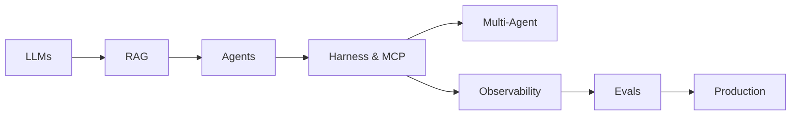

# AI Engineering Handbook

Your **free, open-source** path from transformers and LLMs to production-grade RAG, agentic AI, harnesses, tools, orchestration, evals, and observability.

  16 modules
  140+ lessons
  4 phases
  MIT license

  
Depth promise

  Every lesson covers <em>why</em> before <em>how</em> — no shallow overviews, no link dumps. Each module ends with a hands-on exercise or capstone.

---

## Who is this for?

  

    
New to AI

    
Software engineer or student starting from scratch

    <a href="foundations/module-00-genai-foundations-from-nlp-to-transformers/index.md"><strong>Start at M00 →</strong></a>
  

  

    
Know ML, need LLMs

    
ML practitioner catching up on transformers and APIs

    <a href="foundations/module-07-large-language-models-llms/index.md"><strong>Jump to M07 →</strong></a>
  

  

    
Building agents

    
Engineer shipping autonomous AI systems

    <a href="agentic-ai/index.md"><strong>Agentic AI Hub →</strong></a>
  

  

    
Shipping to production

    
Need LLMOps, evals, monitoring, safety

    <a href="production/module-10-llmops-production-systems/index.md"><strong>Go to Production →</strong></a>
  

---

## Start here

| Goal | Go to |
|------|-------|
| **New here** | [Getting Started](getting-started.md) |
| **Find a topic** | [Topic Map](topic-map.md) |
| **Full curriculum** | [Learning Path](learning-path.md) |
| **Build agents** | [Agentic AI](agentic-ai/index.md) |
| **Ship with confidence** | [Evals & Observability](evals-observability/index.md) |
| **Find a term** | [Glossary](glossary.md) |

---

## Four phases

| Phase | Modules | Topics |
|-------|---------|--------|
| [Foundations](foundations/index.md) | M00, M01, M05, M06, M07 | NLP → neural nets → transformers → LLMs |
| [Build](build/index.md) | M09, M11, M18, M12, M13, M14 | RAG, agents, harness, MCP, multi-agent, prompts |
| [Production](production/index.md) | M10, M19, M16 | LLMOps, evals, safety, monitoring |
| [Advanced](advanced/index.md) | M15, M17 | Fine-tuning, capstone projects |

---

## The agentic stack

---

## What's new

- **M18 · Agent Harness, Tools & Runtime** — loops, MCP, permissions, tracing
- **M19 · LLM Evaluation & Quality** — golden sets, CI gates, production monitoring
- **M12 · Multi-Agent** — 10 lessons (orchestration, handoffs, end-to-end build)
- **Hub pages** — [Topic Map](topic-map.md), [Glossary](glossary.md), [OSS Hubs](resources/open-source-hubs.md)

---

## Resources & practice

- [Essential Papers](resources/essential-papers.md) · [Essential Videos](resources/essential-videos.md)
- [Open Source Hubs](resources/open-source-hubs.md) — Agents Towards Production, Awesome Evals, RAG Techniques
- [Exercises](exercises/index.md) · [Projects](projects/index.md)

---

## Contribute

Help make this the best free AI engineering handbook. See [Contribute](contribute.md) and [Roadmap](roadmap.md).
[GitHub →](https://github.com/psssnikhil/learn-ai-engineering){ .md-button }
