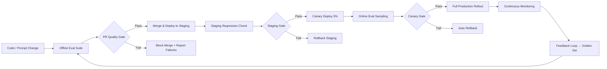

# Why LLM Evals Matter

## What You'll Learn

| Objective | Time | Difficulty |
|-----------|------|------------|
| Understand why traditional unit tests fail for LLMs | 40 min | Intermediate |
| Distinguish offline vs online evaluation | | |
| Design regression suites and quality gates | | |
| Map the end-to-end eval pipeline | | |

---

## The Problem with "It Works on My Machine"

LLM applications are **non-deterministic**. The same prompt can produce different outputs across runs, model versions, and temperature settings. A prompt tweak that fixes one edge case can silently break twenty others. Without systematic evaluation, you are shipping changes blind.

Traditional software testing assumes deterministic behavior:

```
Unit test: assert add(2, 2) == 4        # Always passes or fails
LLM eval:  assert response is helpful   # What does "helpful" mean?
```

This is why teams that treat LLM apps like regular APIs eventually hit a wall: a green CI pipeline tells you nothing about whether users will get worse answers tomorrow.

---

## Offline vs Online Evaluation

Evaluation happens in two environments, and you need both.

### Offline Evaluation

Runs **before deployment** against a fixed dataset. Fast, repeatable, and cheap enough to run on every PR.

| Characteristic | Details |
|----------------|---------|
| **When** | Pre-merge, nightly, before model swaps |
| **Data** | Golden datasets, synthetic cases, red-team prompts |
| **Goal** | Catch regressions, compare variants, gate releases |
| **Tools** | [Promptfoo](https://github.com/promptfoo/promptfoo), [DeepEval](https://github.com/confident-ai/deepeval), custom harnesses |

```python
# Offline eval: run against a fixed test suite
def run_offline_eval(app, test_cases: list[dict]) -> dict:
    results = []
    for case in test_cases:
        output = app.run(case["input"])
        score = evaluate(output, case["expected"])
        results.append({"id": case["id"], "score": score, "passed": score >= case["threshold"]})

    return {
        "pass_rate": sum(r["passed"] for r in results) / len(results),
        "avg_score": sum(r["score"] for r in results) / len(results),
        "failures": [r for r in results if not r["passed"]],
    }
```

### Online Evaluation

Runs **in production** on real traffic. Captures distribution shift, user behavior, and emergent failure modes your offline set missed.

| Characteristic | Details |
|----------------|---------|
| **When** | Continuously in production |
| **Data** | Live requests, user feedback, sampled traces |
| **Goal** | Detect drift, measure real-world quality, close the feedback loop |
| **Tools** | Langfuse, Braintrust, custom dashboards |

```python
# Online eval: sample production traffic
def sample_for_eval(request_id: str, user_id: str, sample_rate: float = 0.05) -> bool:
    """Deterministically sample ~5% of traffic for human or LLM review."""
    import hashlib
    bucket = int(hashlib.md5(f"{request_id}:{user_id}".encode()).hexdigest(), 16) % 100
    return bucket < sample_rate * 100
```

### When to Use Each

| Scenario | Offline | Online |
|----------|---------|--------|
| Prompt change in PR | Yes | No (yet) |
| Model version upgrade | Yes, then canary online | Yes |
| New feature launch | Yes | Yes (shadow traffic) |
| Investigating user complaints | Maybe (reproduce) | Yes |
| Cost/latency regression | Yes (synthetic load) | Yes (real p99) |

---

## Regression Testing for LLMs

Regression testing means: **every change is measured against a baseline**. If quality drops beyond a threshold, the change is blocked.

### What to Regression-Test

1. **Answer quality** — relevance, accuracy, completeness
2. **Format compliance** — JSON schema, required fields, tone
3. **Safety** — refusal behavior, PII leakage, injection resistance
4. **RAG fidelity** — groundedness, citation accuracy
5. **Latency and cost** — p50/p99 response time, tokens per request

### Baseline Comparison Pattern

Store baselines per release tag. When `v2.4.1` ships, its eval scores become the baseline for `v2.4.2`.

---

## Quality Gates

Quality gates are **automated checkpoints** that prevent bad changes from reaching users. They belong in your CI/CD pipeline, not in a spreadsheet reviewed once a quarter.

### Typical Gate Stages

| Gate | When | Criteria | Action on Fail |
|------|------|----------|----------------|
| **PR gate** | Every pull request | Pass rate ≥ 95% on golden set | Block merge |
| **Staging gate** | Pre-production deploy | No regression vs baseline | Block promote |
| **Canary gate** | 5% traffic for 24h | Online metrics within bounds | Rollback |
| **Full release gate** | 100% traffic after canary | Sustained quality over 7 days | Alert, investigate |

```python
# PR quality gate — runs in CI
def pr_quality_gate(eval_results: dict) -> bool:
    gates = {
        "pass_rate": (eval_results["pass_rate"], 0.95, ">="),
        "faithfulness": (eval_results["faithfulness"], 0.85, ">="),
        "hallucination_rate": (eval_results["hallucination_rate"], 0.05, "<="),
    }

    for metric, (value, threshold, op) in gates.items():
        if op == ">=" and value < threshold:
            raise QualityGateError(f"{metric}: {value:.3f} < {threshold}")
        if op == "<=" and value > threshold:
            raise QualityGateError(f"{metric}: {value:.3f} > {threshold}")

    return True
```

### Designing Effective Gates

- **Start strict on safety, lenient on style** — block PII leaks and hallucinations; warn on tone drift
- **Use tiered gates** — hard block for pass rate, soft warning for latency
- **Make failures actionable** — print which test cases failed and why, not just a red X
- **Version your gates** — as quality improves, tighten thresholds incrementally

---

## The Evaluation Pipeline

Here is how offline eval, quality gates, and online monitoring connect:



The feedback loop at the bottom is critical: production failures become new test cases. Your golden dataset grows with every incident.

---

## The Eval Tooling Landscape

For a curated overview of frameworks, datasets, and patterns, see [benchflow-ai/awesome-evals](https://github.com/benchflow-ai/awesome-evals) on GitHub. It catalogs the rapidly evolving eval ecosystem.

| Tool | Strength | Best For |
|------|----------|----------|
| **[Promptfoo](https://github.com/promptfoo/promptfoo)** | CLI-first, provider-agnostic, red-teaming | Prompt/model comparison, CI integration |
| **[DeepEval](https://github.com/confident-ai/deepeval)** | Python-native, RAG metrics, pytest integration | RAG apps, unit-test-style evals |
| **Braintrust** | Hosted platform, experiment tracking | Team collaboration, online + offline |
| **LangSmith** | LangChain-native tracing + evals | LangChain/LangGraph apps |
| **Custom harness** | Full control | Domain-specific metrics, compliance |

Start with Promptfoo or DeepEval for offline evals. Add online monitoring once you have traffic. Build custom only when off-the-shelf metrics do not capture your domain.

---

## Key Takeaways

- LLMs are non-deterministic — you cannot rely on traditional unit tests alone
- **Offline eval** catches regressions before deploy; **online eval** catches what your test set missed
- Regression testing compares every change against a stored baseline with per-metric thresholds
- **Quality gates** in CI/CD block bad changes automatically — do not leave this to manual review
- Close the loop: production failures become new golden test cases
- Use [awesome-evals](https://github.com/benchflow-ai/awesome-evals), Promptfoo, and DeepEval to bootstrap your pipeline

---

## Next Lesson

**Lesson 2: Golden Datasets & Benchmarks** — Learn how to build curated test sets, use RAGAS metrics, and design domain-specific benchmarks that actually predict production quality.
