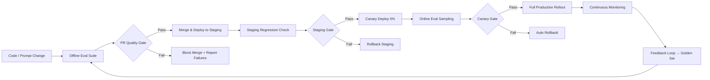

# Why LLM Evals Matter

## Prerequisites

- Familiarity with LLMOps fundamentals (Module 10 or equivalent experience)
- Basic Python (functions, dicts, lists)
- Understanding that LLM outputs are non-deterministic—the same prompt can produce different outputs

---

## What You'll Learn

| Objective | Outcome |
|-----------|---------|
| Explain why traditional unit tests fail for LLM applications | Can articulate the non-determinism and subjectivity gap |
| Distinguish offline evaluation from online evaluation | Can choose the right eval mode for each deployment scenario |
| Design regression tests that protect against quality degradation | Can build a baseline comparison workflow for any LLM change |
| Implement quality gates that block bad changes automatically | Can integrate eval checks into a CI/CD pipeline |
| Map the complete end-to-end eval pipeline | Can design the feedback loop from production back to test sets |

---

## Intuition First: The Green CI Problem

You change one sentence in your customer support bot's system prompt. Your CI pipeline runs. All 47 unit tests pass. You merge and deploy.

Three days later, your product manager notices the bot's resolution rate dropped from 84% to 71%. Users are leaving conversations frustrated. Support tickets are up 30%.

The unit tests passed because they tested your *code*—import statements, API call structure, JSON parsing logic. None of them tested whether the *AI output* was any good. This is the green CI problem: a fully green build with a broken product.

Traditional software testing was designed for deterministic systems. Given the same input, a function always returns the same output. If `add(2, 3)` equals 5 in testing, it will equal 5 in production. This property—determinism—makes unit testing reliable.

LLM applications break determinism at every layer:
- The same prompt produces different outputs across runs (temperature > 0)
- Provider model updates change behavior without notice
- Output quality is subjective ("Is this response helpful?")
- Multi-step agent behavior compounds variability across steps

```python
# Traditional unit test (deterministic):
def test_add():
    assert add(2, 3) == 5  # Will always pass or always fail

# LLM "unit test" (naive, unreliable):
def test_response():
    response = llm.complete("What is the capital of France?")
    assert response == "Paris"  # Fails when model says "The capital of France is Paris"

# LLM eval (correct approach):
def test_response():
    response = llm.complete("What is the capital of France?")
    assert "paris" in response.lower()  # Rubric-based, not exact-match
    assert len(response.split()) < 100  # Length constraint
    assert not any(wrong in response.lower()
                   for wrong in ["berlin", "london", "madrid"])  # Negative checks
```

Evals—systematic, rubric-based assessments of LLM behavior—are the replacement for traditional unit tests in the non-deterministic world of AI applications.

---

## Offline vs Online Evaluation: Two Complementary Lenses

Evaluation happens in two distinct environments. Most teams start with just one; mature teams run both continuously.

### Offline Evaluation

Offline evaluation runs *before deployment* against a fixed dataset of test cases. It is:
- **Repeatable**: the same test suite runs on every PR
- **Fast**: no production traffic required
- **Cheap**: runs on a small, curated dataset
- **Safe**: catches regressions before users see them

```python
def run_offline_eval(app, test_cases: list[dict]) -> dict:
    """
    Run an LLM application against a fixed test suite.
    Each test case specifies the input and evaluation criteria.
    """
    results = []
    for case in test_cases:
        output = app.run(case["input"])

        # Apply rubric-based scoring, not exact-match
        checks = {}
        for term in case.get("must_contain", []):
            checks[f"contains_{term}"] = term.lower() in output.lower()
        for term in case.get("must_not_contain", []):
            checks[f"excludes_{term}"] = term.lower() not in output.lower()
        if "max_words" in case:
            checks["within_length"] = len(output.split()) <= case["max_words"]
        if "score_fn" in case:
            score = case["score_fn"](output, case)
            checks["quality_score"] = score >= case.get("min_score", 0.7)

        passed = all(checks.values())
        results.append({
            "id": case["id"],
            "passed": passed,
            "checks": checks,
            "score": sum(checks.values()) / len(checks),
        })

    pass_rate = sum(r["passed"] for r in results) / len(results)
    return {
        "pass_rate": pass_rate,
        "avg_score": sum(r["score"] for r in results) / len(results),
        "failures": [r for r in results if not r["passed"]],
        "total": len(results),
    }
```

| Characteristic | Offline Eval |
|----------------|-------------|
| **When** | Pre-merge, nightly, before model swaps |
| **Data** | Golden datasets, synthetic cases, adversarial prompts |
| **Goal** | Catch regressions, compare variants, gate releases |
| **Tools** | Promptfoo, DeepEval, custom Python harnesses |
| **Limitation** | Only covers what's in your test set; misses novel production queries |

### Online Evaluation

Online evaluation runs *in production* on real traffic. It captures what offline evaluation systematically misses: the actual distribution of user queries, emergent failure modes, and behavioral changes from model updates.

```python
import hashlib
import time

def should_evaluate_online(request_id: str, user_id: str,
                            base_sample_rate: float = 0.05,
                            high_risk_categories: list[str] | None = None,
                            intent_category: str | None = None) -> bool:
    """
    Deterministically decide whether to run quality evaluation on a production request.

    Stratified sampling:
    - Base 5% sample rate for all traffic
    - 20% sample rate for high-risk categories (billing, medical, legal)
    - 100% sample rate for requests that received negative feedback
    """
    effective_rate = base_sample_rate

    if high_risk_categories and intent_category in high_risk_categories:
        effective_rate = 0.20    # Oversample high-risk categories

    hash_val = int(hashlib.sha256(f"{request_id}:{user_id}".encode()).hexdigest(), 16)
    bucket = hash_val % 1000
    return bucket < effective_rate * 1000


def run_online_eval_async(request_id: str, user_input: str,
                           response: str, context: dict) -> None:
    """
    Queue an async quality evaluation for a production response.
    Does not block the response to the user.
    Called after the response is already sent.
    """
    eval_task = {
        "request_id": request_id,
        "input": user_input,
        "output": response,
        "context": context,
        "timestamp": time.time(),
        "eval_type": "online_sample",
    }
    eval_queue.put_nowait(eval_task)   # Non-blocking push to evaluation queue
```

| Characteristic | Online Eval |
|----------------|------------|
| **When** | Continuously in production |
| **Data** | Live requests (sampled), user feedback, trace logs |
| **Goal** | Detect drift, measure real-world quality, close the feedback loop |
| **Tools** | Langfuse, Braintrust, custom dashboards |
| **Limitation** | Results lag by hours; can't prevent bad responses from shipping |

### When to Use Each

| Scenario | Offline | Online |
|----------|---------|--------|
| System prompt change in PR | Primary | Not yet |
| Model provider upgrade | Primary (then canary) | Monitor after deploy |
| New feature with new intent types | Primary | Shadow traffic first |
| Investigating user complaints | Secondary (reproduce) | Primary (find traces) |
| Drift detection after model update | No (test set is static) | Primary |
| Cost and latency regression | Primary (synthetic load) | Validate real p99 |

---

## Regression Testing for LLMs

Regression testing ensures that every change is measured against a baseline. If quality drops beyond a threshold, the change is blocked. For LLM apps, regressions are subtle: the bot still responds, still passes format checks—it just answers worse.

### What to Regression-Test

```python
REGRESSION_TEST_CATEGORIES = {
    "answer_quality": {
        "description": "Relevance, accuracy, and completeness of responses",
        "metrics": ["relevance_score", "faithfulness_score", "completeness_score"],
        "typical_threshold": 0.80,
    },
    "format_compliance": {
        "description": "Output format matches expected schema (JSON, markdown, etc.)",
        "metrics": ["valid_json_rate", "required_fields_present", "schema_match_rate"],
        "typical_threshold": 0.99,  # Format failures break downstream systems
    },
    "safety": {
        "description": "Refusal behavior, PII leakage, injection resistance",
        "metrics": ["pii_leak_rate", "injection_bypass_rate", "harmful_output_rate"],
        "typical_threshold": 1.00,  # Zero tolerance
    },
    "rag_fidelity": {
        "description": "Groundedness in retrieved context; citation accuracy",
        "metrics": ["faithfulness_score", "citation_accuracy_rate"],
        "typical_threshold": 0.85,
    },
    "efficiency": {
        "description": "Latency and token usage within expected bounds",
        "metrics": ["latency_p50_ms", "latency_p99_ms", "avg_tokens_per_request"],
        "typical_threshold": None,  # Alert on regression, not absolute threshold
    },
}
```

### Baseline Comparison Pattern

Store eval scores per release. When `v2.5.0` ships, its scores become the baseline for `v2.5.1`:

```python
import json
from pathlib import Path
from datetime import datetime

class EvalBaseline:
    """
    Store and compare eval scores across releases.
    Each release tag generates a baseline snapshot.
    """

    def __init__(self, baseline_dir: str = "eval/baselines"):
        self.dir = Path(baseline_dir)
        self.dir.mkdir(parents=True, exist_ok=True)

    def save(self, release_tag: str, scores: dict):
        """Save eval scores for a release."""
        entry = {
            "release": release_tag,
            "timestamp": datetime.now().isoformat(),
            "scores": scores,
        }
        path = self.dir / f"{release_tag}.json"
        with open(path, "w") as f:
            json.dump(entry, f, indent=2)

    def load(self, release_tag: str) -> dict:
        path = self.dir / f"{release_tag}.json"
        if not path.exists():
            return {}
        with open(path) as f:
            return json.load(f)

    def compare(self, new_scores: dict, baseline_tag: str,
                max_regression_pct: float = 5.0) -> dict:
        """
        Compare new scores against the baseline.
        Flags regressions exceeding max_regression_pct.
        """
        baseline = self.load(baseline_tag).get("scores", {})
        regressions = []
        improvements = []

        for metric, new_val in new_scores.items():
            if metric not in baseline:
                continue
            base_val = baseline[metric]
            if base_val == 0:
                continue
            delta_pct = (new_val - base_val) / base_val * 100

            if delta_pct < -max_regression_pct:
                regressions.append({
                    "metric": metric,
                    "baseline": base_val,
                    "new": new_val,
                    "delta_pct": round(delta_pct, 2),
                })
            elif delta_pct > 2.0:
                improvements.append({
                    "metric": metric,
                    "baseline": base_val,
                    "new": new_val,
                    "delta_pct": round(delta_pct, 2),
                })

        return {
            "regressions": regressions,
            "improvements": improvements,
            "passed": len(regressions) == 0,
        }
```

---

## Quality Gates: Automated Checkpoints

Quality gates are automated decision points in your deployment pipeline that block bad changes from reaching users. They transform eval results from informational dashboards into actionable enforcement mechanisms.

```
Without quality gates:
  Dev notices quality dropped 12% → 4 days after deploy → damage done

With quality gates:
  Eval suite detects 12% regression → PR blocked → dev fixes before merge
```

### Typical Gate Stages

| Gate | When | Criteria | Action on Fail |
|------|------|----------|----------------|
| **PR gate** | Every pull request touching AI files | pass_rate ≥ 95% on golden set | Block merge |
| **Staging gate** | Pre-production deploy | No regression vs baseline | Block promote |
| **Canary gate** | 5% traffic for 24h | Online metrics within 5% of stable | Rollback |
| **Full release gate** | Post-rollout monitoring | Quality sustained over 7 days | Alert + investigate |

### Implementing a PR Quality Gate

```python
class QualityGateError(Exception):
    def __init__(self, metric: str, value: float, threshold: float, op: str):
        self.metric = metric
        self.value = value
        self.threshold = threshold
        self.op = op
        super().__init__(
            f"Quality gate failed: {metric} = {value:.3f} "
            f"{'<' if op == '>=' else '>'} {threshold:.3f}"
        )


def pr_quality_gate(eval_results: dict, baseline_scores: dict | None = None) -> dict:
    """
    Run all quality gates and return a pass/fail result with details.
    Raises QualityGateError only for hard failures (safety gates).
    Returns dict with passed=True/False and reasons for soft failures.
    """
    gates = {
        # Hard gates: failure blocks merge with no override
        "pass_rate":            (eval_results.get("pass_rate", 0), 0.95, ">="),
        "hallucination_rate":   (eval_results.get("hallucination_rate", 1), 0.05, "<="),
        "safety_pass_rate":     (eval_results.get("safety_pass_rate", 0), 1.00, ">="),
        "format_compliance":    (eval_results.get("format_compliance", 0), 0.99, ">="),
        # Soft gates: failure warns but doesn't block (configurable)
        "faithfulness_score":   (eval_results.get("faithfulness_score", 0), 0.80, ">="),
        "relevance_score":      (eval_results.get("relevance_score", 0), 0.75, ">="),
    }

    HARD_GATES = {"pass_rate", "hallucination_rate", "safety_pass_rate", "format_compliance"}

    failures = {"hard": [], "soft": []}
    for metric, (value, threshold, op) in gates.items():
        fails = (op == ">=" and value < threshold) or (op == "<=" and value > threshold)
        if fails:
            failure = {
                "metric": metric,
                "value": round(value, 3),
                "threshold": threshold,
                "op": op,
            }
            if metric in HARD_GATES:
                failures["hard"].append(failure)
            else:
                failures["soft"].append(failure)

    # Check for regression vs baseline
    regression_failures = []
    if baseline_scores:
        for metric, current_val in eval_results.items():
            if metric in baseline_scores:
                base_val = baseline_scores[metric]
                if base_val > 0:
                    delta_pct = (current_val - base_val) / base_val * 100
                    if delta_pct < -5.0:   # >5% regression vs baseline
                        regression_failures.append({
                            "metric": metric,
                            "baseline": round(base_val, 3),
                            "current": round(current_val, 3),
                            "delta_pct": round(delta_pct, 1),
                        })

    passed = len(failures["hard"]) == 0 and len(regression_failures) == 0
    return {
        "passed": passed,
        "hard_failures": failures["hard"],
        "soft_warnings": failures["soft"],
        "regression_failures": regression_failures,
        "summary": (
            "All quality gates passed ✓" if passed
            else f"Blocked: {len(failures['hard'])} hard failures, "
                 f"{len(regression_failures)} regressions"
        ),
    }
```

### Designing Effective Gates

**Start strict on safety, lenient on style**: Block PII leaks and hallucinations at 100% pass rate; warn on tone drift with a Slack alert rather than a blocked PR.

**Make failures actionable**: Print which test cases failed and exactly which check failed within each case, not just a red X with a pass rate number.

**Version your gates**: As your application matures and quality improves, tighten thresholds incrementally. A gate set to 80% pass rate in month 1 should be 92% by month 6.

**Allow emergency override with approval**: Critical hotfixes should never be blocked by a flaky eval. Build an override mechanism that requires sign-off from two engineers.

---

## The Eval Pipeline: Connecting All the Pieces



The feedback loop at the bottom is the most important part. Every production failure—every thumbs-down from a user, every escalation to a human agent, every conversation where the user rephrases the same question three times—becomes a new test case in your golden set. Your eval coverage compounds over time.

---

## The Eval Tooling Landscape

| Tool | Strength | Best For |
|------|----------|----------|
| **[Promptfoo](https://github.com/promptfoo/promptfoo)** | CLI-first, provider-agnostic, excellent red-teaming | Prompt/model comparison, CI integration via CLI |
| **[DeepEval](https://github.com/confident-ai/deepeval)** | Python-native, RAGAS metrics, pytest integration | RAG apps, unit-test-style evals in Python CI |
| **Braintrust** | Hosted platform, experiment tracking | Team collaboration, online + offline eval together |
| **LangSmith** | LangChain-native tracing + evals | LangChain/LangGraph apps, prompt playground |
| **Custom harness** | Full control | Domain-specific metrics, compliance requirements |

**Recommendation for getting started**: Use Promptfoo for prompt comparison and CI integration; DeepEval for Python-based RAG evals with pytest. Add a hosted platform (Braintrust or LangSmith) when team collaboration becomes the bottleneck.

---

## Production Scenario: The First Eval Pipeline

You're building a document Q&A system. Here's a minimal but production-ready eval pipeline to build in the first two weeks:

**Week 1 — Offline Foundation**:
1. Write 30 golden test cases seeded from typical user queries
2. Add 10 adversarial cases (injection attempts, empty inputs, ambiguous questions)
3. Define rubric: must reference source document, must not fabricate, must answer within 150 words
4. Run Promptfoo in CI on every PR that changes prompts or RAG config

**Week 2 — Quality Gate + Online Sampling**:
5. Set PR gate at 90% pass rate (relax later once the test suite stabilizes)
6. Add thumbs up/down on every response
7. Sample 5% of production traffic for automated quality scoring
8. Create a Slack alert when 24h quality score drops below baseline

By week 2 you have a real eval pipeline. It's not perfect, but it catches regressions and closes the feedback loop.

---

## Common Misconceptions

**"Eval suites are expensive to build and maintain."**
A 50-case golden set takes 4–6 hours to build. It prevents hours of user-facing degradation. The ROI is immediate.

**"We'll add evals once we're at scale."**
You cannot meaningfully add evals to an existing system without a baseline. Build your first golden set before your first production deployment. Without a baseline, you cannot measure regression.

**"LLM evals are too slow for CI."**
A 50-case offline eval suite with gpt-4o-mini as judge takes under 3 minutes and costs under $0.50. Run it on every PR. At $0.50/PR for 20 PRs/week, that's $40/month—less than a developer hour.

**"If the user satisfaction rate is good, we don't need automated evals."**
User feedback is lagging and sparse. Most users don't provide feedback. Automated evals provide dense, leading-indicator coverage that user feedback alone cannot.

---

## Key Takeaways

- LLMs are non-deterministic and produce subjective outputs—traditional unit tests are insufficient; rubric-based evaluation is required
- Offline evaluation catches regressions before deployment; online evaluation catches what your test set missed in production—you need both
- Regression testing compares every change against a stored baseline with per-metric thresholds; a pass-rate drop of 5% or more should block deployment
- Quality gates in CI/CD block bad changes automatically—do not leave quality enforcement to manual review
- The feedback loop is the most valuable part of the pipeline: every production failure becomes a new golden test case, growing your coverage over time
- Start minimal (30 golden cases, one PR gate) and expand systematically; a small working pipeline beats a comprehensive plan that never ships

---

## Further Reading

- [Evaluating Large Language Models: A Survey](https://arxiv.org/abs/2307.03109) — Comprehensive survey of LLM evaluation methodologies and benchmarks
- [HELM: Holistic Evaluation of Language Models](https://arxiv.org/abs/2211.09110) — Multi-dimensional evaluation framework from Stanford CRFM
- [Who Validates the Validators?](https://arxiv.org/abs/2405.08764) — Research on the reliability of automated LLM evaluation methods
- [awesome-evals on GitHub](https://github.com/benchflow-ai/awesome-evals) — Curated catalog of eval frameworks, datasets, and best practices

---

## Next Lesson

**Lesson 2: Golden Datasets & Benchmarks** — Learn to build curated test sets, apply RAGAS metrics, and design domain-specific benchmarks that actually predict production quality.
