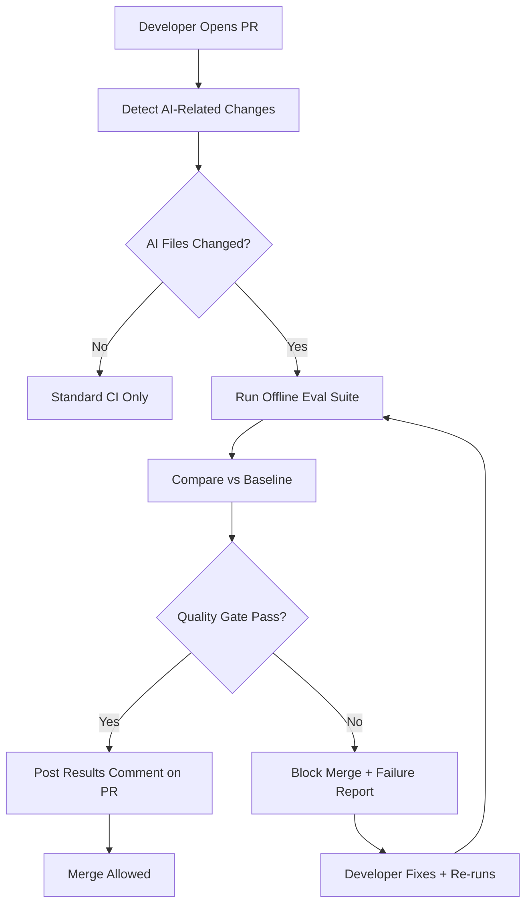
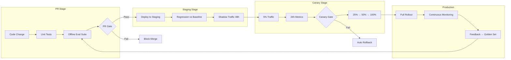

# CI/CD for AI Quality

## What You'll Learn

| Objective | Time | Difficulty |
|-----------|------|------------|
| Integrate eval suites into PR checks | 35 min | Advanced |
| Implement canary deployments for AI changes | | |
| Use shadow traffic for pre-production validation | | |
| Design a complete CI/CD pipeline for AI quality | | |

---

## Why AI Needs Its Own CI/CD Pipeline

Traditional CI/CD checks whether code compiles and tests pass. For LLM applications, the code can be perfect while the product gets worse — a prompt tweak, a model swap, or a retrieval config change does not break any unit test.

AI quality CI/CD adds **eval gates** at every stage of the deployment pipeline:

```
Code change → Unit tests → Eval suite → Merge gate
  → Staging deploy → Regression check → Canary gate
    → Shadow traffic → Online eval → Full rollout
```

Without eval gates, you are deploying prompt changes the same way you deploy CSS fixes — and wondering why user satisfaction dropped 20% on Tuesday.

---

## Eval in Pull Request Checks

The PR gate is your first line of defense. Every change that touches prompts, models, retrieval, or agent logic should run the offline eval suite before merge.

### PR Check Architecture



### Detecting AI-Related Changes

Not every PR needs a full eval run. Trigger evals only when AI-relevant files change:

```python
AI_CHANGE_PATTERNS = [
    "prompts/**",
    "config/models.yaml",
    "config/retrieval.yaml",
    "src/agents/**",
    "src/rag/**",
    "eval/golden-set/**",
    "pyproject.toml",  # Dependency changes may affect model behavior
]

def should_run_eval(changed_files: list[str]) -> bool:
    import fnmatch
    for pattern in AI_CHANGE_PATTERNS:
        if any(fnmatch.fnmatch(f, pattern) for f in changed_files):
            return True
    return False
```

### GitHub Actions with Promptfoo

```yaml
# .github/workflows/ai-eval.yml
name: AI Quality Gate
on:
  pull_request:
    paths: ['prompts/**', 'src/agents/**', 'eval/**']
jobs:
  eval:
    runs-on: ubuntu-latest
    steps:
      - uses: actions/checkout@v4
      - run: npm install -g promptfoo
      - run: npx promptfoo eval --config eval/promptfooconfig.yaml
        env:
          OPENAI_API_KEY: ${{ secrets.OPENAI_API_KEY }}
      - run: python eval/quality_gate.py --results output.json
```

### DeepEval in pytest CI

For Python-native projects, DeepEval integrates directly with pytest:

Run with `pytest tests/test_ai_quality.py` in CI. Compare results against a stored baseline on every PR.

### PR Gate Best Practices

| Practice | Rationale |
|----------|-----------|
| **Run on every AI-related PR** | Catch regressions before they reach main |
| **Post results as PR comments** | Reviewers see quality impact without running evals locally |
| **Compare against main baseline** | Relative comparison, not absolute thresholds alone |
| **Cache eval results** | Skip re-eval for unchanged golden cases |
| **Set time limits** | Eval suites that take 30+ minutes kill developer velocity; target < 10 min |
| **Allow override with approval** | Emergency fixes should not be blocked by flaky evals, but require explicit sign-off |

---

## Canary Deployments

A canary routes a small percentage of production traffic to the new version while the majority stays on the current version. For AI apps, this catches issues that offline evals miss — real user queries, production data distributions, and latency under load.

### Canary Architecture for AI

```python
class CanaryRouter:
    def __init__(self, canary_percentage: float = 5.0, canary_version: str = "v2"):
        self.canary_percentage = canary_percentage
        self.canary_version = canary_version

    def route(self, request_id: str) -> str:
        """Deterministically route requests to canary or stable."""
        import hashlib
        bucket = int(hashlib.md5(request_id.encode()).hexdigest(), 16) % 100
        return self.canary_version if bucket < self.canary_percentage else "stable"

    def get_handler(self, request_id: str):
        version = self.route(request_id)
        return self.handlers[version]
```

### Canary Evaluation Criteria

Do not promote a canary based on gut feeling. Define automated promotion and rollback criteria:

```python
CANARY_GATES = {
    "min_duration_hours": 24,
    "min_requests": 500,
    "metrics": {
        "user_satisfaction": {
            "canary_min": 0.85,
            "max_regression_vs_stable": 0.03,  # Canary can be at most 3% worse
        },
        "error_rate": {
            "canary_max": 0.02,
            "max_increase_vs_stable": 0.01,
        },
        "latency_p99_ms": {
            "canary_max": 5000,
            "max_increase_vs_stable": 0.15,
        },
        "cost_per_request": {
            "canary_max": 0.05,  # $0.05 per request
            "max_increase_vs_stable": 0.20,
        },
        "faithfulness_score": {
            "canary_min": 0.80,
            "max_regression_vs_stable": 0.05,
        },
    },
}

def evaluate_canary(canary_metrics: dict, stable_metrics: dict) -> dict:
    """Determine if canary should be promoted, held, or rolled back."""
    failures = []

    for metric, gates in CANARY_GATES["metrics"].items():
        canary_val = canary_metrics.get(metric, 0)
        stable_val = stable_metrics.get(metric, 0)

        if "canary_min" in gates and canary_val < gates["canary_min"]:
            failures.append(f"{metric}: {canary_val:.3f} < min {gates['canary_min']}")

        if "canary_max" in gates and canary_val > gates["canary_max"]:
            failures.append(f"{metric}: {canary_val:.3f} > max {gates['canary_max']}")

        if stable_val > 0 and "max_regression_vs_stable" in gates:
            regression = (stable_val - canary_val) / stable_val
            if regression > gates["max_regression_vs_stable"]:
                failures.append(f"{metric}: {regression:.1%} regression vs stable")

        if stable_val > 0 and "max_increase_vs_stable" in gates:
            increase = (canary_val - stable_val) / stable_val
            if increase > gates["max_increase_vs_stable"]:
                failures.append(f"{metric}: {increase:.1%} increase vs stable")

    return {
        "action": "rollback" if failures else "promote",
        "failures": failures,
    }
```

Promote only when all gates pass. Roll back immediately on safety failures.

---

## Shadow Traffic

Shadow traffic (also called dark launching) sends a copy of production requests to the new version **without returning its response to the user**. The user always gets the stable version; you compare both outputs offline.

### Why Shadow Traffic Matters

- **Zero user risk** — new version cannot break the user experience
- **Real production data** — evaluates against actual query distributions, not just golden sets
- **Latency-insensitive** — shadow version can be slower without affecting users
- **Pre-canary validation** — run shadow for days before any canary traffic

```python
import asyncio

class ShadowTrafficHandler:
    def __init__(self, stable_handler, candidate_handler, recorder):
        self.stable = stable_handler
        self.candidate = candidate_handler
        self.recorder = recorder

    async def handle(self, request: dict) -> dict:
        # Always return stable response to user
        stable_response = await self.stable.handle(request)

        # Fire-and-forget: run candidate in background
        asyncio.create_task(self._shadow_eval(request, stable_response))

        return stable_response

    async def _shadow_eval(self, request: dict, stable_response: dict):
        try:
            candidate_response = await self.candidate.handle(request)
            self.recorder.log_comparison(
                request_id=request["id"],
                stable_output=stable_response,
                candidate_output=candidate_response,
                metrics=compute_comparison_metrics(stable_response, candidate_response),
            )
        except Exception as e:
            self.recorder.log_error(request_id=request["id"], error=str(e))
```

### Shadow Traffic Comparison

```python
def compute_comparison_metrics(stable: dict, candidate: dict) -> dict:
    """Compare stable and candidate responses for shadow eval."""
    return {
        "output_changed": stable["text"] != candidate["text"],
        "length_ratio": len(candidate["text"]) / max(len(stable["text"]), 1),
        "latency_delta_ms": candidate["latency_ms"] - stable["latency_ms"],
        "cost_delta": candidate["cost"] - stable["cost"],
        "tools_called_diff": set(candidate.get("tools", [])) - set(stable.get("tools", [])),
    }
```

Run LLM-as-judge on a sample of shadow comparisons to score quality differences at scale.

---

## End-to-End CI/CD Pipeline

Putting it all together:



### Cost Management in CI/CD

Eval gates run LLM calls, which cost money. Manage CI eval costs:

| Strategy | Savings |
|----------|---------|
| Run full suite only on AI-related PRs | Skip 80% of PRs |
| Cache results for unchanged test cases | Skip re-eval on prompt-unrelated changes |
| Use cheaper models for screening | GPT-4.1-mini for first pass, GPT-4.1 for failures only |
| Nightly full suite, PR subset | PR runs 50 critical cases, nightly runs all 500 |
| Budget alerts | Alert when CI eval spend exceeds $X/day |

---

## Key Takeaways

- AI changes need **eval gates** at every CI/CD stage — unit tests alone are insufficient
- **PR checks** with Promptfoo or DeepEval catch regressions before merge; post results as PR comments
- **Canary deployments** route 5% traffic to the new version with automated promotion/rollback criteria
- **Shadow traffic** evaluates against real production data with zero user risk
- Pipeline flow: PR gate → staging regression → shadow traffic → canary → full rollout → monitoring → feedback loop
- Manage CI eval costs with change detection, caching, and tiered model usage

---

## Next Lesson

**Lesson 6: Production Monitoring & Alerts** — Set up continuous monitoring for quality drift, latency, cost, and user feedback loops that keep your eval pipeline current.
