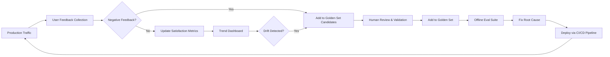

# Production Monitoring & Alerts

## What You'll Learn

| Objective | Time | Difficulty |
|-----------|------|------------|
| Detect quality drift in production | 35 min | Advanced |
| Monitor latency and cost at scale | | |
| Build user feedback loops | | |
| Design actionable alert systems | | |

---

## Why Production Monitoring Is Not Optional

Offline evals tell you how your app performed on yesterday's test cases. Production monitoring tells you how it is performing **right now** on queries you never anticipated. The gap between the two is where user trust erodes.

```
Offline eval:     96% pass rate on golden set → "Ship it!"
Production week 1: 94% user satisfaction → "Looking good"
Production week 4: 78% user satisfaction → "What happened?"
```

What happened: user query distribution shifted, a model provider updated weights silently, retrieval index went stale, or a new product feature introduced questions your golden set never covered. Production monitoring catches these failures in hours, not quarters.

---

## The Four Monitoring Pillars

| Pillar | What to Track | Alert When |
|--------|---------------|------------|
| **Quality** | Faithfulness, relevancy, user satisfaction, error patterns | Score drops > 5% over 24h |
| **Latency** | p50, p95, p99 response time, time-to-first-token | p99 exceeds SLA |
| **Cost** | Tokens per request, daily spend, cost per user | Daily spend exceeds budget |
| **Reliability** | Error rate, timeout rate, fallback activation | Error rate > 1% |

Every pillar needs both a **real-time dashboard** (what is happening now) and **trend alerts** (what is changing over time).

---

## Quality Drift Detection

**Quality drift** is the slow degradation of response quality that offline evals cannot catch because the test set is static while production data evolves.

### Types of Drift

| Drift Type | Cause | Signal |
|------------|-------|--------|
| **Input drift** | Users ask different questions than your golden set | New intent categories in logs |
| **Model drift** | Provider updates model weights silently | Quality scores drop with no code changes |
| **Data drift** | RAG index goes stale, docs outdated | Faithfulness drops, citation errors rise |
| **Seasonal drift** | Holidays, product launches, news events | Spike in unseen query types |
| **Feedback drift** | Users stop reporting issues (fatigue) | Satisfaction stable but complaints rise elsewhere |

Sample ~5% of production traffic for LLM-as-judge scoring. Increase the rate for high-risk categories (billing, medical, legal), low-confidence responses, and any request that received thumbs-down feedback.

Compare rolling 24-hour quality scores against your baseline using a two-sample t-test. Alert at >5% drift (warning) and >15% drift (critical, consider rollback).

### Drift Response Playbook

| Severity | Drift % | Action |
|----------|---------|--------|
| Normal | < 5% | Log and continue monitoring |
| Warning | 5–15% | Alert team, increase sampling rate, investigate top failure categories |
| Critical | > 15% | Page on-call, consider rollback, pause experiments |

When drift is detected, pull the failing cases into your golden set (Lesson 2) and run offline evals to isolate the root cause: prompt, model, retrieval, or input distribution.

---

## Latency Monitoring

Latency is a quality metric. Users abandon responses that take too long, regardless of accuracy.

### Key Latency Metrics

```python
LATENCY_METRICS = {
    "time_to_first_token_ms": "Perceived responsiveness (streaming apps)",
    "total_response_ms": "End-to-end request time",
    "retrieval_ms": "Vector search + reranking time",
    "llm_inference_ms": "Model generation time",
    "tool_execution_ms": "Agent tool call latency (sum of all tools)",
    "post_processing_ms": "Parsing, formatting, guardrail checks",
}
```

Instrument each pipeline stage (retrieval, inference, tool execution, post-processing) with span-level timing. A global p99 can hide a single intent category running 10x slower than the rest.

### Latency Alerts

| Alert | Condition | Action |
|-------|-----------|--------|
| p99 spike | p99 > 2x baseline for 15 min | Check provider status, scale up |
| Retrieval slowdown | retrieval_ms p95 > 500ms | Check vector DB health, index size |
| TTFT degradation | time_to_first_token p95 > 2s | Check model routing, consider smaller model |
| Tool timeout | tool_execution_ms > 10s | Check external API health |

Track latency **per model, per prompt version, and per intent category**. A global p99 can hide a specific category that is 10x slower.

---

## Cost Monitoring

LLM costs are variable and unpredictable. A viral feature, a prompt that encourages verbosity, or a retrieval config that sends 20K tokens of context can spike your bill overnight.

### Cost Tracking and Alerts

Track per-request token usage broken down by system prompt, retrieved context, and generation. Alert at 80% of daily budget (warning) and 95% (critical). Also alert when hourly spend exceeds 2x the rolling average or a single request exceeds your per-request cap.

Production cost data reveals optimization opportunities: prompt version efficiency, model routing waste, context bloat, and retry spend.

---

## User Feedback Loops

User feedback is the highest-signal quality data you have — if you collect and act on it systematically.

### Feedback Collection Patterns

| Pattern | Signal Strength | Implementation |
|---------|-----------------|----------------|
| **Thumbs up/down** | Medium | Inline on every response |
| **Explicit rating (1-5)** | High | Post-conversation survey |
| **Implicit signals** | Medium | Copy text, follow-up question, session abandonment |
| **Correction** | Very high | "That's wrong, the answer is X" |
| **Escalation** | Very high | User requests human agent |

Collect thumbs up/down on every response. Treat corrections, escalations, and explicit ratings as high-signal events — each should become a golden set candidate after human review.

### Closing the Loop

The feedback loop is what separates teams that improve from teams that stagnate:



Every thumbs-down should eventually become a test case. Every correction should become an expected output. This is how your eval coverage grows to match production reality.

---

## Alert Design

Bad alerts are worse than no alerts. They train teams to ignore the monitoring system.

### Alert Principles

| Principle | Bad | Good |
|-----------|-----|------|
| **Actionable** | "Quality score changed" | "Faithfulness dropped 8% on billing queries — 12 cases failed citation check" |
| **Severity-appropriate** | Page on-call for every metric fluctuation | Page for >15% drift; Slack for >5% drift; dashboard for normal variance |
| **Context-rich** | "Latency alert" | "p99 latency 6.2s (SLA: 5s) — retrieval_ms p99 up 3x, vector DB CPU at 92%" |
| **Deduplicated** | 50 alerts for the same root cause | One alert with count: "23 requests failed faithfulness check in last hour" |
| **Escalating** | Same alert forever | Warning at 5% drift for 1h → critical at 10% drift for 30min → page at 15% for 15min |

Route warnings to Slack, critical issues to PagerDuty. Quality and feedback alerts go to the AI team; latency breaches to infra; cost overruns to engineering leads.

### Dashboard Essentials

Build one dashboard per audience:

| Dashboard | Audience | Key Panels |
|-----------|----------|------------|
| **Quality** | AI team | Pass rates by category, drift trends, feedback volume |
| **Performance** | Infra team | Latency percentiles, error rates, throughput |
| **Cost** | Engineering leads | Daily spend, cost per request, budget utilization |
| **User experience** | Product team | Satisfaction rate, escalation rate, top complaints |

---

---

## Key Takeaways

- Production monitoring catches failures that static golden sets miss: input drift, model drift, data staleness
- Monitor four pillars: **quality, latency, cost, reliability** — each with dashboards and trend alerts
- Sample production traffic for LLM-as-judge scoring; increase sampling on high-risk and negative-feedback requests
- **User feedback loops** are the highest-signal quality data — every thumbs-down should become a golden test case
- Design alerts that are actionable, severity-appropriate, and context-rich — bad alerts get ignored
- Close the loop: production failures → golden set → offline eval → fix → deploy → monitor

---

## Module Complete

You now have the full evaluation and quality engineering pipeline: offline evals, golden datasets, LLM-as-judge, agent trajectory evals, CI/CD gates, and production monitoring. The system is only as strong as its feedback loop — keep production failures flowing back into your test suite, and your quality will compound over time.
