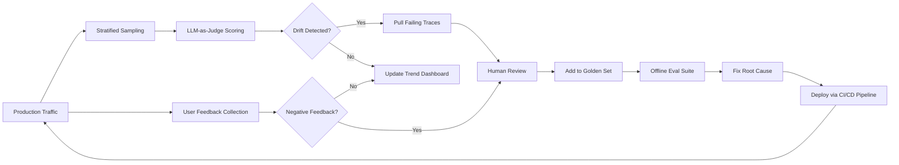

# Production Monitoring & Alerts

## Prerequisites

- Completed Lessons 1–5 (full eval pipeline through CI/CD for AI Quality)
- Familiarity with basic statistics (mean, percentiles, t-test)
- Understanding of webhooks and event-driven alerting

---

## What You'll Learn

| Objective | Outcome |
|-----------|---------|
| Explain why production monitoring catches failures that offline evals miss | Can articulate input drift, model drift, and data staleness as ongoing risks |
| Implement quality drift detection with statistical significance testing | Can detect 5% quality degradation within hours rather than days |
| Design a stratified sampling strategy for continuous quality evaluation | Can balance monitoring cost against coverage for high-risk intent categories |
| Build user feedback collection and actionable feedback routing | Can convert thumbs-down events into golden set candidates automatically |
| Design alert rules that are actionable and severity-appropriate | Can write alert definitions that teams actually respond to |

---

## Intuition First: The Static Test Set Problem

Your offline eval suite is your best available proxy for production quality—but it's a static snapshot of yesterday's queries. Production is a moving target:

```
Week 1: Offline eval pass rate = 96%. Deploy.
         Production satisfaction = 94%. ✓ Good.

Week 3: Offline eval pass rate = 96%. (unchanged — same test set)
         Production satisfaction = 81%. ✗ What happened?

Root causes that offline evals cannot catch:
  1. Model drift: Provider updated weights silently on March 15
  2. Input drift: New feature launch introduced a query type not in test set
  3. Data drift: RAG knowledge base went stale; docs outdated
  4. Seasonal drift: Holiday traffic pattern differs from test distribution
```

Offline evals tell you "your app performed well on the queries you anticipated." Production monitoring tells you "your app is performing on the queries you're actually getting, right now." The gap between these two is where user trust silently erodes.

---

## The Four Monitoring Pillars

Production monitoring for LLM applications tracks four dimensions simultaneously. Each can degrade independently; each requires different alerts and different remediation.

```python
MONITORING_PILLARS = {
    "quality": {
        "description": "Are responses accurate, relevant, and helpful?",
        "primary_metrics": [
            "quality_score_rolling_24h",           # LLM-judged quality (sampled)
            "user_satisfaction_rate_7d",           # Thumbs-up ratio
            "faithfulness_score_rolling_24h",      # RAG groundedness
            "escalation_rate_24h",                 # % requests escalated to human
        ],
        "alert_threshold": "quality_score drops > 5% from 7-day baseline",
        "alert_channel": "slack:#ai-quality",
        "resolution": "Pull failing traces, isolate root cause, update golden set",
    },
    "latency": {
        "description": "Are responses fast enough for users?",
        "primary_metrics": [
            "latency_p50_ms",
            "latency_p95_ms",
            "latency_p99_ms",
            "time_to_first_token_ms",    # For streaming
            "retrieval_latency_ms",      # RAG-specific
        ],
        "alert_threshold": "p99 > SLA for 5 consecutive minutes",
        "alert_channel": "slack:#ai-infra",
        "resolution": "Check provider status, scale workers, enable fallback",
    },
    "cost": {
        "description": "Is spending within budget?",
        "primary_metrics": [
            "cost_per_request_usd",
            "daily_spend_usd",
            "tokens_per_request",
            "cache_hit_rate",
        ],
        "alert_threshold": "daily_spend > 80% of daily budget",
        "alert_channel": "slack:#ai-costs",
        "resolution": "Review token usage hotspots, tighten RAG context limits",
    },
    "reliability": {
        "description": "Is the application available and stable?",
        "primary_metrics": [
            "error_rate_pct",
            "fallback_activation_rate",
            "timeout_rate_pct",
            "provider_uptime_pct",
        ],
        "alert_threshold": "error_rate > 2% for 2 consecutive minutes",
        "alert_channel": "pagerduty",
        "resolution": "Activate fallback chain, check provider status page",
    },
}
```

---

## Quality Drift Detection

Quality drift is the gradual degradation of response quality that static test sets cannot catch. It has multiple root causes, each requiring a different response.

### Taxonomy of Drift

| Drift Type | Cause | Signal | Response |
|-----------|-------|--------|----------|
| **Input drift** | Users ask new types of questions not in golden set | New intent categories appearing in logs | Add cases to golden set; expand test coverage |
| **Model drift** | Provider updates model weights silently | Quality scores drop with no code or config changes | Re-run golden set with current model; contact provider |
| **Data drift** | RAG knowledge base goes stale | Faithfulness drops; citation errors increase | Re-index stale documents; add freshness signals |
| **Seasonal drift** | Holiday/event traffic pattern changes | Query distribution shifts temporarily | Monitor closely; accept temporary variance |
| **Feedback drift** | Users stop reporting issues (fatigue) | Satisfaction stable, but complaints appear elsewhere | Supplement with implicit signals (session abandonment) |

### Implementing Statistical Drift Detection

```python
import math
from collections import deque
from datetime import datetime, timedelta

class QualityDriftDetector:
    """
    Detects statistically significant quality drift using a sliding window.
    Compares the current window against a baseline window using Welch's t-test.
    """

    def __init__(
        self,
        window_hours: int = 24,
        baseline_hours: int = 168,    # 7-day baseline
        warning_threshold: float = 0.05,    # 5% drop triggers warning
        critical_threshold: float = 0.15,   # 15% drop triggers critical
        min_samples: int = 50,
    ):
        self.window = timedelta(hours=window_hours)
        self.baseline_window = timedelta(hours=baseline_hours)
        self.warning_threshold = warning_threshold
        self.critical_threshold = critical_threshold
        self.min_samples = min_samples
        self._scores: deque[tuple[datetime, float]] = deque()

    def record_score(self, score: float, timestamp: datetime | None = None):
        ts = timestamp or datetime.now()
        self._scores.append((ts, score))
        # Prune scores older than the baseline window
        cutoff = datetime.now() - self.baseline_window
        while self._scores and self._scores[0][0] < cutoff:
            self._scores.popleft()

    def detect_drift(self) -> dict:
        now = datetime.now()
        current_cutoff = now - self.window
        baseline_cutoff = now - self.baseline_window

        current_scores = [s for ts, s in self._scores if ts >= current_cutoff]
        baseline_scores = [s for ts, s in self._scores
                           if baseline_cutoff <= ts < current_cutoff]

        if len(current_scores) < self.min_samples:
            return {
                "status": "insufficient_data",
                "current_n": len(current_scores),
                "required_n": self.min_samples,
            }

        if not baseline_scores:
            return {"status": "no_baseline"}

        current_mean = sum(current_scores) / len(current_scores)
        baseline_mean = sum(baseline_scores) / len(baseline_scores)
        delta_pct = (baseline_mean - current_mean) / baseline_mean * 100  # Positive = degradation

        # Welch's t-test (doesn't assume equal variance)
        def variance(data):
            n = len(data)
            mean = sum(data) / n
            return sum((x - mean) ** 2 for x in data) / (n - 1) if n > 1 else 0

        n1, n2 = len(current_scores), len(baseline_scores)
        var1, var2 = variance(current_scores), variance(baseline_scores)
        se = math.sqrt(var1 / n1 + var2 / n2)
        t_stat = (baseline_mean - current_mean) / max(se, 1e-10)

        # Simplified p-value approximation (use scipy in production)
        # p < 0.05 for |t| > ~2 with large samples
        significant = abs(t_stat) > 2.0 and n1 >= 30

        if delta_pct >= self.critical_threshold * 100 and significant:
            severity = "critical"
        elif delta_pct >= self.warning_threshold * 100 and significant:
            severity = "warning"
        else:
            severity = "normal"

        return {
            "status": "analyzed",
            "severity": severity,
            "current_mean": round(current_mean, 3),
            "baseline_mean": round(baseline_mean, 3),
            "delta_pct": round(delta_pct, 2),
            "statistically_significant": significant,
            "t_stat": round(t_stat, 2),
            "current_n": n1,
            "baseline_n": n2,
        }
```

### Sampling Strategy for Continuous Quality Evaluation

Running an LLM judge on every production request is too expensive. Sample strategically:

```python
import hashlib
from enum import Enum

class SamplingTier(str, Enum):
    ALWAYS = "always"           # 100% — safety-critical categories
    HIGH = "high"               # 20% — billing, medical, legal
    STANDARD = "standard"       # 5%  — most traffic
    LOW = "low"                 # 1%  — low-stakes queries

INTENT_SAMPLING_TIERS: dict[str, SamplingTier] = {
    "billing":                  SamplingTier.HIGH,
    "legal":                    SamplingTier.ALWAYS,
    "medical":                  SamplingTier.ALWAYS,
    "account_deletion":         SamplingTier.HIGH,
    "password_reset":           SamplingTier.HIGH,
    "general_faq":              SamplingTier.STANDARD,
    "product_info":             SamplingTier.LOW,
}

TIER_RATES: dict[SamplingTier, float] = {
    SamplingTier.ALWAYS: 1.00,
    SamplingTier.HIGH: 0.20,
    SamplingTier.STANDARD: 0.05,
    SamplingTier.LOW: 0.01,
}

def should_evaluate(
    request_id: str,
    intent_category: str,
    user_gave_negative_feedback: bool = False,
    response_was_low_confidence: bool = False,
) -> tuple[bool, str]:
    """
    Determine whether to run quality evaluation on a production response.
    Returns (should_evaluate, reason).
    """
    # Always evaluate negative feedback — highest signal
    if user_gave_negative_feedback:
        return True, "negative_feedback"

    # Always evaluate low-confidence responses
    if response_was_low_confidence:
        return True, "low_confidence"

    tier = INTENT_SAMPLING_TIERS.get(intent_category, SamplingTier.STANDARD)
    rate = TIER_RATES[tier]

    # Deterministic sampling based on request_id
    bucket = int(hashlib.sha256(request_id.encode()).hexdigest(), 16) % 1000
    if bucket < rate * 1000:
        return True, f"sampled_{tier.value}"

    return False, "not_sampled"
```

---

## Latency Monitoring

Latency is a quality metric as much as a performance metric. Users abandon responses that take too long, regardless of accuracy. Monitor latency at the pipeline stage level, not just end-to-end.

```python
LATENCY_METRICS = {
    "time_to_first_token_ms": {
        "description": "Perceived responsiveness in streaming applications",
        "target_p95": 1500,
        "alert_threshold": 3000,
    },
    "total_response_ms": {
        "description": "End-to-end wall-clock time",
        "target_p95": 5000,
        "alert_threshold": 8000,
    },
    "retrieval_ms": {
        "description": "Vector search + reranking time",
        "target_p95": 400,
        "alert_threshold": 1000,
    },
    "llm_inference_ms": {
        "description": "Pure model generation time",
        "target_p95": 4000,
        "alert_threshold": 7000,
    },
    "tool_execution_ms": {
        "description": "Agent tool call latency (sum of all tools)",
        "target_p95": 2000,
        "alert_threshold": 5000,
    },
    "post_processing_ms": {
        "description": "Output validation, guardrails, formatting",
        "target_p95": 200,
        "alert_threshold": 500,
    },
}

LATENCY_ALERTS = [
    {
        "name": "total_p99_breach",
        "condition": "latency_p99_ms > SLA for 5 consecutive minutes",
        "severity": "critical",
        "action": "Check provider status; activate fallback model if provider-side",
    },
    {
        "name": "retrieval_slowdown",
        "condition": "retrieval_ms_p95 > 1000 for 10 minutes",
        "severity": "warning",
        "action": "Check vector DB CPU and index size; consider query result caching",
    },
    {
        "name": "ttft_degradation",
        "condition": "time_to_first_token_ms_p95 > 2000 for 10 minutes",
        "severity": "warning",
        "action": "Check model routing; consider smaller model for TTFT-sensitive paths",
    },
    {
        "name": "tool_timeout_pattern",
        "condition": "tool_execution_ms_p95 > 5000 for 5 minutes",
        "severity": "warning",
        "action": "Check external API health; increase tool timeout or add fallback",
    },
]
```

Track latency per intent category, not just overall. A global p99 of 4.8 seconds can hide one intent category running at 18 seconds while others run at 2 seconds.

---

## User Feedback Loops

User feedback is the highest-signal quality data available. If you collect and act on it systematically, it compounds: every thumbs-down becomes a test case that prevents future similar failures.

### Feedback Collection Patterns

```python
from enum import Enum
from dataclasses import dataclass

class FeedbackType(str, Enum):
    THUMBS_UP = "thumbs_up"
    THUMBS_DOWN = "thumbs_down"
    CORRECTION = "correction"          # User provides the right answer
    ESCALATION = "escalation"          # User requests human agent
    RATING_1_5 = "rating_1_5"         # Post-conversation 1-5 star
    IMPLICIT_ABANDON = "implicit_abandon"   # User abandons after response

FEEDBACK_SIGNAL_STRENGTHS = {
    FeedbackType.CORRECTION:      "very_high",    # User tells you the right answer
    FeedbackType.ESCALATION:      "very_high",    # User gave up on the AI
    FeedbackType.RATING_1_5:      "high",         # Explicit, post-session
    FeedbackType.THUMBS_DOWN:     "medium",       # Explicit, in-session
    FeedbackType.IMPLICIT_ABANDON:"medium",       # Behavioral signal
    FeedbackType.THUMBS_UP:       "medium",       # Positive signal
}

@dataclass
class FeedbackEvent:
    request_id: str
    user_id: str
    feedback_type: FeedbackType
    value: float | str | None   # Rating value, correction text, or None
    intent_category: str
    timestamp: float


def route_feedback(event: FeedbackEvent) -> list[str]:
    """
    Determine what actions to take based on a feedback event.
    Returns list of action strings for logging.
    """
    actions = []

    # Always log every feedback event
    actions.append("log_to_analytics")

    # High-signal events: queue for human review and golden set consideration
    if event.feedback_type in (FeedbackType.CORRECTION, FeedbackType.ESCALATION):
        actions.append("queue_for_human_review")
        actions.append("flag_as_golden_set_candidate")

    # Thumbs down: sample for quality evaluation if not already evaluated
    if event.feedback_type == FeedbackType.THUMBS_DOWN:
        actions.append("trigger_quality_evaluation")
        actions.append("flag_as_golden_set_candidate")

    # 1-2 star rating: treat as very high signal
    if event.feedback_type == FeedbackType.RATING_1_5:
        try:
            rating = float(event.value)
            if rating <= 2.0:
                actions.append("queue_for_human_review")
                actions.append("flag_as_golden_set_candidate")
        except (TypeError, ValueError):
            pass

    return actions
```

### The Feedback → Golden Set Pipeline

```python
class FeedbackToGoldenSetPipeline:
    """
    Converts production negative feedback events into golden set candidates.
    This is how your eval coverage grows to match production reality over time.
    """

    def __init__(self, golden_set_dir: str, review_queue):
        self.golden_dir = golden_set_dir
        self.review_queue = review_queue

    async def process_feedback(self, event: FeedbackEvent, trace: dict) -> None:
        """
        Enrich the feedback event with trace data and queue for human review.
        Human reviewer decides whether to add to golden set and what expected output should be.
        """
        candidate = {
            "id": f"feedback-{event.request_id}",
            "input": trace["user_input"],
            "context": trace.get("retrieved_context", {}),
            "actual_output": trace["response"],
            "feedback_type": event.feedback_type,
            "correction": event.value if event.feedback_type == FeedbackType.CORRECTION else None,
            "intent_category": event.intent_category,
            "metadata": {
                "source": f"production_feedback_{event.feedback_type}",
                "request_id": event.request_id,
                "user_id": event.user_id,      # May need anonymization for privacy
                "timestamp": event.timestamp,
                "human_validated": False,
                "status": "pending_review",
            },
        }

        # Add to human review queue (annotation tool, Airtable, internal app, etc.)
        await self.review_queue.add(candidate)

    def compute_feedback_metrics(self, events: list[FeedbackEvent],
                                 window_days: int = 7) -> dict:
        """
        Weekly feedback summary for monitoring dashboard.
        """
        import time
        cutoff = time.time() - window_days * 86400
        recent = [e for e in events if e.timestamp >= cutoff]

        if not recent:
            return {"status": "no_recent_feedback"}

        thumbs_up = sum(1 for e in recent if e.feedback_type == FeedbackType.THUMBS_UP)
        thumbs_down = sum(1 for e in recent if e.feedback_type == FeedbackType.THUMBS_DOWN)
        corrections = sum(1 for e in recent if e.feedback_type == FeedbackType.CORRECTION)
        escalations = sum(1 for e in recent if e.feedback_type == FeedbackType.ESCALATION)

        rated = thumbs_up + thumbs_down
        return {
            "period_days": window_days,
            "total_feedback_events": len(recent),
            "satisfaction_rate": round(thumbs_up / rated, 3) if rated else None,
            "correction_count": corrections,
            "escalation_count": escalations,
            "high_signal_events": corrections + escalations,
            "by_category": {
                cat: {
                    "n": sum(1 for e in recent if e.intent_category == cat),
                    "satisfaction": sum(
                        1 for e in recent
                        if e.intent_category == cat and e.feedback_type == FeedbackType.THUMBS_UP
                    ) / max(1, sum(
                        1 for e in recent if e.intent_category == cat
                        and e.feedback_type in (FeedbackType.THUMBS_UP, FeedbackType.THUMBS_DOWN)
                    )),
                }
                for cat in set(e.intent_category for e in recent)
            },
        }
```

---

## Alert Design: Actionable, Not Noisy

Bad alerts are worse than no alerts. They train teams to ignore the monitoring system. Every alert must be actionable, severity-appropriate, and context-rich.

```python
ALERT_DEFINITIONS = {
    # Quality alerts
    "quality_drift_warning": {
        "condition": "rolling_24h_quality_score drops > 5% from 7d baseline (statistically significant)",
        "severity": "warning",
        "channel": "slack:#ai-quality",
        "message_template": (
            "Quality drift detected: {metric} dropped {delta:.1f}% "
            "(current: {current:.3f}, baseline: {baseline:.3f}). "
            "Top failing categories: {top_failures}. "
            "Pull failing traces from trace_id range: {time_range}."
        ),
        "runbook": (
            "1. Query failing traces from the last 2h. "
            "2. Identify common failure patterns (category, query type). "
            "3. Check if any prompt, model, or RAG config changed in the last 24h. "
            "4. Add top 3 failure cases to golden set. "
            "5. If model-drift suspected, re-run golden set and compare to baseline."
        ),
    },
    "quality_drift_critical": {
        "condition": "rolling_24h_quality_score drops > 15% from 7d baseline",
        "severity": "critical",
        "channel": "pagerduty",
        "message_template": (
            "CRITICAL: Quality dropped {delta:.1f}%. "
            "Current: {current:.3f} | Baseline: {baseline:.3f}. "
            "Consider rollback or fallback activation."
        ),
        "runbook": (
            "1. Immediately check if last deploy correlates with drop time. "
            "2. If yes: rollback via SUPPORT_AGENT_PROMPT_VERSION env var. "
            "3. If no code change: check provider model status page. "
            "4. Activate human escalation for all billing/legal queries. "
            "5. Notify product team within 30 minutes."
        ),
    },

    # Reliability alerts
    "error_rate_critical": {
        "condition": "error_rate_pct > 5 for 2 consecutive minutes",
        "severity": "critical",
        "channel": "pagerduty",
        "runbook": "1. Check provider status. 2. Activate fallback model. 3. Page on-call.",
    },

    # Cost alerts
    "daily_budget_80pct": {
        "condition": "daily_spend_usd > daily_budget * 0.80",
        "severity": "warning",
        "channel": "slack:#ai-costs",
        "runbook": "1. Identify highest-cost endpoints. 2. Tighten max_tokens or enable semantic caching.",
    },

    # Latency alerts
    "latency_sla_breach": {
        "condition": "latency_p99_ms > SLA_ms for 5 consecutive minutes",
        "severity": "warning",
        "channel": "slack:#ai-infra",
        "runbook": "1. Check vector DB latency. 2. Check provider latency. 3. Enable more aggressive caching.",
    },
}

def evaluate_alert_conditions(current_metrics: dict,
                               baseline_metrics: dict,
                               alert_definitions: dict) -> list[dict]:
    """
    Evaluate all alert conditions against current metrics.
    Returns list of fired alerts; empty list means all metrics nominal.
    """
    fired = []
    for alert_name, defn in alert_definitions.items():
        # In production, condition evaluation is more sophisticated;
        # here we show the data structure
        fired_alert = {
            "name": alert_name,
            "severity": defn["severity"],
            "channel": defn["channel"],
            "current_metrics": {k: current_metrics.get(k) for k in current_metrics},
            "runbook": defn.get("runbook", ""),
        }
        # Condition evaluation logic goes here
        # fired.append(fired_alert) when condition is true

    return fired
```

### Dashboard Design Per Audience

| Dashboard | Audience | Key Panels |
|-----------|----------|------------|
| **Quality** | AI/ML team | Pass rates by category, drift trends, LLM judge scores, feedback volume |
| **Performance** | Infra/SRE team | Latency percentiles by pipeline stage, error rates, fallback activation rate |
| **Cost** | Engineering leads | Daily spend vs budget, cost per request trend, cache hit rate, by-model distribution |
| **User Experience** | Product team | Satisfaction rate, escalation rate, correction count, top complaint categories |

Build one dashboard per audience; resist the temptation to build one giant dashboard. Teams stop checking dashboards that contain information irrelevant to them.

---

## Closing the Loop: Production → Golden Set

The feedback loop transforms production monitoring from a lagging indicator into a compounding quality investment:



Every thumbs-down eventually becomes a test case. Every correction becomes an expected output. Every escalation triggers an investigation that strengthens both the system and the eval suite.

Teams that run this loop consistently find that:
- Their golden set doubles in size every 3–6 months
- Their offline eval pass rate becomes a better predictor of production quality over time
- The time from "deploy a change" to "know if it's better or worse" shrinks from days to hours

---

## Key Takeaways

- Production monitoring catches failures that static golden sets cannot: input drift, model drift, data staleness, and seasonal patterns all require continuous evaluation on live traffic
- Monitor four pillars simultaneously—quality, latency, cost, reliability—each needs its own dashboard and alert channel
- Stratified sampling by intent category keeps monitoring cost manageable while ensuring high-risk categories get appropriate coverage (always evaluate legal and medical queries)
- User feedback is the highest-signal quality data: treat corrections and escalations as very high signal; route every thumbs-down into the golden set review pipeline
- Alerts must be actionable with specific runbooks attached—vague alerts get ignored; context-rich alerts with runbook links get resolved
- Close the loop: production failures → golden set → offline eval → fix → deploy → monitor; this is the compound investment that makes your system better over time

---

## Further Reading

- [Monitoring Machine Learning Models in Production](https://arxiv.org/abs/2205.14893) — Comprehensive survey of production ML monitoring patterns
- [Data Drift Detection for Natural Language Processing](https://arxiv.org/abs/2107.08369) — Techniques for detecting when production text distributions shift
- [Continuous Monitoring and Alerting for AI Systems](https://arxiv.org/abs/2401.10957) — Production AI observability research
- [Langfuse monitoring documentation](https://langfuse.com/docs/monitoring) — Production LLM quality monitoring with open-source tooling

---

## Module Complete

You now have the complete LLM Evaluation & Quality Engineering pipeline:

- **Lesson 1**: Why evals matter — offline vs online, regression testing, quality gates
- **Lesson 2**: Golden datasets — build, validate, version, and maintain your test set
- **Lesson 3**: LLM-as-judge — rubric design, bias mitigation, calibration
- **Lesson 4**: Agent trajectory evals — step-level, outcome-level, forbidden sequences
- **Lesson 5**: CI/CD for AI quality — PR gates, canary deployments, shadow traffic
- **Lesson 6**: Production monitoring — drift detection, feedback loops, actionable alerts

The system compounds: production failures grow the golden set, which improves offline evals, which catches more regressions before deploy, which reduces production failures. The longer you run it, the more predictive your offline evals become—and the faster you can ship changes with confidence.
