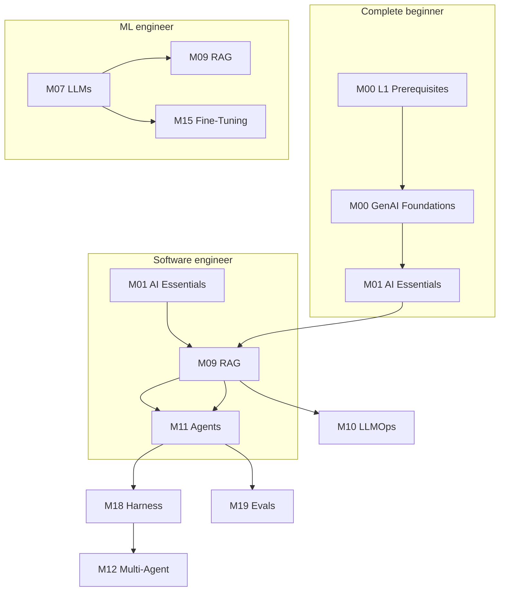

# Start Here

**One page to route every learner.** Pick your background, follow the path, build something real.

!!! tip "Quick setup"
    Need install commands only? See [Getting Started](getting-started.md#local-setup).

---

## Who are you?

| Persona | Background | Start with | Time to first app |
|---------|------------|------------|-------------------|
| **Complete beginner** | No CS / no Python | [M00 L1 Prerequisites](foundations/module-00-genai-foundations-from-nlp-to-transformers/lessons/01-prerequisites.md) → M00 → M01 | ~2 weeks part-time |
| **Software engineer, new to AI** | Can code, never built with LLMs | [M01 AI Engineering Essentials](foundations/module-01-ai-engineering-essentials/index.md) | ~3 days |
| **ML engineer → LLM/agents** | Knows training, needs product stack | [M07 LLMs](foundations/module-07-large-language-models-llms/index.md) or [M09 RAG](build/module-09-rag-retrieval-augmented-generation/index.md) | ~1 week |
| **Career switcher** | Changing into AI engineering | Full [Learning Path](learning-path.md) + [Build These First](projects/build-these.md) | 4–6 months part-time |

---

## I want to learn…

### By goal

| I want to… | Read first | Then | Build |
|------------|------------|------|-------|
| **Understand how LLMs work** | [M00](foundations/module-00-genai-foundations-from-nlp-to-transformers/index.md) → [M06](foundations/module-06-transformers-attention-mechanisms/index.md) → [M07](foundations/module-07-large-language-models-llms/index.md) | [Deep Dives](deep-dives/index.md) | [M06 exercises](../foundations/module-06-transformers-attention-mechanisms/exercises/) |
| **Call LLM APIs in production** | [M01](foundations/module-01-ai-engineering-essentials/index.md) | [M10 LLMOps](production/module-10-llmops-production-systems/index.md) | [Project 1: Doc Q&A bot](projects/build-these.md#1-doc-qa-bot-rag-starter) |
| **Build RAG over my documents** | [M09 RAG](build/module-09-rag-retrieval-augmented-generation/index.md) | [M13 Vector DBs](build/module-13-vector-databases-deep-dive/index.md) | [Project 2: Enterprise RAG](projects/build-these.md#2-enterprise-rag-with-citations) |
| **Build AI agents** | [Agent Engineering track](agent-engineering/index.md) or [M11](build/module-11-ai-agents-fundamentals/index.md) | [M18 Harness](build/module-18-agent-harness-tools-runtime/index.md) | [Project 4: Tool-using agent](projects/build-these.md#4-tool-using-research-agent) |
| **Ship multi-agent systems** | [M12 Multi-Agent](build/module-12-multi-agent-systems/index.md) | [M19 Evals](production/module-19-llm-evaluation-quality/index.md) | [Project 5: Multi-agent research](projects/build-these.md#5-multi-agent-research-system) |
| **Fine-tune a model** | [M15 Fine-Tuning](advanced/module-15-fine-tuning-custom-models/index.md) | [M07 L6–8](foundations/module-07-large-language-models-llms/index.md) | [Project 8: Domain fine-tune](projects/build-these.md#8-domain-style-fine-tune) |
| **Evaluate & monitor LLM apps** | [M19 Evals](production/module-19-llm-evaluation-quality/index.md) | [Evals hub](evals-observability/index.md) | [Project 9: Eval suite](projects/build-these.md#9-ai-quality-eval-suite) |
| **Use Claude Code / agentic IDE skills** | [AI Engineering 2026](ai-engineering-2026/index.md) | [Skills & Rules](ai-engineering-2026/skills-and-rules.md) | Custom skill for your repo |
| **Get a job in AI engineering** | This page → [Learning Path](learning-path.md) | [Build These First](projects/build-these.md) (portfolio) | 3 projects + [M17 capstones](advanced/module-17-capstone-projects/index.md) |

### By concept

| Concept | Primary module | Hub / deep dive |
|---------|----------------|-----------------|
| Transformers | [M06](foundations/module-06-transformers-attention-mechanisms/index.md) | [Attention math](deep-dives/attention-math.md) |
| Prompting | [M14](build/module-14-prompt-engineering-mastery/index.md) | [M01 L4](foundations/module-01-ai-engineering-essentials/lessons/04-prompt-engineering.md) |
| RAG | [M09](build/module-09-rag-retrieval-augmented-generation/index.md) | [Graph RAG](build/module-09-rag-retrieval-augmented-generation/lessons/11-graph-rag-and-knowledge-graphs.md) |
| Agents | [M11](build/module-11-ai-agents-fundamentals/index.md) | [Agentic AI hub](agentic-ai/index.md) |
| MCP & tools | [M18](build/module-18-agent-harness-tools-runtime/index.md) | [Agent Engineering L3](agent-engineering/03-tools-and-mcp.md) |
| Safety | [M16](production/module-16-ai-safety-ethics/index.md) | [Prompt injection](production/module-16-ai-safety-ethics/lessons/04-lesson-04.md) |

Full index: [Topic Map](topic-map.md) · [Glossary](glossary.md)

---

## Prerequisite chains

Follow these before jumping ahead. Skipping steps causes confusion later.

| Module | Requires | Self-check |
|--------|----------|------------|
| **M00** | Python basics, comfort with fractions/exponents | Can you run `pip install numpy` and write a function? |
| **M01** | M00 or equivalent SWE experience | Can you call a REST API in Python? |
| **M05–M06** | M00 L2 math, NumPy | Can you explain matrix multiply and softmax? |
| **M07** | M06 or M00 L5–8 transformers | Can you draw the transformer block? |
| **M09** | M01 (APIs) + basic embeddings concept | Can you chunk text and call an embedding API? |
| **M11** | M01 + M09 recommended | Can you explain retrieve-then-generate? |
| **M18** | M11 agent loop | Can you implement a ReAct loop? |
| **M12** | M11 + M18 | Can you trace a multi-step agent run? |
| **M15** | M07 fine-tuning basics | Do you know LoRA vs full fine-tune? |
| **M17 capstones** | M09 + M11 minimum | Have you built one RAG app and one agent? |

---

## Your first 4 weeks (career switcher roadmap)

| Week | Focus | Modules | Milestone |
|------|-------|---------|-----------|
| **1** | Python + first API call | M00 L1, M01 | Working chat script + token cost log |
| **2** | Prompts + RAG basics | M01 exercises, M09 L1–5 | Doc Q&A over 10 PDFs |
| **3** | Agents + harness | M11 L1–7, M18 L1–3 | Agent with 2 tools |
| **4** | Evals + portfolio polish | M19 L1–3, [Build These](projects/build-these.md) | One project on GitHub with README |

After week 4: continue [Learning Path](learning-path.md) through Production (M10, M16) and Advanced (M15, M17).

---

## Practice: exercises & projects

| Resource | What it is | Link |
|----------|------------|------|
| **Exercises** | Starter/solution `.py` files per module | [Exercise index](exercises/index.md) |
| **Build These First** | 10 portfolio projects mapped to modules | [build-these.md](projects/build-these.md) |
| **Capstones** | Full production briefs (M17) | [Capstone module](advanced/module-17-capstone-projects/index.md) |

!!! note "Exercise coverage today"
    Hands-on files exist for **M01, M05, M06**. M09 and M11 notebooks are on the [roadmap](roadmap.md). Use module lesson exercises and [Build These](projects/build-these.md) until those ship.

---

## When to use RAG vs fine-tune vs agents

Quick decision guide — full tables in [FAQ](faq.md#rag-vs-fine-tuning-vs-agents).

| Need | Use | Avoid |
|------|-----|-------|
| Answer from **your documents** | **RAG** | Fine-tuning for facts |
| **Consistent format/style** every time | **Fine-tune** or strict prompts | Hoping RAG fixes tone |
| **Multi-step tasks** with tools | **Agent** | Long deterministic workflow pretending to be an agent |
| **Deterministic pipeline** (ETL, approvals) | **Workflow** | Autonomous agent |
| **Cheapest first attempt** | Prompt engineering | Fine-tune on day one |

Decision tree: [M15 L1](advanced/module-15-fine-tuning-custom-models/lessons/01-lesson-01.md) · Workflow vs agent: [M11 L10](build/module-11-ai-agents-fundamentals/lessons/10-Workflow-vs-Agent.md)

---

## Stuck? Read this

| Problem | Go to |
|---------|-------|
| Don't know where to start | This page — pick a persona above |
| Lesson assumes math I don't have | [M00 L2 Math](foundations/module-00-genai-foundations-from-nlp-to-transformers/lessons/02-math-foundations.md) |
| API key / rate limit errors | [FAQ — Troubleshooting](faq.md#troubleshooting) |
| Term I don't understand | [Glossary](glossary.md) |
| Want a portfolio project | [Build These First](projects/build-these.md) |
| Content gap or bug | [Contribute](contribute.md) · [GitHub Issues](https://github.com/psssnikhil/learn-ai-engineering/issues) |

---

## Site map (avoid scattered hubs)

| Page | Purpose |
|------|---------|
| **Start Here** (this page) | Persona routing, prerequisites, goals |
| [Learning Path](learning-path.md) | Full module order |
| [Topic Map](topic-map.md) | Concept → module lookup |
| [Agentic AI](agentic-ai/index.md) | Agent-focused stack |
| [Agent Engineering](agent-engineering/index.md) | Dedicated agent curriculum |
| [Evals & Observability](evals-observability/index.md) | Measure and debug |
| [FAQ](faq.md) | Common questions |
| [Resources](resources/index.md) | Papers, videos, OSS hubs |
