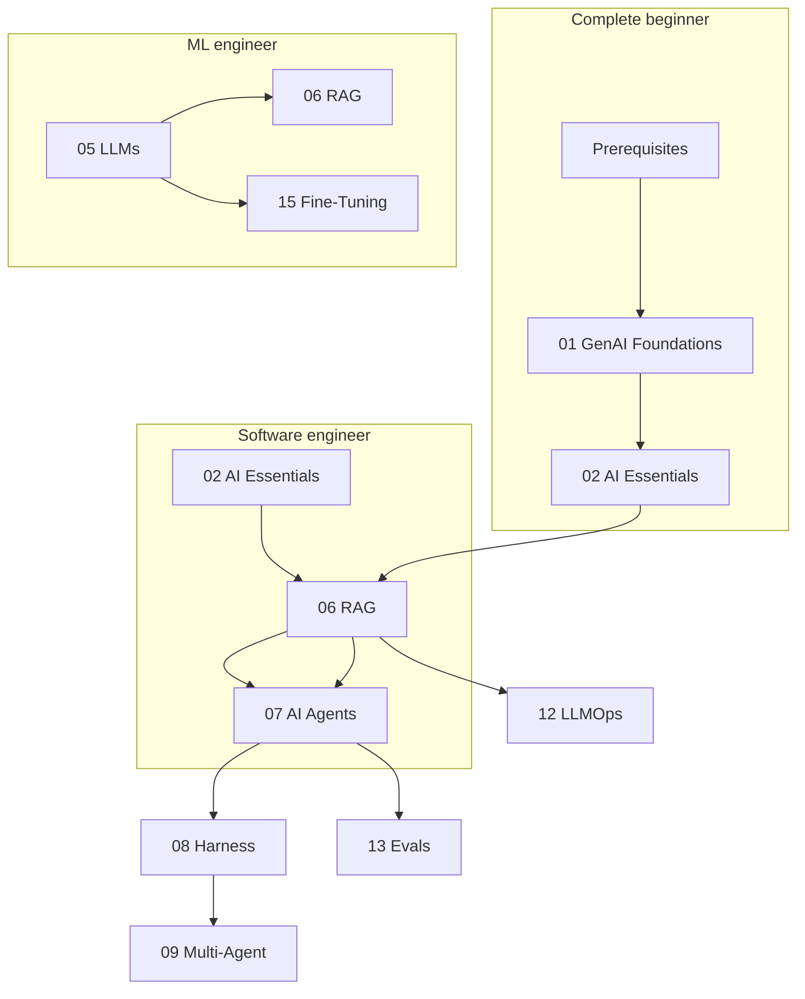

# Start Here

**One page to route every learner.** Pick your background, follow the sequential path in the **Learn** tab, and build something real.

!!! tip "How the site works"
    Open **Learn** in the top nav — 16 courses in order (01–16). Each course page lists its lessons. No module codes in the UI.

!!! tip "Quick setup"
    Need install commands only? See [Getting Started](getting-started.md#local-setup).

---

## Who are you?

| Persona | Background | Start with | Time to first app |
|---------|------------|------------|-------------------|
| **Complete beginner** | No CS / no Python | [Prerequisites](foundations/module-00-genai-foundations-from-nlp-to-transformers/lessons/01-prerequisites.md) → [01 GenAI Foundations](foundations/module-00-genai-foundations-from-nlp-to-transformers/index.md) → [02 AI Essentials](foundations/module-01-ai-engineering-essentials/index.md) | ~2 weeks part-time |
| **Software engineer, new to AI** | Can code, never built with LLMs | [02 AI Engineering Essentials](foundations/module-01-ai-engineering-essentials/index.md) | ~3 days |
| **ML engineer → LLM/agents** | Knows training, needs product stack | [05 Large Language Models](foundations/module-07-large-language-models-llms/index.md) or [06 RAG](build/module-09-rag-retrieval-augmented-generation/index.md) | ~1 week |
| **Career switcher** | Changing into AI engineering | [Learn overview](learn/index.md) + [Build These First](projects/build-these.md) | 4–6 months part-time |

Need a week-by-week schedule? See [Study Plans](learn/study-plans.md).

---

## I want to learn…

### By goal

| I want to… | Read first | Then | Build |
|------------|------------|------|-------|
| **Understand how LLMs work** | [01](foundations/module-00-genai-foundations-from-nlp-to-transformers/index.md) → [04 Transformers](foundations/module-06-transformers-attention-mechanisms/index.md) → [05 LLMs](foundations/module-07-large-language-models-llms/index.md) | [Deep Dives](deep-dives/index.md) | [Transformers exercises](foundations/module-06-transformers-attention-mechanisms/exercises/) |
| **Call LLM APIs in production** | [02 AI Essentials](foundations/module-01-ai-engineering-essentials/index.md) | [12 LLMOps](production/module-10-llmops-production-systems/index.md) | [Project 1: Doc Q&A bot](projects/build-these.md#1-doc-qa-bot-rag-starter) |
| **Build RAG over my documents** | [06 RAG](build/module-09-rag-retrieval-augmented-generation/index.md) | [10 Vector DBs](build/module-13-vector-databases-deep-dive/index.md) | [Project 2: Enterprise RAG](projects/build-these.md#2-enterprise-rag-with-citations) |
| **Build AI agents** | [Agent Engineering track](agent-engineering/index.md) or [07 AI Agents](build/module-11-ai-agents-fundamentals/index.md) | [08 Agent Harness](build/module-18-agent-harness-tools-runtime/index.md) | [Project 4: Tool-using agent](projects/build-these.md#4-tool-using-research-agent) |
| **Ship multi-agent systems** | [09 Multi-Agent Systems](build/module-12-multi-agent-systems/index.md) | [13 LLM Evals](production/module-19-llm-evaluation-quality/index.md) | [Project 5: Multi-agent research](projects/build-these.md#5-multi-agent-research-system) |
| **Fine-tune a model** | [15 Fine-Tuning](advanced/module-15-fine-tuning-custom-models/index.md) | [05 LLMs — fine-tuning lessons](foundations/module-07-large-language-models-llms/index.md) | [Project 8: Domain fine-tune](projects/build-these.md#8-domain-style-fine-tune) |
| **Evaluate & monitor LLM apps** | [13 LLM Evaluation](production/module-19-llm-evaluation-quality/index.md) | [Evals hub](evals-observability/index.md) | [Project 9: Eval suite](projects/build-these.md#9-ai-quality-eval-suite) |
| **Use Claude Code / agentic IDE skills** | [Modern AI (2026)](ai-engineering-2026/index.md) | [Skills & Rules](ai-engineering-2026/skills-and-rules.md) | Custom skill for your repo |
| **Get a job in AI engineering** | This page → [Learn](learn/index.md) | [Build These First](projects/build-these.md) (portfolio) | 3 projects + [16 Capstones](advanced/module-17-capstone-projects/index.md) |

### By concept

| Concept | Primary course | Hub / deep dive |
|---------|----------------|-----------------|
| Transformers | [04 Transformers & Attention](foundations/module-06-transformers-attention-mechanisms/index.md) | [Attention math](deep-dives/attention-math.md) |
| Prompting | [11 Prompt Engineering](build/module-14-prompt-engineering-mastery/index.md) | [AI Essentials · Prompts](foundations/module-01-ai-engineering-essentials/lessons/04-prompt-engineering.md) |
| RAG | [06 RAG](build/module-09-rag-retrieval-augmented-generation/index.md) | [Graph RAG](build/module-09-rag-retrieval-augmented-generation/lessons/11-graph-rag-and-knowledge-graphs.md) |
| Agents | [07 AI Agents](build/module-11-ai-agents-fundamentals/index.md) | [Agentic AI hub](agentic-ai/index.md) |
| MCP & tools | [08 Agent Harness](build/module-18-agent-harness-tools-runtime/index.md) | [Agent Engineering · Tools](agent-engineering/03-tools-and-mcp.md) |
| Safety | [14 AI Safety](production/module-16-ai-safety-ethics/index.md) | [Prompt injection](production/module-16-ai-safety-ethics/lessons/04-lesson-04.md) |

Full index: [Topic Map](topic-map.md) · [Glossary](glossary.md)

---

## Prerequisite chains

Follow these before jumping ahead. Skipping steps causes confusion later.

| Course | Requires | Self-check |
|--------|----------|------------|
| **01 GenAI Foundations** | Python basics, comfort with fractions/exponents | Can you run `pip install numpy` and write a function? |
| **02 AI Essentials** | Course 01 or equivalent SWE experience | Can you call a REST API in Python? |
| **03–04 Neural nets & transformers** | Course 01 math lessons, NumPy | Can you explain matrix multiply and softmax? |
| **05 LLMs** | Course 04 or transformer lessons in course 01 | Can you draw the transformer block? |
| **06 RAG** | Course 02 (APIs) + basic embeddings concept | Can you chunk text and call an embedding API? |
| **07 AI Agents** | Course 02 + course 06 recommended | Can you explain retrieve-then-generate? |
| **08 Agent Harness** | Course 07 agent loop | Can you implement a ReAct loop? |
| **09 Multi-Agent** | Courses 07 + 08 | Can you trace a multi-step agent run? |
| **15 Fine-Tuning** | Course 05 fine-tuning basics | Do you know LoRA vs full fine-tune? |
| **16 Capstones** | Courses 06 + 07 minimum | Have you built one RAG app and one agent? |

---

## Your first 4 weeks (career switcher roadmap)

| Week | Focus | Courses | Milestone |
|------|-------|---------|-----------|
| **1** | Python + first API call | 01 (prerequisites), 02 | Working chat script + token cost log |
| **2** | Prompts + RAG basics | 02 exercises, 06 lessons 1–5 | Doc Q&A over 10 PDFs |
| **3** | Agents + harness | 07 lessons 1–7, 08 lessons 1–3 | Agent with 2 tools |
| **4** | Evals + portfolio polish | 13 lessons 1–3, [Build These](projects/build-these.md) | One project on GitHub with README |

After week 4: continue the [Learn path](learn/index.md) through production (12–14) and advanced (15–16).

---

## Practice: exercises & projects

| Resource | What it is | Link |
|----------|------------|------|
| **Exercises** | Starter/solution `.py` files per course | [Exercise index](exercises/index.md) |
| **Build These First** | 10 portfolio projects mapped to courses | [build-these.md](projects/build-these.md) |
| **Capstones** | Full production briefs (course 16) | [Capstone projects](advanced/module-17-capstone-projects/index.md) |

---

## When to use RAG vs fine-tune vs agents

Quick decision guide — full tables in [FAQ](faq.md#rag-vs-fine-tuning-vs-agents).

| Need | Use | Avoid |
|------|-----|-------|
| Answer from **your documents** | **RAG** | Fine-tuning for facts |
| **Consistent format/style** every time | **Fine-tune** or strict prompts | Hoping RAG fixes tone |
| **Multi-step tasks** with tools | **Agent** | Long deterministic workflow pretending to be an agent |
| **Deterministic pipeline** (ETL, approvals) | **Workflow** | Autonomous agent |
| **Cheapest first attempt** | Prompt engineering | Fine-tune on day one |

---

## Stuck? Read this

| Problem | Go to |
|---------|-------|
| Don't know where to start | This page — pick a persona above |
| Lesson assumes math I don't have | [01 · Math foundations](foundations/module-00-genai-foundations-from-nlp-to-transformers/lessons/02-math-foundations.md) |
| API key / rate limit errors | [FAQ — Troubleshooting](faq.md#troubleshooting) |
| Term I don't understand | [Glossary](glossary.md) |
| Want a portfolio project | [Build These First](projects/build-these.md) |
| Content gap or bug | [Contribute](contribute.md) · [GitHub Issues](https://github.com/psssnikhil/learn-ai-engineering/issues) |

---

## Site map

| Tab / page | Purpose |
|------------|---------|
| **Start Here** (this page) | Persona routing, prerequisites, goals |
| **[Learn](learn/index.md)** | Sequential courses 01–16 + optional tracks |
| **[Study Plans](learn/study-plans.md)** | Week-by-week schedules by persona |
| **[Topic Map](topic-map.md)** | Concept → course lookup |
| **[Reference](faq.md)** | FAQ, glossary, deep dives, resources |
| **[Projects](projects/build-these.md)** | Portfolio builds |
