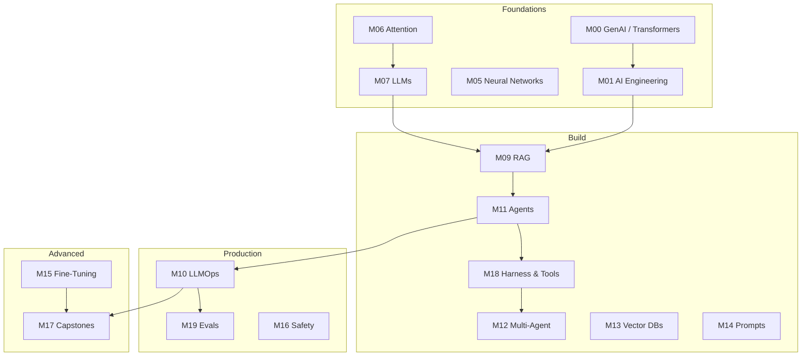
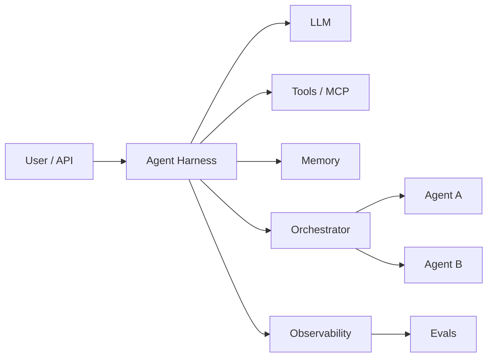

# Topic Map

Find any concept across the handbook. Module IDs match the platform (`module-09` = RAG).

## Full learning arc

## Concept → module index

| Topic | Primary modules | Also covered in |
|-------|-----------------|-----------------|
| **Transformers & attention** | [M00](foundations/module-00-genai-foundations-from-nlp-to-transformers/index.md), [M06](foundations/module-06-transformers-attention-mechanisms/index.md) | M07 |
| **LLMs & APIs** | [M07](foundations/module-07-large-language-models-llms/index.md) | M01 |
| **Prompt engineering** | [M14](build/module-14-prompt-engineering-mastery/index.md) | M01 |
| **RAG** | [M09](build/module-09-rag-retrieval-augmented-generation/index.md) | M13, M17 |
| **Vector search** | [M13](build/module-13-vector-databases-deep-dive/index.md) | M09 |
| **AI agents** | [M11](build/module-11-ai-agents-fundamentals/index.md) | M09 L9 |
| **Agent harness & runtime** | [M18](build/module-18-agent-harness-tools-runtime/index.md) | [Agentic AI hub](agentic-ai/index.md) |
| **Tools & MCP** | [M18](build/module-18-agent-harness-tools-runtime/index.md) | M11 L4 |
| **Orchestration** | [M12](build/module-12-multi-agent-systems/index.md) | M11 L8, M18 |
| **Multi-agent systems** | [M12](build/module-12-multi-agent-systems/index.md) | M17 |
| **LLMOps** | [M10](production/module-10-llmops-production-systems/index.md) | M17 |
| **Observability & monitoring** | [M10](production/module-10-llmops-production-systems/index.md) | M18, M19 |
| **Evaluation** | [M19](production/module-19-llm-evaluation-quality/index.md) | M09 L8, M16 |
| **Safety & red teaming** | [M16](production/module-16-ai-safety-ethics/index.md) | M14, M19 |
| **Fine-tuning** | [M15](advanced/module-15-fine-tuning-custom-models/index.md) | M07 |

## Agentic AI stack

Deep dive: [Agentic AI hub](agentic-ai/index.md) · **[Agent Engineering track](agent-engineering/index.md)**

## Agent engineering (dedicated track)

| Topic | Page |
|-------|------|
| Agent loop | [01 · Loop](agent-engineering/01-agent-loop.md) |
| Memory | [02 · Memory](agent-engineering/02-memory.md) |
| Tools & MCP | [03 · Tools](agent-engineering/03-tools-and-mcp.md) |
| Harness engineering | [04 · Harness](agent-engineering/04-harness-engineering.md) |
| Orchestration | [05 · Orchestration](agent-engineering/05-orchestration.md) |
| Observability & tracing | [06 · Observability](agent-engineering/06-observability-and-tracing.md) |
| Agent evals | [07 · Evals](agent-engineering/07-agent-evals.md) |

## 2026 skills

| Topic | Page |
|-------|------|
| Overview | [AI Engineering 2026](ai-engineering-2026/index.md) |
| Claude Code | [claude-code.md](ai-engineering-2026/claude-code.md) |
| Skills & rules | [skills-and-rules.md](ai-engineering-2026/skills-and-rules.md) |
| Loop engineering | [loop-engineering.md](ai-engineering-2026/loop-engineering.md) |
| Context engineering | [context-engineering.md](ai-engineering-2026/context-engineering.md) |

## Deep Dives (mathematical foundations)

Go beyond lesson summaries for full derivations:

- [Attention Math](deep-dives/attention-math.md) — QKV derivation with numpy
- [Backpropagation Calculus](deep-dives/backpropagation-calculus.md) — chain rule through a 2-layer net
- [Tokenization Internals](deep-dives/tokenization-internals.md) — BPE merge rules worked by hand

See [Deep Dives hub](deep-dives/index.md).

## Visual references (open educational resources)

| Diagram | Source | Topic |
|---------|--------|-------|
| [The Illustrated Transformer](https://jalammar.github.io/illustrated-transformer/) | Jay Alammar | M00, M06 |
| [The Illustrated GPT-2](https://jalammar.github.io/illustrated-gpt2/) | Jay Alammar | M07 |
| [LLM Visualization](https://bbycroft.net/llm) | Brendan Bycroft | M07 |
| [RAG diagram](https://github.com/NirDiamant/RAG_Techniques) | RAG Techniques repo | M09 |

## Cross-cutting guides

- [Agentic AI](agentic-ai/index.md) — agents, harness, tools, orchestration
- [Evals & Observability](evals-observability/index.md) — quality, tracing, monitoring
- [Glossary](glossary.md) — term definitions
