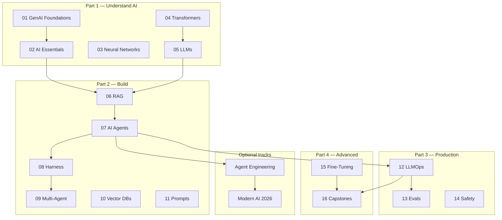

# Topic Map

Find any concept across the handbook. Course numbers match the **Learn** tab (01–16).

  <a class="quick-nav__item" href="learn/index.md">Learn</a>
  <a class="quick-nav__item" href="start-here.md">Start Here</a>
  <a class="quick-nav__item" href="agent-engineering/index.md">Agent Engineering</a>
  <a class="quick-nav__item" href="ai-engineering-2026/index.md">Modern AI (2026)</a>
  <a class="quick-nav__item" href="glossary.md">Glossary</a>

!!! tip "Can't find it?"
    Try [Glossary](glossary.md) for term definitions, or use the search bar (⌘K / Ctrl+K).

## Full learning arc

## Concept → course index

| Topic | Primary course(s) | Also covered in |
|-------|-------------------|-----------------|
| **Neural networks & deep learning** | [03 Neural Networks](foundations/module-05-neural-networks-deep-learning-fundamentals/index.md) | 01 |
| **Transformers & attention** | [01 GenAI](foundations/module-00-genai-foundations-from-nlp-to-transformers/index.md), [04 Transformers](foundations/module-06-transformers-attention-mechanisms/index.md) | 05 |
| **LLMs & APIs** | [05 LLMs](foundations/module-07-large-language-models-llms/index.md) | 02 |
| **Reasoning models** | [05 LLMs · reasoning lesson](foundations/module-07-large-language-models-llms/lessons/11-reasoning-models-and-test-time-compute.md) | — |
| **Prompt engineering** | [11 Prompt Engineering](build/module-14-prompt-engineering-mastery/index.md) | 02 |
| **Context engineering** | [Modern AI 2026](ai-engineering-2026/context-engineering.md) | 02, [Agent Engineering · Memory](agent-engineering/02-memory.md) |
| **RAG** | [06 RAG](build/module-09-rag-retrieval-augmented-generation/index.md) | 10, 16 |
| **Vector search** | [10 Vector DBs](build/module-13-vector-databases-deep-dive/index.md) | 06 |
| **AI agents** | [07 AI Agents](build/module-11-ai-agents-fundamentals/index.md) | 06, [Agent Engineering](agent-engineering/index.md) |
| **Agent harness & runtime** | [08 Harness](build/module-18-agent-harness-tools-runtime/index.md) | [Agent Engineering · Harness](agent-engineering/04-harness-engineering.md) |
| **Tools & MCP** | [08 Harness](build/module-18-agent-harness-tools-runtime/index.md) | 07, [Agent Engineering · Tools](agent-engineering/03-tools-and-mcp.md) |
| **Loop engineering** | [Modern AI 2026](ai-engineering-2026/loop-engineering.md) | [Agent Loop](agent-engineering/01-agent-loop.md), 08 |
| **Orchestration** | [09 Multi-Agent](build/module-12-multi-agent-systems/index.md) | 07, 08, [Agent Engineering · Orchestration](agent-engineering/05-orchestration.md) |
| **Multi-agent systems** | [09 Multi-Agent](build/module-12-multi-agent-systems/index.md) | 16 |
| **Claude Code & IDE agents** | [Modern AI 2026](ai-engineering-2026/claude-code.md) | [Skills & Rules](ai-engineering-2026/skills-and-rules.md) |
| **LLMOps** | [12 LLMOps](production/module-10-llmops-production-systems/index.md) | 16 |
| **Observability & monitoring** | [12 LLMOps](production/module-10-llmops-production-systems/index.md) | 08, 13, [Agent Engineering · Observability](agent-engineering/06-observability-and-tracing.md) |
| **Evaluation** | [13 LLM Evaluation](production/module-19-llm-evaluation-quality/index.md) | 06, 14, [Agent Engineering · Evals](agent-engineering/07-agent-evals.md) |
| **Safety & red teaming** | [14 AI Safety](production/module-16-ai-safety-ethics/index.md) | 11, 13 |
| **Fine-tuning** | [15 Fine-Tuning](advanced/module-15-fine-tuning-custom-models/index.md) | 05 |

## Agent engineering (optional track)

| Topic | Page | Related course |
|-------|------|----------------|
| Agent loop | [01 · Loop](agent-engineering/01-agent-loop.md) | 07 |
| Memory | [02 · Memory](agent-engineering/02-memory.md) | 07 |
| Tools & MCP | [03 · Tools](agent-engineering/03-tools-and-mcp.md) | 08 |
| Harness engineering | [04 · Harness](agent-engineering/04-harness-engineering.md) | 08 |
| Orchestration | [05 · Orchestration](agent-engineering/05-orchestration.md) | 09 |
| Observability & tracing | [06 · Observability](agent-engineering/06-observability-and-tracing.md) | 12, 08 |
| Agent evals | [07 · Evals](agent-engineering/07-agent-evals.md) | 13 |

## Modern AI (2026)

| Topic | Page | Related course |
|-------|------|----------------|
| Overview | [Modern AI 2026](ai-engineering-2026/index.md) | — |
| Claude Code | [claude-code.md](ai-engineering-2026/claude-code.md) | Agent Engineering |
| Skills & rules | [skills-and-rules.md](ai-engineering-2026/skills-and-rules.md) | 11 |
| Loop engineering | [loop-engineering.md](ai-engineering-2026/loop-engineering.md) | 08, Agent Engineering |
| Context engineering | [context-engineering.md](ai-engineering-2026/context-engineering.md) | 02, Agent Engineering |

## Deep Dives (mathematical foundations)

- [Attention Math](deep-dives/attention-math.md) — QKV derivation with numpy
- [Backpropagation Calculus](deep-dives/backpropagation-calculus.md) — chain rule through a 2-layer net
- [Tokenization Internals](deep-dives/tokenization-internals.md) — BPE merge rules worked by hand

See [Deep Dives hub](deep-dives/index.md).

## Cross-cutting guides

- [Start Here](start-here.md) — pick your entry point by background
- [Learn](learn/index.md) — full 16-course curriculum
- [Study Plans](learn/study-plans.md) — week-by-week schedules
- [Agentic AI](agentic-ai/index.md) — agents, harness, tools, orchestration
- [Evals & Observability](evals-observability/index.md) — quality, tracing, monitoring
- [Glossary](glossary.md) — term definitions
